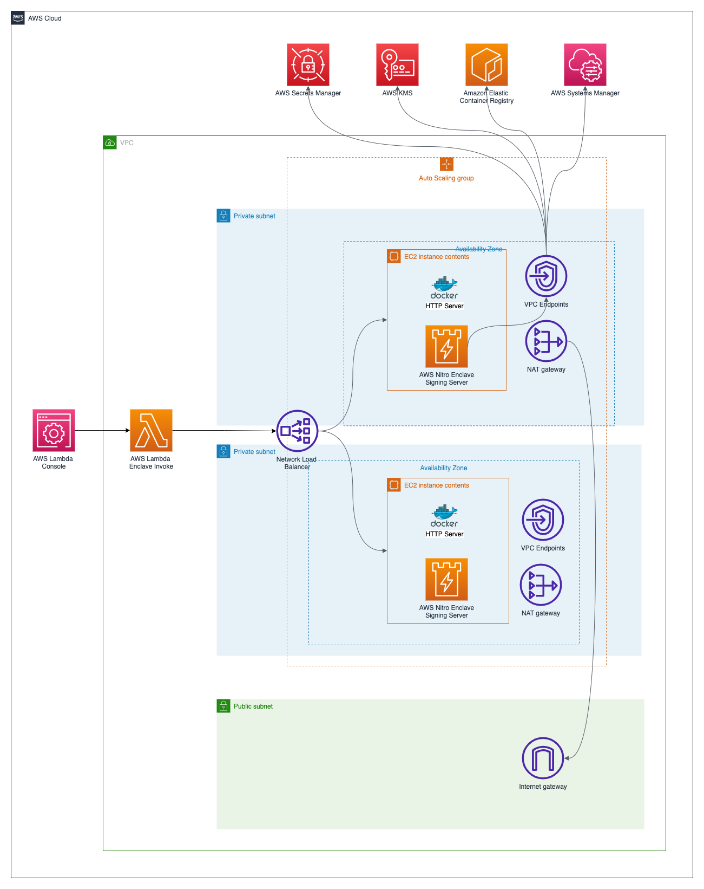
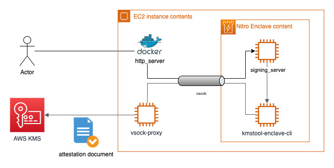

# Heimdall - Multi-User Starknet Signing Service with AWS Nitro Enclaves

Heimdall is a secure, multi-user Starknet transaction signing service built on AWS Nitro Enclaves. It provides deterministic key derivation for multiple users while maintaining the highest security standards through hardware-based isolation.

## Features

- **Multi-User Support**: Deterministic key derivation allows multiple users to have their own unique Starknet private keys
- **Hardware Security**: AWS Nitro Enclaves provide hardware-based isolation and cryptographic attestation
- **Starknet Native**: Built specifically for Starknet using starknet-py SDK with support for Cairo 1.0
- **Secure Key Management**: Master seed encrypted with AWS KMS, individual keys derived using HKDF
- **Simple Authentication**: Username-based authentication for easy integration
- **Production Ready**: Comprehensive testing, monitoring, and deployment automation

## Multi-User Architecture

The system uses a master seed to deterministically derive unique Starknet private keys for each user:

```
Master Seed (AWS KMS) → HKDF(username, key_index) → User-Specific Starknet Key
```

Each user authenticates with just a username and receives their own isolated key space. Users can derive multiple keys using different key indices.

## Quick Start

### 1. Set up environment variables
```bash
export CDK_DEPLOY_REGION=us-east-1
export CDK_DEPLOY_ACCOUNT=$(aws sts get-caller-identity | jq -r '.Account')
export CDK_PREFIX=dev
```

### 2. Deploy the infrastructure
```bash
npm install -g aws-cdk && cdk --version
pip install -r requirements.txt
./scripts/build_kmstool_enclave_cli.sh
cdk deploy ${CDK_PREFIX}NitroWalletStarknet
```

### 3. Use the multi-user API
```bash
# Sign a transaction for user "alice"
curl -X POST https://your-endpoint/sign \
  -H "Content-Type: application/json" \
  -d '{
    "username": "alice",
    "operation": "sign_transaction",
    "key_index": 0,
    "transaction_payload": {
      "contract_address": "0x049d36570d4e46f48e99674bd3fcc84644ddd6b96f7c741b1562b82f9e004dc7",
      "function_name": "transfer",
      "calldata": ["0x123...", "1000", "0"]
    }
  }'
```

## Documentation

For detailed information, see the Starknet-specific documentation:

- [Multi-User Design](./application/starknet/MULTIUSER_DESIGN.md) - Technical architecture and security model
- [Deployment Guide](./application/starknet/MULTIUSER_DEPLOYMENT.md) - Complete deployment instructions
- [API Reference](./application/starknet/API_REFERENCE.md) - Full API documentation
- [Starknet Integration](./application/starknet/STARKNET_INTEGRATION.md) - Starknet-specific details
- [Security Model](./application/starknet/SECURITY.md) - Security considerations and best practices

## Architecture

### High Level


### Application


## Deploying the solution with AWS CDK

Deploying the solution with the AWS CDK The AWS CDK is an open-source framework for defining and provisioning cloud
application resources. It uses common programming languages such as JavaScript, C#, and Python.
The [AWS CDK command line interface](https://docs.aws.amazon.com/cdk/latest/guide/cli.html) (CLI) allows you to interact
with CDK applications. It provides features like synthesizing AWS CloudFormation templates, confirming the security
changes, and deploying applications.

This section shows how to prepare the environment for running CDK and the sample code. For this walkthrough, you must
have the following prerequisites:

* An [AWS account](https://signin.aws.amazon.com/signin?redirect_uri=https%3A%2F%2Fportal.aws.amazon.com%2Fbilling%2Fsignup%2Fresume&client_id=signup).
* An IAM user with administrator access
* [Configured AWS credentials](https://docs.aws.amazon.com/cdk/latest/guide/getting_started.html#getting_started_prerequisites)
* Installed Node.js, Python 3, and pip. To install the example application:

When working with Python, it’s good practice to use [venv](https://docs.python.org/3/library/venv.html#module-venv) to
create project-specific virtual environments. The use of `venv` also reflects AWS CDK standard behavior. You can find
out more in the
workshop [Activating the virtualenv](https://cdkworkshop.com/30-python/20-create-project/200-virtualenv.html).

1. Install the CDK and test the CDK CLI:
    ```bash
    npm install -g aws-cdk && cdk --version
    ```
   
2. Download the code from the GitHub repo and switch in the new directory:
    ```bash
    git clone https://github.com/aws-samples/aws-nitro-enclave-blockchain-wallet.git && cd aws-nitro-enclave-blockchain-wallet
    ```
3. Install the dependencies using the Python package manager:
   ```bash
   pip install -r requirements.txt
   ```
4. Specify the AWS region and account for your deployment:
   ```bash
   export CDK_DEPLOY_REGION=us-east-1
   export CDK_DEPLOY_ACCOUNT=$(aws sts get-caller-identity | jq -r '.Account')
   export CDK_PREFIX=dev
   ```
   You can set the ```CDK_PREFIX``` variable as per your preference.

5. Trigger the `kmstool_enclave_cli` build:
   ```bash
   ./scripts/build_kmstool_enclave_cli.sh
   ```

6. Deploy the Starknet multi-user service with the CDK CLI:
    ```bash
    cdk deploy ${CDK_PREFIX}NitroWalletStarknet
    ```

## KMS Key Policy

```json5
{
  "Version": "2012-10-17",
  "Statement": [
    {
      "Sid": "Enable decrypt from enclave",
      "Effect": "Allow",
      "Principal": {
        "AWS": <devNitroWalletEth.EC2InstanceRoleARN>
      },
      "Action": "kms:Decrypt",
      "Resource": "*",
      "Condition": {
        "StringEqualsIgnoreCase": {
          "kms:RecipientAttestation:ImageSha384": <PCR0_VALUE_FROM_EIF_BUILD>
        }
      }
    },
    {
      "Sid": "Enable encrypt from lambda",
      "Effect": "Allow",
      "Principal": {
        "AWS": <devNitroWalletEth.LambdaExecutionRoleARN>
      },
      "Action": "kms:Encrypt",
      "Resource": "*"
    },
    {
      "Effect": "Allow",
      "Principal": {
        "AWS": <KMS_ADMINISTRATOR_ROLE_ARN>
      },
      "Action": [
        "kms:Create*",
        "kms:Describe*",
        "kms:Enable*",
        "kms:List*",
        "kms:Put*",
        "kms:Update*",
        "kms:Revoke*",
        "kms:Disable*",
        "kms:Get*",
        "kms:Delete*",
        "kms:ScheduleKeyDeletion",
        "kms:CancelKeyDeletion",
        "kms:GenerateDataKey",
        "kms:TagResource",
        "kms:UntagResource"
      ],
      "Resource": "*"
    }
  ]
}
```

To leverage the provided `generate_key_policy.sh` script, a CDK output file needs to be provided.
This file can be created by running the following command:
```bash
cdk deploy devNitroWalletEth -O output.json
```

After the `output.json` file has been created, the following command can be used to create the KMS key policy:
```bash
./scripts/generate_key_policy.sh ./output.json
```

If the debug mode has been turned on by appending `--debug-mode` to the enclaves start sequence, the enclaves PCR0 value in the AWS KMS key policy needs to be updated to `000000000000000000000000000000000000000000000000000000000000000000000000000000000000000000000000`,
otherwise AWS KMS will return error code `400`.

## Multi-User Operations

### Initialize Master Seed

Use the Lambda function to initialize the master seed for key derivation:

```json
{
  "operation": "set_master_seed"
}
```

### Sign Transaction for User

Use the multi-user API to sign transactions for specific users:

```json
{
  "username": "alice",
  "operation": "sign_transaction",
  "key_index": 0,
  "transaction_payload": {
    "contract_address": "0x049d36570d4e46f48e99674bd3fcc84644ddd6b96f7c741b1562b82f9e004dc7",
    "function_name": "transfer",
    "calldata": ["0x123abc...", "1000", "0"],
    "max_fee": "0x1000000000000",
    "nonce": 0,
    "chain_id": "testnet"
  }
}
```

### Get Account Information

Retrieve account information for a user:

```json
{
  "username": "alice", 
  "operation": "get_account_info",
  "key_index": 0
}
```

## Cleaning up

Once you have completed the deployment and tested the application, clean up the environment to avoid incurring extra
cost. This command removes all resources in this stack provisioned by the CDK:

```bash
cdk destroy
```

## Troubleshooting

**Docker Image Push/Pull Error**
* On `building` instance during `cdk deploy` step:
```shell
devNitroWalletEth: fail: docker push 012345678910.dkr.ecr.us-east-1.amazonaws.com/cdk-hnb659fds-container-assets-012345678910-us-east-1:ab3fe... exited with error code 1: failed commit on ref "manifest-sha256:7141...": unexpected status from PUT request to https://012345678910.dkr.ecr.us-east-1.amazonaws.com/v2/cdk-hnb659fds-container-assets-012345678910-us-east-1/manifests/ab3fe...: 400 Bad Request
Failed to publish asset ab3fe...:012345678910-us-east-1
```

* On EC2 instance pulling docker container
```shell
ab3fe...: Pulling from cdk-hnb659fds-container-assets-012345678910-us-east-1
unsupported media type application/vnd.in-toto+json
```

**Solution**
* Issue might be related building and publishing docker containers from an `arm` based instances such as Apple Silicon, requiring docker `buildx` [issue](https://github.com/aws/aws-cdk/issues/30258)
* Cleanup images from local docker repository (`docker rmi ...`) and from Amazon Elastic Container Registry (ECR) e.g. via AWS console
* Set environment variable in terminal session (`export BUILDX_NO_DEFAULT_ATTESTATIONS=1`) or specify it during cdk deployment  (`BUILDX_NO_DEFAULT_ATTESTATIONS=1 cdk deploy`)


## Security

See [CONTRIBUTING](CONTRIBUTING.md#security-issue-notifications) for more information.

## License

This library is licensed under the MIT-0 License. See the LICENSE file.
