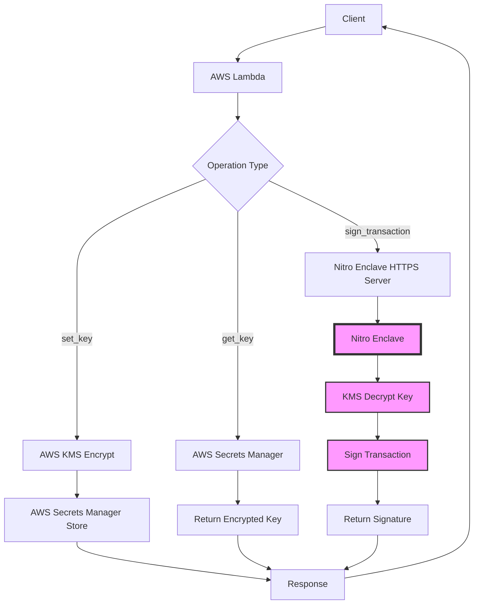

# Starknet Transaction Service API Reference

## Overview

The Starknet Transaction Service is a secure, AWS Nitro Enclave-based API for managing Starknet private keys and signing transactions. The service provides enterprise-grade security by isolating cryptographic operations within a trusted execution environment.

### Service Capabilities

- **Secure Key Management**: Encrypt and store Starknet private keys using AWS KMS
- **Transaction Signing**: Sign Starknet transactions without exposing private keys
- **Multi-Network Support**: Support for Mainnet, Testnet, and other Starknet networks
- **Hardware Security**: Private keys never exist in plaintext outside the Nitro Enclave

### Authentication & Authorization

The service uses AWS IAM roles and policies for authentication. All requests must be made through AWS Lambda with appropriate permissions for:
- AWS KMS (encryption/decryption)
- AWS Secrets Manager (secure storage)
- Nitro Enclave communication

### Base URL & Architecture

```
Lambda Function → Nitro Enclave (HTTPS:443) → Secure Signing
```

The service operates through AWS Lambda functions that communicate with isolated Nitro Enclaves via secure HTTPS connections.

## Request/Response Flow



## Operations Reference

### SET_KEY Operation

**Purpose**: Encrypt and securely store Starknet private keys using AWS KMS and Secrets Manager.

#### Request Format

```json
{
  "operation": "set_key",
  "starknet_key": "0x1234567890abcdef..."
}
```

#### Parameters

| Parameter | Type | Required | Description |
|-----------|------|----------|-------------|
| `operation` | string | Yes | Must be "set_key" |
| `starknet_key` | string | Yes | Hexadecimal private key (with or without 0x prefix) |

#### Validation Rules

- **Key Format**: Must be valid hexadecimal string
- **Key Range**: Must be within STARK curve order [1, STARK_ORDER-1]
- **STARK_ORDER**: `0x800000000000010FFFFFFFFFFFFFFFFB781126DCAE7B2321E66A241ADC64D2F`

#### Response Format

```json
{
  "ARN": "arn:aws:secretsmanager:region:account:secret:name",
  "Name": "secret-name",
  "VersionId": "version-uuid",
  "VersionStages": ["AWSCURRENT"]
}
```

#### Error Cases

| Error | HTTP Code | Description |
|-------|-----------|-------------|
| Missing starknet_key | 400 | `starknet_key is required for set_key operation` |
| Invalid hex format | 400 | `Invalid Starknet private key format. Must be a valid hexadecimal string.` |
| Out of range | 400 | `Invalid Starknet private key format. Key must be within STARK curve order.` |
| KMS error | 500 | `exception happened sending encryption request to KMS: {error}` |
| Secrets Manager error | 500 | `exception happened updating secret: {error}` |

### GET_KEY Operation

**Purpose**: Retrieve encrypted private keys from AWS Secrets Manager.

#### Request Format

```json
{
  "operation": "get_key"
}
```

#### Parameters

| Parameter | Type | Required | Description |
|-----------|------|----------|-------------|
| `operation` | string | Yes | Must be "get_key" |

#### Response Format

```json
"base64-encoded-encrypted-key-data"
```

#### Security Considerations

- Returns encrypted key data only
- Decryption requires access to Nitro Enclave with KMS permissions
- Key never exists in plaintext outside secure enclave

#### Error Cases

| Error | HTTP Code | Description |
|-------|-----------|-------------|
| Secrets Manager error | 500 | `exception happened reading secret from secrets manager: {error}` |

### SIGN_TRANSACTION Operation

**Purpose**: Sign Starknet transactions securely within the Nitro Enclave without exposing private keys.

#### Request Format

```json
{
  "operation": "sign_transaction",
  "transaction_payload": {
    "contract_address": "0x049d36570d4e46f48e99674bd3fcc84644ddd6b96f7c741b1562b82f9e004dc7",
    "function_name": "transfer",
    "calldata": ["0x123...", "1000", "0"],
    "max_fee": "0x1000000000000",
    "nonce": 0,
    "chain_id": "testnet",
    "rpc_url": "https://starknet-testnet.public.blastapi.io"
  }
}
```

#### Required Parameters

| Parameter | Type | Required | Description |
|-----------|------|----------|-------------|
| `operation` | string | Yes | Must be "sign_transaction" |
| `transaction_payload` | object | Yes | Transaction details |
| `transaction_payload.contract_address` | string | Yes | Target contract address (hex with/without 0x) |
| `transaction_payload.function_name` | string | Yes | Function name to call |

#### Optional Parameters with Defaults

| Parameter | Type | Default | Description |
|-----------|------|---------|-------------|
| `transaction_payload.calldata` | array | `[]` | Function call parameters |
| `transaction_payload.max_fee` | string | `"0x1000000000000"` | Maximum fee for transaction |
| `transaction_payload.nonce` | integer | `0` | Account nonce |
| `transaction_payload.chain_id` | string | `"testnet"` | Network identifier |
| `transaction_payload.rpc_url` | string | `"https://starknet-testnet.public.blastapi.io"` | RPC endpoint |

#### Chain ID Options

| Value | Network |
|-------|---------|
| `"mainnet"` | Starknet Mainnet |
| `"testnet"` | Starknet Testnet |
| `"testnet2"` | Starknet Testnet2 |

#### Response Format

```json
{
  "transaction_signed": "0xr_component,0xs_component",
  "transaction_hash": "0x1234567890abcdef...",
  "contract_address": "0x049d36570d4e46f48e99674bd3fcc84644ddd6b96f7c741b1562b82f9e004dc7",
  "function_name": "transfer",
  "calldata": ["0x123...", "1000", "0"],
  "max_fee": "0x1000000000000",
  "nonce": 0,
  "success": true
}
```

#### Response Fields

| Field | Type | Description |
|-------|------|-------------|
| `transaction_signed` | string | ECDSA signature in "r,s" format |
| `transaction_hash` | string | Computed transaction hash |
| `contract_address` | string | Target contract address |
| `function_name` | string | Function being called |
| `calldata` | array | Function parameters |
| `max_fee` | string | Maximum fee (hex) |
| `nonce` | integer | Transaction nonce |
| `success` | boolean | Operation success indicator |

#### Error Cases

| Error | HTTP Code | Description |
|-------|-----------|-------------|
| Missing transaction_payload | 400 | `sign_transaction requires transaction_payload` |
| Missing required field | 400 | `Missing required field: {field_name}` |
| Invalid contract address | 400 | `Invalid contract_address format. Must be a valid hexadecimal string.` |
| Enclave communication error | 500 | `exception happened sending signing request to Nitro Enclave: {error}` |
| Signing error | 500 | `exception happened signing the Starknet transaction: {error}` |

## Request/Response Examples

### Complete SET_KEY Example

**Request:**
```json
{
  "operation": "set_key",
  "starknet_key": "0x1234567890abcdef1234567890abcdef1234567890abcdef1234567890abcdef"
}
```

**Success Response:**
```json
{
  "ARN": "arn:aws:secretsmanager:us-east-1:123456789012:secret:starknet-private-key-AbCdEf",
  "Name": "starknet-private-key",
  "VersionId": "12345678-1234-1234-1234-123456789012",
  "VersionStages": ["AWSCURRENT"]
}
```

**Error Response:**
```json
{
  "errorMessage": "Invalid Starknet private key format. Key must be within STARK curve order.",
  "errorType": "Exception"
}
```

### Complete GET_KEY Example

**Request:**
```json
{
  "operation": "get_key"
}
```

**Success Response:**
```json
"AQICAHhQm2Y8P1...base64-encoded-encrypted-data...+vU="
```

### Complete SIGN_TRANSACTION Examples

#### Mainnet Transfer Transaction

**Request:**
```json
{
  "operation": "sign_transaction",
  "transaction_payload": {
    "contract_address": "0x049d36570d4e46f48e99674bd3fcc84644ddd6b96f7c741b1562b82f9e004dc7",
    "function_name": "transfer",
    "calldata": [
      "0x1234567890abcdef1234567890abcdef12345678",
      "1000000000000000000",
      "0"
    ],
    "max_fee": "0x2386f26fc10000",
    "nonce": 42,
    "chain_id": "mainnet",
    "rpc_url": "https://starknet-mainnet.public.blastapi.io"
  }
}
```

**Success Response:**
```json
{
  "transaction_signed": "0x123456789abcdef,0xfedcba9876543210",
  "transaction_hash": "0xabcdef1234567890abcdef1234567890abcdef1234567890abcdef1234567890",
  "contract_address": "0x49d36570d4e46f48e99674bd3fcc84644ddd6b96f7c741b1562b82f9e004dc7",
  "function_name": "transfer",
  "calldata": [
    "0x1234567890abcdef1234567890abcdef12345678",
    "1000000000000000000",
    "0"
  ],
  "max_fee": "0x2386f26fc10000",
  "nonce": 42,
  "success": true
}
```

#### Testnet Contract Call

**Request:**
```json
{
  "operation": "sign_transaction",
  "transaction_payload": {
    "contract_address": "0xabcdef1234567890abcdef1234567890abcdef12",
    "function_name": "approve",
    "calldata": [
      "0x987654321fedcba0987654321fedcba098765432",
      "1000000000000000000",
      "0"
    ],
    "max_fee": "0x1000000000000",
    "nonce": 5,
    "chain_id": "testnet"
  }
}
```

#### Minimal Transaction (Using Defaults)

**Request:**
```json
{
  "operation": "sign_transaction",
  "transaction_payload": {
    "contract_address": "0x049d36570d4e46f48e99674bd3fcc84644ddd6b96f7c741b1562b82f9e004dc7",
    "function_name": "balanceOf",
    "calldata": ["0x1234567890abcdef1234567890abcdef12345678"]
  }
}
```

### Error Response Examples

#### Missing Required Parameter

**Request:**
```json
{
  "operation": "sign_transaction",
  "transaction_payload": {
    "function_name": "transfer"
  }
}
```

**Error Response:**
```json
{
  "errorMessage": "Missing required field: contract_address",
  "errorType": "Exception"
}
```

#### Invalid Operation

**Request:**
```json
{
  "operation": "invalid_operation"
}
```

**Error Response:**
```json
{
  "errorMessage": "operation: invalid_operation not supported right now",
  "errorType": "Exception"
}
```

## Parameter Reference

### Data Types and Formats

#### Hexadecimal Strings
- **Format**: Optional "0x" prefix followed by hexadecimal digits
- **Example**: `"0x1234abcd"` or `"1234abcd"`
- **Validation**: Must be valid hexadecimal representation

#### STARK Field Elements
- **Range**: [0, STARK_PRIME)
- **STARK_PRIME**: `0x800000000000011000000000000000000000000000000000000000000000001`
- **Format**: Hexadecimal string

#### Private Keys
- **Range**: [1, STARK_ORDER)
- **STARK_ORDER**: `0x800000000000010FFFFFFFFFFFFFFFFB781126DCAE7B2321E66A241ADC64D2F`
- **Format**: Hexadecimal string with or without "0x" prefix
- **Length**: Up to 64 hex characters (256 bits)

#### Contract Addresses
- **Type**: STARK field element
- **Format**: Hexadecimal string representing contract address
- **Validation**: Must be valid hex and within field element range

#### Transaction Fees
- **Type**: String or integer
- **Format**: Hexadecimal string (preferred) or decimal integer
- **Unit**: Wei (smallest unit of ETH on Starknet)
- **Example**: `"0x1000000000000"` (1 finney)

#### Calldata Arrays
- **Type**: Array of strings or integers
- **Element Format**: Each element can be hex string or integer
- **Purpose**: Function parameters for contract calls
- **Example**: `["0x123", "1000", "0"]`

### Validation Rules

#### Private Key Validation
1. Must be valid hexadecimal string
2. Must be in range [1, STARK_ORDER-1]
3. Cannot be zero or equal to STARK_ORDER

#### Contract Address Validation
1. Must be valid hexadecimal string
2. Must be valid STARK field element
3. Automatically prefixed with "0x" if missing

#### Chain ID Validation
- Accepted values: "mainnet", "testnet", "testnet2"
- Case-insensitive matching
- Default: "testnet"

#### Fee Validation
- Must be positive integer or valid hex string
- Cannot exceed reasonable gas limits
- Default: `"0x1000000000000"` (reasonable for most operations)

## Error Codes & Troubleshooting

### Error Categories

#### 400 - Client Errors
- **Missing Parameters**: Required fields not provided
- **Invalid Format**: Data doesn't match expected format
- **Out of Range**: Values exceed allowed bounds

#### 500 - Server Errors
- **AWS Service Errors**: KMS, Secrets Manager, or Enclave communication issues
- **Cryptographic Errors**: Key derivation or signing failures
- **Internal Errors**: Unexpected system failures

### Common Error Scenarios

#### Invalid Private Key Errors

**Scenario**: Key out of STARK curve range
```json
{
  "errorMessage": "Invalid Starknet private key format. Key must be within STARK curve order.",
  "errorType": "Exception"
}
```

**Resolution**: Ensure private key is in valid range [1, STARK_ORDER-1]

**Scenario**: Invalid hex format
```json
{
  "errorMessage": "Invalid Starknet private key format. Must be a valid hexadecimal string.",
  "errorType": "Exception"
}
```

**Resolution**: Provide valid hexadecimal string with or without "0x" prefix

#### Transaction Signing Errors

**Scenario**: Missing transaction payload
```json
{
  "errorMessage": "sign_transaction requires transaction_payload",
  "errorType": "Exception"
}
```

**Resolution**: Include complete transaction_payload object with required fields

**Scenario**: Enclave communication failure
```json
{
  "errorMessage": "exception happened sending signing request to Nitro Enclave: Connection timed out",
  "errorType": "Exception"
}
```

**Resolution**: Check network connectivity and Nitro Enclave status

#### AWS Service Errors

**Scenario**: KMS access denied
```json
{
  "errorMessage": "exception happened sending encryption request to KMS: AccessDenied",
  "errorType": "Exception"
}
```

**Resolution**: Verify IAM permissions for KMS operations

### Debugging Guidelines

1. **Check Environment Variables**:
   - `NITRO_INSTANCE_PRIVATE_DNS`
   - `SECRET_ARN`
   - `KEY_ARN`

2. **Validate Request Format**:
   - Ensure JSON is properly formatted
   - Check required fields are present
   - Verify data types match specifications

3. **Monitor AWS Services**:
   - Check KMS key permissions and status
   - Verify Secrets Manager accessibility
   - Confirm Nitro Enclave is running

4. **Network Connectivity**:
   - Ensure Lambda can reach Nitro Enclave
   - Verify HTTPS port 443 is accessible
   - Check security group configurations

## Integration Guide

### Step-by-Step Integration Workflow

#### 1. Environment Setup

```bash
# Set required environment variables
export NITRO_INSTANCE_PRIVATE_DNS="your-enclave-dns"
export SECRET_ARN="arn:aws:secretsmanager:region:account:secret:name"
export KEY_ARN="arn:aws:kms:region:account:key/key-id"
export REGION="us-east-1"
```

#### 2. IAM Role Configuration

Required permissions for Lambda execution role:

```json
{
  "Version": "2012-10-17",
  "Statement": [
    {
      "Effect": "Allow",
      "Action": [
        "kms:Encrypt",
        "kms:Decrypt"
      ],
      "Resource": "arn:aws:kms:region:account:key/key-id"
    },
    {
      "Effect": "Allow",
      "Action": [
        "secretsmanager:GetSecretValue",
        "secretsmanager:UpdateSecret"
      ],
      "Resource": "arn:aws:secretsmanager:region:account:secret:name"
    }
  ]
}
```

#### 3. Private Key Setup

```python
import json
import boto3

# Initialize Lambda client
lambda_client = boto3.client('lambda')

# Set up private key
set_key_payload = {
    "operation": "set_key",
    "starknet_key": "0x1234567890abcdef1234567890abcdef1234567890abcdef1234567890abcdef"
}

response = lambda_client.invoke(
    FunctionName='starknet-transaction-handler',
    Payload=json.dumps(set_key_payload)
)
```

#### 4. Transaction Signing

```python
# Sign a transaction
sign_payload = {
    "operation": "sign_transaction",
    "transaction_payload": {
        "contract_address": "0x049d36570d4e46f48e99674bd3fcc84644ddd6b96f7c741b1562b82f9e004dc7",
        "function_name": "transfer",
        "calldata": ["0x123...", "1000000000000000000", "0"],
        "max_fee": "0x2386f26fc10000",
        "nonce": 42,
        "chain_id": "mainnet"
    }
}

response = lambda_client.invoke(
    FunctionName='starknet-transaction-handler',
    Payload=json.dumps(sign_payload)
)

result = json.loads(response['Payload'].read())
print(f"Transaction hash: {result['transaction_hash']}")
print(f"Signature: {result['transaction_signed']}")
```

### SDK Usage Examples

#### Python SDK Integration

```python
import json
import boto3
from typing import Dict, List, Union

class StarknetTransactionService:
    def __init__(self, function_name: str, region: str = 'us-east-1'):
        self.lambda_client = boto3.client('lambda', region_name=region)
        self.function_name = function_name
    
    def set_private_key(self, private_key: str) -> Dict:
        """Store encrypted private key."""
        payload = {
            "operation": "set_key",
            "starknet_key": private_key
        }
        return self._invoke_lambda(payload)
    
    def get_private_key(self) -> str:
        """Retrieve encrypted private key."""
        payload = {"operation": "get_key"}
        return self._invoke_lambda(payload)
    
    def sign_transaction(self, 
                        contract_address: str,
                        function_name: str,
                        calldata: List[Union[str, int]] = None,
                        max_fee: str = "0x1000000000000",
                        nonce: int = 0,
                        chain_id: str = "testnet",
                        rpc_url: str = None) -> Dict:
        """Sign a Starknet transaction."""
        transaction_payload = {
            "contract_address": contract_address,
            "function_name": function_name,
            "calldata": calldata or [],
            "max_fee": max_fee,
            "nonce": nonce,
            "chain_id": chain_id
        }
        
        if rpc_url:
            transaction_payload["rpc_url"] = rpc_url
        
        payload = {
            "operation": "sign_transaction",
            "transaction_payload": transaction_payload
        }
        
        return self._invoke_lambda(payload)
    
    def _invoke_lambda(self, payload: Dict) -> Dict:
        """Invoke Lambda function with error handling."""
        try:
            response = self.lambda_client.invoke(
                FunctionName=self.function_name,
                Payload=json.dumps(payload)
            )
            
            result = json.loads(response['Payload'].read())
            
            if 'errorMessage' in result:
                raise Exception(f"Lambda error: {result['errorMessage']}")
            
            return result
            
        except Exception as e:
            raise Exception(f"Failed to invoke Lambda: {str(e)}")

# Usage example
service = StarknetTransactionService('starknet-transaction-handler')

# Set up private key
service.set_private_key("0x1234567890abcdef...")

# Sign a transaction
signature = service.sign_transaction(
    contract_address="0x049d36570d4e46f48e99674bd3fcc84644ddd6b96f7c741b1562b82f9e004dc7",
    function_name="transfer",
    calldata=["0x123...", "1000000000000000000", "0"],
    nonce=42,
    chain_id="mainnet"
)

print(f"Signed transaction: {signature['transaction_signed']}")
```

#### JavaScript/Node.js SDK Integration

```javascript
const AWS = require('aws-sdk');

class StarknetTransactionService {
    constructor(functionName, region = 'us-east-1') {
        this.lambda = new AWS.Lambda({ region });
        this.functionName = functionName;
    }
    
    async setPrivateKey(privateKey) {
        const payload = {
            operation: 'set_key',
            starknet_key: privateKey
        };
        return await this.invokeLambda(payload);
    }
    
    async getPrivateKey() {
        const payload = { operation: 'get_key' };
        return await this.invokeLambda(payload);
    }
    
    async signTransaction(options) {
        const {
            contractAddress,
            functionName,
            calldata = [],
            maxFee = '0x1000000000000',
            nonce = 0,
            chainId = 'testnet',
            rpcUrl
        } = options;
        
        const transactionPayload = {
            contract_address: contractAddress,
            function_name: functionName,
            calldata,
            max_fee: maxFee,
            nonce,
            chain_id: chainId
        };
        
        if (rpcUrl) {
            transactionPayload.rpc_url = rpcUrl;
        }
        
        const payload = {
            operation: 'sign_transaction',
            transaction_payload: transactionPayload
        };
        
        return await this.invokeLambda(payload);
    }
    
    async invokeLambda(payload) {
        try {
            const response = await this.lambda.invoke({
                FunctionName: this.functionName,
                Payload: JSON.stringify(payload)
            }).promise();
            
            const result = JSON.parse(response.Payload);
            
            if (result.errorMessage) {
                throw new Error(`Lambda error: ${result.errorMessage}`);
            }
            
            return result;
            
        } catch (error) {
            throw new Error(`Failed to invoke Lambda: ${error.message}`);
        }
    }
}

// Usage example
const service = new StarknetTransactionService('starknet-transaction-handler');

async function example() {
    try {
        // Set up private key
        await service.setPrivateKey('0x1234567890abcdef...');
        
        // Sign a transaction
        const signature = await service.signTransaction({
            contractAddress: '0x049d36570d4e46f48e99674bd3fcc84644ddd6b96f7c741b1562b82f9e004dc7',
            functionName: 'transfer',
            calldata: ['0x123...', '1000000000000000000', '0'],
            nonce: 42,
            chainId: 'mainnet'
        });
        
        console.log('Signed transaction:', signature.transaction_signed);
        
    } catch (error) {
        console.error('Error:', error.message);
    }
}

example();
```

### Rate Limiting Considerations

#### Lambda Concurrency Limits
- **Default**: 1000 concurrent executions per region
- **Burst**: Additional capacity for traffic spikes
- **Recommendation**: Monitor CloudWatch metrics for throttling

#### Nitro Enclave Capacity
- **Connection Limit**: Single enclave handles one connection at a time
- **Processing Time**: ~100-500ms per transaction signing
- **Scaling**: Deploy multiple enclaves for higher throughput

#### Best Practices
1. **Implement Retry Logic**: Handle temporary throttling with exponential backoff
2. **Batch Operations**: Group multiple transactions when possible
3. **Monitor Metrics**: Track success rates and response times
4. **Circuit Breaker**: Implement fallback mechanisms for service degradation

### Security Best Practices

#### Private Key Management
1. **Never Log Keys**: Ensure private keys are never written to logs
2. **Secure Generation**: Use cryptographically secure random number generators
3. **Key Rotation**: Implement regular key rotation procedures
4. **Access Control**: Restrict KMS and Secrets Manager access to minimum required permissions

#### Transaction Security
1. **Validate Inputs**: Always validate transaction parameters before signing
2. **Fee Limits**: Implement maximum fee limits to prevent excessive charges
3. **Nonce Management**: Track and validate transaction nonces to prevent replay attacks
4. **Network Verification**: Verify transactions are sent to intended networks

#### Infrastructure Security
1. **Enclave Attestation**: Verify Nitro Enclave attestation documents
2. **Network Isolation**: Use VPC and security groups to isolate enclave traffic
3. **Monitoring**: Implement comprehensive logging and monitoring
4. **Incident Response**: Have procedures for security incident response

#### Code Security
1. **Input Sanitization**: Validate and sanitize all inputs
2. **Error Handling**: Implement secure error handling that doesn't leak sensitive information
3. **Memory Management**: Securely clear sensitive data from memory
4. **Dependency Management**: Keep all dependencies updated and scan for vulnerabilities

---

## Additional Resources

- [Starknet Documentation](https://docs.starknet.io/)
- [AWS Nitro Enclaves Documentation](https://docs.aws.amazon.com/enclaves/)
- [AWS KMS Documentation](https://docs.aws.amazon.com/kms/)
- [AWS Secrets Manager Documentation](https://docs.aws.amazon.com/secretsmanager/)

---

*This API reference is for the Starknet Transaction Service built on AWS Nitro Enclaves. For support or questions, please refer to your organization's internal documentation or contact the development team.*