# Heimdall Starknet Deployment Guide

A comprehensive guide for deploying the Heimdall Starknet integration in production environments using AWS Nitro Enclaves for secure transaction signing.

## Table of Contents

1. [Prerequisites & Requirements](#prerequisites--requirements)
2. [Infrastructure Setup](#infrastructure-setup)
3. [Docker Container Deployment](#docker-container-deployment)
4. [AWS Lambda Configuration](#aws-lambda-configuration)
5. [Security Configuration](#security-configuration)
6. [Testing & Validation](#testing--validation)
7. [Monitoring & Observability](#monitoring--observability)
8. [Production Considerations](#production-considerations)
9. [Deployment Workflow](#deployment-workflow)
10. [Troubleshooting](#troubleshooting)

## Prerequisites & Requirements

### AWS Account & Services

**Required AWS Services:**
- **AWS EC2** with Nitro Enclaves support
- **AWS KMS** for key encryption/decryption
- **AWS Secrets Manager** for encrypted key storage
- **AWS Lambda** for API endpoints
- **AWS VPC** with private/public subnet configuration
- **AWS ECR** for container image storage
- **AWS Application Load Balancer** or **Network Load Balancer**
- **AWS CloudWatch** for logging and monitoring
- **AWS CloudFormation/CDK** for infrastructure as code

**Required EC2 Instance Types:**
- **Nitro Enclaves Enabled**: M5n, M5dn, M6i, C5n, C6i, R5n, R6i families
- **Minimum Recommended**: `m6i.xlarge` (4 vCPU, 16 GB RAM)
- **Production Recommended**: `m6i.2xlarge` or larger for high availability

### IAM Permissions

**Deployment User/Role Requirements:**
```json
{
  "Version": "2012-10-17",
  "Statement": [
    {
      "Effect": "Allow",
      "Action": [
        "ec2:*",
        "kms:*",
        "secretsmanager:*",
        "lambda:*",
        "iam:*",
        "logs:*",
        "ecr:*",
        "elasticloadbalancing:*",
        "autoscaling:*",
        "cloudformation:*"
      ],
      "Resource": "*"
    }
  ]
}
```

### Development Environment

**Required Tools:**
- **AWS CLI v2** (configured with appropriate credentials)
- **AWS CDK v2.100+** (`npm install -g aws-cdk`)
- **Python 3.8+** with pip
- **Docker 20.10+** with BuildKit support
- **Git** for version control
- **jq** for JSON processing (optional but recommended)

**Python Dependencies:**
```bash
pip install aws-cdk-lib>=2.100.0 cdk-nag boto3 pytest
```

### Network Requirements

**Outbound Internet Access Required For:**
- Docker Hub and ECR image pulls
- AWS service API calls
- Starknet RPC endpoints
- Python package installations

**VPC Endpoint Recommendations:**
- KMS VPC Endpoint (for secure KMS access)
- Secrets Manager VPC Endpoint
- ECR VPC Endpoints (API, DKR)
- S3 VPC Endpoint (for CDK deployments)

## Infrastructure Setup

### AWS CDK Stack Deployment

#### 1. Environment Configuration

**Set AWS Environment Variables:**
```bash
export AWS_REGION=us-east-1
export AWS_ACCOUNT_ID=$(aws sts get-caller-identity --query Account --output text)
export CDK_DEFAULT_REGION=$AWS_REGION
export CDK_DEFAULT_ACCOUNT=$AWS_ACCOUNT_ID
```

**Configure CDK Context:**
```bash
# Initialize CDK if first time
cdk bootstrap aws://$AWS_ACCOUNT_ID/$AWS_REGION

# Verify CDK configuration
cdk doctor
```

#### 2. Deploy Infrastructure

**Production Deployment:**
```bash
# Navigate to project root
cd /path/to/heimdall

# Install Python dependencies
pip install -r requirements.txt

# Deploy the Starknet stack
cdk deploy NitroWalletStack \
  --parameters application_type=starknet \
  --parameters deployment=prod \
  --require-approval never \
  --outputs-file deployment-outputs.json
```

**Development Deployment:**
```bash
cdk deploy NitroWalletStack \
  --parameters application_type=starknet \
  --parameters deployment=dev \
  --require-approval never \
  --outputs-file deployment-outputs-dev.json
```

#### 3. Infrastructure Components Created

```mermaid
graph TB
    %% High contrast styling for readability
    classDef vpc fill:#1a202c,stroke:#4299e1,stroke-width:3px,color:#e2e8f0
    classDef security fill:#2d3748,stroke:#f56565,stroke-width:2px,color:#e2e8f0
    classDef compute fill:#2d3748,stroke:#48bb78,stroke-width:2px,color:#e2e8f0
    classDef storage fill:#2d3748,stroke:#ed8936,stroke-width:2px,color:#e2e8f0
    classDef network fill:#2d3748,stroke:#9f7aea,stroke-width:2px,color:#e2e8f0
    
    subgraph VPC["🌐 VPC (10.0.0.0/16)"]
        subgraph PublicSubnet["📡 Public Subnet"]
            NAT[🔀 NAT Gateway]
            IGW[🌍 Internet Gateway]
        end
        
        subgraph PrivateSubnet["🔒 Private Subnet"]
            ASG[⚖️ Auto Scaling Group<br/>2x EC2 Instances]
            NLB[⚡ Network Load Balancer<br/>Internal]
            Lambda[⚡ Lambda Function<br/>API Handler]
        end
        
        subgraph Endpoints["🔗 VPC Endpoints"]
            KMSEndpoint[🔐 KMS Endpoint]
            SMEndpoint[🗄️ Secrets Manager Endpoint]
            ECREndpoint[📦 ECR Endpoint]
            SSMEndpoint[⚙️ SSM Endpoint]
        end
    end
    
    subgraph Security["🛡️ Security Services"]
        KMS[🔐 AWS KMS<br/>Customer Managed Key]
        SM[🗄️ Secrets Manager<br/>Encrypted Storage]
        IAM[👤 IAM Roles & Policies]
    end
    
    subgraph Storage["📦 Container Registry"]
        ECR[📦 Amazon ECR<br/>Server & Enclave Images]
    end
    
    %% Connections
    IGW --> NAT
    NAT --> ASG
    ASG --> NLB
    Lambda --> NLB
    ASG --> KMSEndpoint
    ASG --> SMEndpoint
    ASG --> ECREndpoint
    Lambda --> KMSEndpoint
    Lambda --> SMEndpoint
    
    %% Apply styles
    class VPC,PublicSubnet,PrivateSubnet,Endpoints vpc
    class KMS,SM,IAM security
    class ASG,NLB,Lambda compute
    class ECR storage
    class NAT,IGW network
```



### EC2 Instance Configuration for Nitro Enclaves

#### 1. Instance Type Selection

**Supported Instance Families:**
- **M6i** (General Purpose) - Recommended for balanced workloads
- **C6i** (Compute Optimized) - For high-performance cryptographic operations
- **R6i** (Memory Optimized) - For large-scale transaction processing

**Resource Allocation:**
```yaml
# /etc/nitro_enclaves/allocator.yaml
memory_mib: 6144  # 6GB allocated to enclave
cpu_count: 2      # 2 vCPUs allocated to enclave
```

#### 2. Nitro Enclaves Configuration

**Enclave Resource Requirements:**
- **Minimum Memory**: 4GB for Starknet operations
- **Recommended Memory**: 6GB for optimal performance
- **CPU Cores**: 2 dedicated cores minimum
- **Network**: vsock communication only (no direct internet)

**Security Configuration:**
```yaml
# /etc/nitro_enclaves/vsock-proxy.yaml
allowlist:
  - address: kms.us-east-1.amazonaws.com
    port: 443
  - address: kms-fips.us-east-1.amazonaws.com
    port: 443
```

### KMS Key Creation and Policy Setup

#### 1. Customer Managed Key Configuration

**Key Policy Template:**
```json
{
  "Version": "2012-10-17",
  "Statement": [
    {
      "Sid": "EnableDecryptFromEnclave",
      "Effect": "Allow",
      "Principal": {
        "AWS": "arn:aws:iam::ACCOUNT-ID:role/NitroWalletStack-InstanceSSM"
      },
      "Action": "kms:Decrypt",
      "Resource": "*",
      "Condition": {
        "StringEqualsIgnoreCase": {
          "kms:RecipientAttestation:ImageSha384": "ENCLAVE_IMAGE_SHA384"
        }
      }
    },
    {
      "Sid": "EnableEncryptFromLambda",
      "Effect": "Allow",
      "Principal": {
        "AWS": "arn:aws:iam::ACCOUNT-ID:role/NitroWalletStack-NitroInvokeLambdaServiceRole"
      },
      "Action": [
        "kms:Encrypt",
        "kms:GenerateDataKey"
      ],
      "Resource": "*"
    },
    {
      "Sid": "EnableKeyAdministration",
      "Effect": "Allow",
      "Principal": {
        "AWS": "arn:aws:iam::ACCOUNT-ID:root"
      },
      "Action": "kms:*",
      "Resource": "*"
    }
  ]
}
```

#### 2. Get Enclave PCR0 Value

```bash
# After enclave deployment, extract PCR0 value
ENCLAVE_IMAGE_SHA384=$(nitro-cli describe-eif --eif-path /home/ec2-user/app/server/starknet_signing_server.eif | jq -r .Measurements.PCR0)

# Update KMS key policy with actual PCR0 value
aws kms put-key-policy \
  --key-id $KMS_KEY_ID \
  --policy-name default \
  --policy "$(cat updated-kms-policy.json)"
```

### VPC and Security Group Setup

#### 1. VPC Configuration

**Network Architecture:**
- **VPC CIDR**: 10.0.0.0/16
- **Public Subnets**: 10.0.1.0/24, 10.0.2.0/24 (Multi-AZ)
- **Private Subnets**: 10.0.11.0/24, 10.0.12.0/24 (Multi-AZ)

#### 2. Security Groups

**Nitro Instance Security Group:**
```json
{
  "GroupName": "NitroWalletStack-Nitro",
  "Description": "Security group for Nitro Enclave instances",
  "Rules": [
    {
      "Type": "Ingress",
      "Protocol": "TCP",
      "Port": 443,
      "Source": "VPC CIDR (10.0.0.0/16)",
      "Description": "HTTPS access from VPC"
    },
    {
      "Type": "Ingress", 
      "Protocol": "TCP",
      "Port": 443,
      "Source": "Self",
      "Description": "HTTPS access between instances"
    },
    {
      "Type": "Egress",
      "Protocol": "All",
      "Port": "All",
      "Destination": "0.0.0.0/0",
      "Description": "All outbound traffic"
    }
  ]
}
```

## Docker Container Deployment

### Enclave Container Build Process

#### 1. Enclave Image Components

**Dockerfile Analysis:**
```dockerfile
FROM amazonlinux:2

# Install dependencies
RUN yum install gcc python3 python3-devel net-tools -y

WORKDIR /app

# Copy KMS tools for secure communication
COPY ./kms/kmstool_enclave_cli ./
COPY ./kms/libnsm.so /usr/lib64/

# Install Python dependencies
COPY requirements.txt ./
RUN pip3 install -r /app/requirements.txt

# Environment configuration
ARG REGION_ARG
ENV REGION=$REGION_ARG

# Application code
COPY server.py ./
CMD [ "python3", "/app/server.py" ]
```

**Required Files for Enclave Build:**
- `kmstool_enclave_cli` - KMS attestation tool
- `libnsm.so` - Nitro Security Module library
- `server.py` - Starknet signing logic
- `requirements.txt` - Python dependencies (boto3, starknet-py)

#### 2. Build and Deploy Process

**Automated Build Script:**
```bash
#!/bin/bash
# build_starknet_signing_server_enclave.sh

set -e
set -x

# Get AWS metadata
TOKEN=$(curl -X PUT "http://169.254.169.254/latest/api/token" -H "X-aws-ec2-metadata-token-ttl-seconds: 21600")
ACCOUNT_ID=$(curl -H "X-aws-ec2-metadata-token: $TOKEN" http://169.254.169.254/latest/dynamic/instance-identity/document | jq -r '.accountId')
REGION=$(curl -H "X-aws-ec2-metadata-token: $TOKEN" http://169.254.169.254/latest/meta-data/placement/region)

# ECR login
aws ecr get-login-password --region $REGION | docker login --username AWS --password-stdin $ACCOUNT_ID.dkr.ecr.$REGION.amazonaws.com

# Pull images
docker pull $SERVER_IMAGE_URI
docker pull $ENCLAVE_IMAGE_URI

# Build enclave file
nitro-cli build-enclave --docker-uri $ENCLAVE_IMAGE_URI --output-file starknet_signing_server.eif

# Extract measurements for KMS policy
nitro-cli describe-eif --eif-path starknet_signing_server.eif
```

### EC2 Server Container Deployment

#### 1. Server Container Configuration

**Server Image Components:**
- **HTTP Server**: Accepts HTTPS requests from Lambda
- **AWS SDK**: Communicates with Secrets Manager and EC2 metadata
- **vsock Client**: Secure communication with enclave
- **SSL/TLS**: Self-signed certificate for HTTPS

#### 2. Container Runtime Configuration

**Docker Run Command:**
```bash
docker run -d \
  --restart unless-stopped \
  --security-opt seccomp=unconfined \
  --name starknet_http_server \
  -v /etc/pki/tls/certs/:/etc/pki/tls/certs/ \
  -p 443:443 \
  $SERVER_IMAGE_URI
```

**Container Environment Variables:**
- `REGION`: AWS region for service calls
- `LOG_LEVEL`: Logging verbosity (INFO, DEBUG, WARNING)

### Container Registry Configuration

#### 1. ECR Repository Setup

**Create Repositories:**
```bash
# Create repositories if they don't exist
aws ecr create-repository --repository-name heimdall/starknet-server --region $AWS_REGION
aws ecr create-repository --repository-name heimdall/starknet-enclave --region $AWS_REGION

# Set lifecycle policies
aws ecr put-lifecycle-policy \
  --repository-name heimdall/starknet-server \
  --lifecycle-policy-text '{
    "rules": [{
      "rulePriority": 1,
      "selection": {
        "tagStatus": "untagged",
        "countType": "sinceImagePushed",
        "countUnit": "days",
        "countNumber": 7
      },
      "action": {"type": "expire"}
    }]
  }'
```

#### 2. Image Versioning Strategy

**Recommended Tagging:**
- `latest` - Latest stable build
- `v1.0.0` - Semantic versioning for releases
- `commit-SHA` - Build-specific tracking
- `env-prod`, `env-dev` - Environment-specific tags

**Example Build and Push:**
```bash
# Build with multiple tags
docker build -t heimdall/starknet-enclave:latest .
docker build -t heimdall/starknet-enclave:v1.0.0 .
docker build -t heimdall/starknet-enclave:commit-$(git rev-parse --short HEAD) .

# Tag for ECR
docker tag heimdall/starknet-enclave:latest $ACCOUNT_ID.dkr.ecr.$REGION.amazonaws.com/heimdall/starknet-enclave:latest

# Push to ECR
docker push $ACCOUNT_ID.dkr.ecr.$REGION.amazonaws.com/heimdall/starknet-enclave:latest
```

## AWS Lambda Configuration

### Function Deployment and Configuration

#### 1. Lambda Function Setup

**Function Configuration:**
```yaml
Runtime: python3.11
Memory: 256 MB
Timeout: 2 minutes
VPC: Enabled (Private subnets)
Security Groups: Same as Nitro instances
Environment Variables:
  - LOG_LEVEL: "DEBUG"
  - NITRO_INSTANCE_PRIVATE_DNS: "internal-nlb-dns-name"
  - SECRET_ARN: "arn:aws:secretsmanager:region:account:secret:name"
  - KEY_ARN: "arn:aws:kms:region:account:key/key-id"
```

**Deployment Package Structure:**
```
lambda/
├── lambda_function.py          # Main handler
├── requirements.txt           # Dependencies (boto3)
└── __pycache__/              # Compiled Python (excluded)
```

#### 2. Lambda Handler Code Review

**Key Features:**
- **Input Validation**: Starknet-specific parameter validation
- **KMS Integration**: Private key encryption/decryption
- **Secrets Manager**: Secure key storage
- **Error Handling**: Comprehensive exception management
- **Logging**: Structured logging for audit trails

### Environment Variables Setup

#### 1. Required Environment Variables

```bash
# Set during CDK deployment
NITRO_INSTANCE_PRIVATE_DNS=internal-heimdall-nlb-123456.elb.us-east-1.amazonaws.com
SECRET_ARN=arn:aws:secretsmanager:us-east-1:123456789012:secret:NitroWalletStack-SecretsManager-ABC123
KEY_ARN=arn:aws:kms:us-east-1:123456789012:key/12345678-1234-1234-1234-123456789012
LOG_LEVEL=INFO
```

#### 2. Runtime Configuration

**Memory and Timeout Optimization:**
- **Memory**: 256MB sufficient for most operations
- **Timeout**: 2 minutes to handle network latency
- **Concurrency**: Set reserved concurrency based on expected load

### IAM Role and Policy Assignment

#### 1. Lambda Execution Role

**Managed Policies:**
- `AWSLambdaVPCAccessExecutionRole` - VPC networking
- Custom policy for KMS and Secrets Manager access

**Custom Policy Document:**
```json
{
  "Version": "2012-10-17",
  "Statement": [
    {
      "Effect": "Allow",
      "Action": [
        "kms:Encrypt",
        "kms:GenerateDataKey"
      ],
      "Resource": "arn:aws:kms:*:*:key/KEY-ID"
    },
    {
      "Effect": "Allow",
      "Action": [
        "secretsmanager:GetSecretValue",
        "secretsmanager:UpdateSecret"
      ],
      "Resource": "arn:aws:secretsmanager:*:*:secret:SECRET-NAME*"
    },
    {
      "Effect": "Allow",
      "Action": [
        "logs:CreateLogGroup",
        "logs:CreateLogStream",
        "logs:PutLogEvents"
      ],
      "Resource": "arn:aws:logs:*:*:*"
    }
  ]
}
```

### API Gateway Integration (Optional)

#### 1. REST API Configuration

**For External Access:**
```yaml
API Gateway Configuration:
  Type: REST API
  Authentication: API Key / Cognito / Custom Authorizer
  Stage: prod/dev
  Throttling: 100 requests/second (adjustable)
  Caching: Disabled (security sensitive)
```

**API Gateway Integration Request:**
```json
{
  "integration": {
    "type": "AWS_PROXY",
    "httpMethod": "POST",
    "uri": "arn:aws:apigateway:region:lambda:path/2015-03-31/functions/LAMBDA_ARN/invocations",
    "requestTemplates": {
      "application/json": "{\"body\": $input.json('$')}"
    }
  }
}
```

## Security Configuration

### KMS Key Policies

#### 1. Production KMS Key Policy

**Enhanced Security Policy:**
```json
{
  "Version": "2012-10-17",
  "Statement": [
    {
      "Sid": "EnableNitroEnclaveDecryption",
      "Effect": "Allow",
      "Principal": {
        "AWS": "arn:aws:iam::ACCOUNT:role/EC2-NitroEnclave-Role"
      },
      "Action": "kms:Decrypt",
      "Resource": "*",
      "Condition": {
        "StringEqualsIgnoreCase": {
          "kms:RecipientAttestation:ImageSha384": "ENCLAVE_PCR0_HASH"
        },
        "StringEquals": {
          "kms:ViaService": "secretsmanager.REGION.amazonaws.com"
        },
        "DateGreaterThan": {
          "aws:CurrentTime": "2024-01-01T00:00:00Z"
        },
        "DateLessThan": {
          "aws:CurrentTime": "2026-01-01T00:00:00Z"
        }
      }
    },
    {
      "Sid": "EnableLambdaEncryption", 
      "Effect": "Allow",
      "Principal": {
        "AWS": "arn:aws:iam::ACCOUNT:role/Lambda-Execution-Role"
      },
      "Action": [
        "kms:Encrypt",
        "kms:GenerateDataKey"
      ],
      "Resource": "*",
      "Condition": {
        "StringEquals": {
          "kms:ViaService": "secretsmanager.REGION.amazonaws.com"
        }
      }
    },
    {
      "Sid": "DenyDirectKeyAccess",
      "Effect": "Deny",
      "NotPrincipal": {
        "AWS": [
          "arn:aws:iam::ACCOUNT:root",
          "arn:aws:iam::ACCOUNT:role/KMS-Admin-Role"
        ]
      },
      "Action": [
        "kms:CreateKey",
        "kms:PutKeyPolicy",
        "kms:ScheduleKeyDeletion"
      ],
      "Resource": "*"
    }
  ]
}
```

#### 2. Key Rotation and Lifecycle

**Automated Key Rotation:**
```bash
# Enable automatic key rotation (recommended)
aws kms enable-key-rotation --key-id $KMS_KEY_ID

# Check rotation status
aws kms get-key-rotation-status --key-id $KMS_KEY_ID

# Manual rotation procedure (if automatic not available)
# 1. Create new key version
# 2. Update all references
# 3. Verify functionality  
# 4. Archive old key version
```

### Network Security Groups

#### 1. Defense in Depth Network Security

**Network Security Matrix:**

| Source | Destination | Protocol | Port | Purpose |
|--------|-------------|----------|------|---------|
| Lambda SG | Nitro SG | TCP | 443 | HTTPS API calls |
| Nitro SG | Nitro SG | TCP | 443 | Inter-instance communication |
| Nitro SG | KMS Endpoint | TCP | 443 | KMS operations |
| Nitro SG | Secrets Endpoint | TCP | 443 | Secret retrieval |
| Nitro SG | ECR Endpoint | TCP | 443 | Container pulls |
| Nitro SG | Internet | TCP | 443 | Starknet RPC (via NAT) |

#### 2. Security Group Rules

**Nitro Instance Security Group:**
```json
{
  "SecurityGroupRules": [
    {
      "Type": "Ingress",
      "IpProtocol": "tcp",
      "FromPort": 443,
      "ToPort": 443,
      "CidrIp": "10.0.0.0/16",
      "Description": "HTTPS from VPC"
    },
    {
      "Type": "Egress",
      "IpProtocol": "tcp", 
      "FromPort": 443,
      "ToPort": 443,
      "DestinationPrefixListId": "pl-id-for-s3",
      "Description": "HTTPS to AWS services"
    }
  ]
}
```

### SSL/TLS Certificate Management

#### 1. Self-Signed Certificates (Internal)

**Certificate Generation Script:**
```bash
#!/bin/bash
# create_certificate.sh

cd /etc/pki/tls/certs

# Create self-signed certificate for internal HTTPS
openssl req -x509 -newkey rsa:4096 -keyout localhost.key -out localhost.crt -days 365 -nodes \
  -subj "/C=US/ST=State/L=City/O=Organization/CN=localhost"

# Set appropriate permissions
chmod 600 localhost.key
chmod 644 localhost.crt

# Create combined certificate file if needed
cat localhost.crt localhost.key > localhost.pem
```

#### 2. AWS Certificate Manager (Production)

**For External APIs (if using ALB):**
```bash
# Request certificate from ACM
aws acm request-certificate \
  --domain-name starknet-api.yourdomain.com \
  --subject-alternative-names "*.starknet-api.yourdomain.com" \
  --validation-method DNS \
  --region $AWS_REGION

# Validate certificate (DNS validation)
# Add CNAME records as shown in ACM console

# Associate with Load Balancer
aws elbv2 modify-listener \
  --listener-arn $LISTENER_ARN \
  --certificates CertificateArn=$CERTIFICATE_ARN
```

## Testing & Validation

### Health Check Procedures

#### 1. Infrastructure Health Checks

**EC2 Instance Health:**
```bash
#!/bin/bash
# health_check_infrastructure.sh

set -e

echo "=== EC2 Instance Health Check ==="

# Check instance status
INSTANCE_IDS=$(aws autoscaling describe-auto-scaling-groups \
  --auto-scaling-group-names $ASG_NAME \
  --query 'AutoScalingGroups[0].Instances[].InstanceId' \
  --output text)

for INSTANCE_ID in $INSTANCE_IDS; do
  echo "Checking instance: $INSTANCE_ID"
  
  # Instance status
  aws ec2 describe-instance-status --instance-ids $INSTANCE_ID
  
  # System status
  aws ec2 describe-instance-status \
    --instance-ids $INSTANCE_ID \
    --query 'InstanceStatuses[0].SystemStatus.Status'
done

echo "=== Nitro Enclave Health Check ==="

# Connect to instance and check enclave
for INSTANCE_ID in $INSTANCE_IDS; do
  echo "Checking enclave on instance: $INSTANCE_ID"
  
  aws ssm start-session --target $INSTANCE_ID --document-name 'AWS-StartShellSession' \
    --parameters 'command=["sudo nitro-cli describe-enclaves"]'
done
```

**Service Health Check:**
```bash
#!/bin/bash
# health_check_services.sh

echo "=== Lambda Function Health ==="
aws lambda invoke \
  --function-name $LAMBDA_FUNCTION_NAME \
  --payload '{"operation": "health_check"}' \
  response.json

echo "=== KMS Key Health ==="  
aws kms describe-key --key-id $KMS_KEY_ID

echo "=== Secrets Manager Health ==="
aws secretsmanager describe-secret --secret-id $SECRET_ARN

echo "=== Load Balancer Health ==="
aws elbv2 describe-target-health --target-group-arn $TARGET_GROUP_ARN
```

#### 2. Application Health Checks

**Starknet Integration Test:**
```python
#!/usr/bin/env python3
# test_starknet_integration.py

import json
import boto3
import requests
from time import sleep

def test_key_management():
    """Test key storage and retrieval"""
    lambda_client = boto3.client('lambda')
    
    # Test key storage
    test_key = "0x1234567890abcdef1234567890abcdef1234567890abcdef1234567890abcdef"
    
    response = lambda_client.invoke(
        FunctionName='NitroWalletStack-NitroInvokeLambda',
        Payload=json.dumps({
            "operation": "set_key",
            "starknet_key": test_key
        })
    )
    
    result = json.loads(response['Payload'].read().decode())
    assert 'SecretString' in result or 'error' not in result
    
    print("✅ Key storage test passed")

def test_transaction_signing():
    """Test Starknet transaction signing"""
    lambda_client = boto3.client('lambda')
    
    transaction_payload = {
        "contract_address": "0x049d36570d4e46f48e99674bd3fcc84644ddd6b96f7c741b1562b82f9e004dc7",
        "function_name": "transfer",
        "calldata": ["0x123abc", "1000", "0"],
        "max_fee": "0x1000000000000",
        "nonce": 0,
        "chain_id": "testnet"
    }
    
    response = lambda_client.invoke(
        FunctionName='NitroWalletStack-NitroInvokeLambda',
        Payload=json.dumps({
            "operation": "sign_transaction",
            "transaction_payload": transaction_payload
        })
    )
    
    result = json.loads(response['Payload'].read().decode())
    assert result.get('success') == True
    assert 'transaction_signed' in result
    assert 'transaction_hash' in result
    
    print("✅ Transaction signing test passed")

if __name__ == "__main__":
    test_key_management()
    test_transaction_signing()
    print("🎉 All tests passed!")
```

### End-to-End Testing Workflow

#### 1. Automated Test Suite

**Test Execution Order:**
```bash
#!/bin/bash
# run_e2e_tests.sh

set -e

echo "Starting End-to-End Testing..."

# 1. Infrastructure health
./health_check_infrastructure.sh

# 2. Service health  
./health_check_services.sh

# 3. Application functionality
python3 test_starknet_integration.py

# 4. Load testing (optional)
# ./load_test_api.sh

# 5. Security validation
./security_validation.sh

echo "✅ All E2E tests completed successfully"
```

#### 2. Performance Validation

**Load Testing Script:**
```bash
#!/bin/bash
# load_test_api.sh

# Using Apache Bench for simple load testing
ab -n 100 -c 10 -p test_payload.json -T application/json \
  https://$API_GATEWAY_URL/prod

# Using Artillery for more advanced testing
npm install -g artillery
artillery run load-test-config.yml
```

**Load Test Configuration (Artillery):**
```yaml
# load-test-config.yml
config:
  target: 'https://api-gateway-url'
  phases:
    - duration: 60
      arrivalRate: 5
  headers:
    x-api-key: 'your-api-key'

scenarios:
  - name: "Sign Transaction"
    requests:
      - post:
          url: "/prod"
          json:
            operation: "sign_transaction"
            transaction_payload:
              contract_address: "0x049d36570d4e46f48e99674bd3fcc84644ddd6b96f7c741b1562b82f9e004dc7"
              function_name: "transfer"
              calldata: ["0x123abc", "1000", "0"]
```

### Security Verification Steps

#### 1. Penetration Testing Checklist

**Security Validation Script:**
```bash
#!/bin/bash
# security_validation.sh

echo "=== Security Validation ==="

# 1. Check enclave isolation
echo "Testing enclave isolation..."
aws ssm start-session --target $INSTANCE_ID --document-name 'AWS-StartShellSession' \
  --parameters 'command=["sudo netstat -tulpn | grep :5000"]'

# 2. Verify KMS key policy
echo "Validating KMS key policy..." 
aws kms get-key-policy --key-id $KMS_KEY_ID --policy-name default

# 3. Check network security groups
echo "Reviewing security group rules..."
aws ec2 describe-security-groups --group-ids $SECURITY_GROUP_ID

# 4. Validate SSL/TLS configuration
echo "Testing SSL/TLS configuration..."
openssl s_client -connect $NLB_ENDPOINT:443 -servername localhost

# 5. Test unauthorized access
echo "Testing unauthorized access scenarios..."
# Attempt to access without proper credentials
curl -k https://$NLB_ENDPOINT/ -X POST -d '{"test": "unauthorized"}'

echo "✅ Security validation completed"
```

#### 2. Compliance Checks

**Audit Trail Verification:**
```bash
# Check CloudTrail logs for KMS operations
aws logs filter-log-events \
  --log-group-name CloudTrail/KMSDataEvents \
  --start-time $(date -d '1 hour ago' +%s)000 \
  --filter-pattern '{ $.eventName = "Decrypt" || $.eventName = "Encrypt" }'

# Check VPC Flow Logs (if enabled)
aws logs filter-log-events \
  --log-group-name VPCFlowLogs \
  --start-time $(date -d '1 hour ago' +%s)000 \
  --filter-pattern '[account_id, interface_id, srcaddr, dstaddr, srcport="443", dstport, protocol, packets, bytes, windowstart, windowend, action="ACCEPT", flowlogstatus]'
```

## Monitoring & Observability

### CloudWatch Logging Setup

#### 1. Log Group Configuration

**Create Log Groups:**
```bash
# Lambda function logs (auto-created)
aws logs create-log-group \
  --log-group-name /aws/lambda/NitroWalletStack-NitroInvokeLambda

# EC2 instance logs
aws logs create-log-group \
  --log-group-name /aws/ec2/nitro-starknet

# Enclave logs (if needed)
aws logs create-log-group \
  --log-group-name /aws/nitro-enclaves/starknet

# Set retention policies
aws logs put-retention-policy \
  --log-group-name /aws/lambda/NitroWalletStack-NitroInvokeLambda \
  --retention-in-days 30
```

#### 2. Structured Logging Configuration

**CloudWatch Agent Configuration:**
```json
{
  "logs": {
    "logs_collected": {
      "files": {
        "collect_list": [
          {
            "file_path": "/var/log/user-data.log",
            "log_group_name": "/aws/ec2/nitro-starknet",
            "log_stream_name": "{instance_id}/user-data",
            "timestamp_format": "%Y-%m-%d %H:%M:%S"
          },
          {
            "file_path": "/var/log/nitro_enclaves/nitro_enclaves.log",
            "log_group_name": "/aws/ec2/nitro-starknet",
            "log_stream_name": "{instance_id}/nitro-enclaves"
          }
        ]
      }
    }
  },
  "metrics": {
    "namespace": "NitroWallet/Starknet",
    "metrics_collected": {
      "cpu": {
        "measurement": ["cpu_usage_idle", "cpu_usage_iowait"],
        "totalcpu": true
      },
      "mem": {
        "measurement": ["mem_used_percent"]
      },
      "disk": {
        "measurement": ["used_percent"],
        "resources": ["*"]
      }
    }
  }
}
```

### Metrics and Alarms Configuration

#### 1. Custom CloudWatch Metrics

**Application Metrics:**
```python
# Add to Lambda function for custom metrics
import boto3

cloudwatch = boto3.client('cloudwatch')

def put_custom_metric(metric_name, value, unit='Count'):
    cloudwatch.put_metric_data(
        Namespace='NitroWallet/Starknet',
        MetricData=[
            {
                'MetricName': metric_name,
                'Value': value,
                'Unit': unit,
                'Dimensions': [
                    {
                        'Name': 'Environment',
                        'Value': 'Production'
                    }
                ]
            }
        ]
    )

# Usage in lambda handler
put_custom_metric('TransactionsSigned', 1)
put_custom_metric('KeysStored', 1)
put_custom_metric('ResponseTime', response_time_ms, 'Milliseconds')
```

#### 2. CloudWatch Alarms

**Critical System Alarms:**
```bash
# Lambda function errors
aws cloudwatch put-metric-alarm \
  --alarm-name "StarknetLambdaErrors" \
  --alarm-description "Lambda function errors" \
  --metric-name Errors \
  --namespace AWS/Lambda \
  --statistic Sum \
  --period 300 \
  --threshold 5 \
  --comparison-operator GreaterThanThreshold \
  --dimensions Name=FunctionName,Value=NitroWalletStack-NitroInvokeLambda \
  --evaluation-periods 2 \
  --alarm-actions arn:aws:sns:$AWS_REGION:$ACCOUNT_ID:alerts

# EC2 instance CPU utilization
aws cloudwatch put-metric-alarm \
  --alarm-name "StarknetInstanceHighCPU" \
  --alarm-description "High CPU utilization" \
  --metric-name CPUUtilization \
  --namespace AWS/EC2 \
  --statistic Average \
  --period 300 \
  --threshold 80 \
  --comparison-operator GreaterThanThreshold \
  --evaluation-periods 2 \
  --alarm-actions arn:aws:sns:$AWS_REGION:$ACCOUNT_ID:alerts

# KMS key usage anomalies
aws cloudwatch put-metric-alarm \
  --alarm-name "StarknetKMSHighUsage" \
  --alarm-description "Unusual KMS key usage" \
  --metric-name NumberOfRequestsSucceeded \
  --namespace AWS/KMS \
  --statistic Sum \
  --period 300 \
  --threshold 1000 \
  --comparison-operator GreaterThanThreshold \
  --dimensions Name=KeyId,Value=$KMS_KEY_ID \
  --evaluation-periods 1 \
  --alarm-actions arn:aws:sns:$AWS_REGION:$ACCOUNT_ID:security-alerts
```

### Audit Trail Setup

#### 1. CloudTrail Configuration

**Enable Comprehensive Logging:**
```bash
# Create CloudTrail for API auditing
aws cloudtrail create-trail \
  --name StarknetAuditTrail \
  --s3-bucket-name starknet-audit-logs-$ACCOUNT_ID \
  --include-global-service-events \
  --is-multi-region-trail \
  --enable-log-file-validation

# Enable KMS data events
aws cloudtrail put-event-selectors \
  --trail-name StarknetAuditTrail \
  --event-selectors '[
    {
      "ReadWriteType": "All",
      "IncludeManagementEvents": true,
      "DataResources": [
        {
          "Type": "AWS::KMS::Key",
          "Values": ["arn:aws:kms:*:*:key/*"]
        },
        {
          "Type": "AWS::SecretsManager::Secret", 
          "Values": ["arn:aws:secretsmanager:*:*:secret:*"]
        }
      ]
    }
  ]'

# Start logging
aws cloudtrail start-logging --name StarknetAuditTrail
```

#### 2. Audit Log Analysis

**Security Event Detection:**
```bash
#!/bin/bash
# analyze_audit_logs.sh

# Check for unauthorized KMS access attempts
aws logs filter-log-events \
  --log-group-name CloudTrail/KMSDataEvents \
  --filter-pattern '{ $.errorCode EXISTS && $.eventName = "Decrypt" }' \
  --start-time $(date -d '24 hours ago' +%s)000

# Monitor unusual access patterns
aws logs filter-log-events \
  --log-group-name CloudTrail/ManagementEvents \
  --filter-pattern '{ $.eventName = "AssumeRole" && $.sourceIPAddress != "10.0.*" }' \
  --start-time $(date -d '24 hours ago' +%s)000

# Check for privilege escalation attempts
aws logs filter-log-events \
  --log-group-name CloudTrail/ManagementEvents \
  --filter-pattern '{ $.eventName = "AttachUserPolicy" || $.eventName = "PutUserPolicy" }' \
  --start-time $(date -d '24 hours ago' +%s)000
```

### Troubleshooting Common Issues

#### 1. Common Error Scenarios

**Enclave Start Failures:**
```bash
# Diagnostic commands
sudo nitro-cli describe-enclaves
sudo journalctl -u nitro-enclaves-allocator
sudo dmesg | grep -i nitro

# Common fixes
sudo systemctl restart nitro-enclaves-allocator
sudo systemctl restart nitro-enclaves-vsock-proxy

# Check resource allocation
cat /etc/nitro_enclaves/allocator.yaml
free -h
```

**KMS Access Denied:**
```bash
# Check KMS key policy
aws kms get-key-policy --key-id $KMS_KEY_ID --policy-name default

# Verify enclave measurements
nitro-cli describe-eif --eif-path /home/ec2-user/app/server/starknet_signing_server.eif

# Test KMS access from instance
aws kms encrypt --key-id $KMS_KEY_ID --plaintext "test" --region $AWS_REGION
```

**Network Connectivity Issues:**
```bash
# Test connectivity
curl -k https://$NLB_ENDPOINT:443
telnet $NLB_ENDPOINT 443

# Check security groups
aws ec2 describe-security-groups --group-ids $SG_ID

# Test DNS resolution
nslookup $NLB_ENDPOINT
```

## Production Considerations

### High Availability Setup

#### 1. Multi-AZ Deployment

**Auto Scaling Group Configuration:**
```bash
# Configure ASG for high availability
aws autoscaling update-auto-scaling-group \
  --auto-scaling-group-name $ASG_NAME \
  --min-size 2 \
  --max-size 6 \
  --desired-capacity 2 \
  --availability-zones us-east-1a us-east-1b us-east-1c \
  --health-check-type ELB \
  --health-check-grace-period 300

# Configure scaling policies
aws autoscaling put-scaling-policy \
  --auto-scaling-group-name $ASG_NAME \
  --policy-name StarknetScaleUp \
  --policy-type TargetTrackingScaling \
  --target-tracking-configuration '{
    "TargetValue": 70.0,
    "PredefinedMetricSpecification": {
      "PredefinedMetricType": "ASGAverageCPUUtilization"
    },
    "ScaleOutCooldown": 300,
    "ScaleInCooldown": 300
  }'
```

#### 2. Cross-Region Disaster Recovery

**Disaster Recovery Strategy:**

```mermaid
graph TB
    %% High contrast styling for dark theme
    classDef primary fill:#1a202c,stroke:#4299e1,stroke-width:3px,color:#e2e8f0
    classDef secondary fill:#2d3748,stroke:#ed8936,stroke-width:2px,color:#e2e8f0
    classDef data fill:#2d3748,stroke:#48bb78,stroke-width:2px,color:#e2e8f0
    
    subgraph Primary["🏢 Primary Region (us-east-1)"]
        PrimaryVPC[🌐 VPC]
        PrimaryEC2[⚖️ Auto Scaling Group]
        PrimaryLambda[⚡ Lambda Functions]
        PrimaryKMS[🔐 KMS Keys]
        PrimarySecrets[🗄️ Secrets Manager]
    end
    
    subgraph Secondary["🏢 Secondary Region (us-west-2)"]
        SecondaryVPC[🌐 VPC]
        SecondaryEC2[⚖️ Auto Scaling Group]
        SecondaryLambda[⚡ Lambda Functions]
        SecondaryKMS[🔐 KMS Keys]
        SecondarySecrets[🗄️ Secrets Manager]
    end
    
    subgraph CrossRegion["🔄 Cross-Region Services"]
        Route53[🌍 Route 53 Health Checks]
        S3Replication[📦 S3 Cross-Region Replication]
        CloudFormation[📋 CloudFormation StackSets]
    end
    
    %% Replication connections
    PrimaryKMS -.->|Manual Key Material Sync| SecondaryKMS
    PrimarySecrets -.->|Cross-Region Replication| SecondarySecrets
    S3Replication -.->|Artifact Replication| Secondary
    
    %% Failover
    Route53 -->|Health Check Failure| Secondary
    CloudFormation -->|Deploy to Multiple Regions| Primary
    CloudFormation -->|Deploy to Multiple Regions| Secondary
    
    %% Apply styles
    class Primary,Secondary primary
    class Route53,S3Replication,CloudFormation secondary
    class PrimaryKMS,PrimarySecrets,SecondaryKMS,SecondarySecrets data
```


**DR Automation Script:**
```bash
#!/bin/bash
# disaster_recovery_setup.sh

PRIMARY_REGION="us-east-1"
DR_REGION="us-west-2"

# Deploy to secondary region
cdk deploy NitroWalletStack \
  --parameters application_type=starknet \
  --parameters deployment=prod \
  --region $DR_REGION \
  --context dr_deployment=true

# Set up cross-region secret replication
aws secretsmanager replicate-secret-to-regions \
  --secret-id $PRIMARY_SECRET_ARN \
  --add-replica-regions Region=$DR_REGION \
  --region $PRIMARY_REGION

# Configure Route 53 health checks
aws route53 create-health-check \
  --caller-reference "starknet-primary-$(date +%s)" \
  --health-check-config Type=HTTPS,ResourcePath=/health,FullyQualifiedDomainName=$PRIMARY_ENDPOINT
```

### Backup and Disaster Recovery

#### 1. Backup Strategy

**Critical Data Backup:**
```bash
#!/bin/bash
# backup_strategy.sh

# 1. Export KMS key material (if using customer-provided keys)
aws kms get-parameters-for-import \
  --key-id $KMS_KEY_ID \
  --wrapping-algorithm RSAES_PKCS1_V1_5 \
  --wrapping-key-spec RSA_2048

# 2. Backup Secrets Manager secrets
aws secretsmanager get-secret-value \
  --secret-id $SECRET_ARN \
  --query SecretString \
  --output text > encrypted_backup.json

# 3. Export CloudFormation templates
aws cloudformation get-template \
  --stack-name NitroWalletStack \
  --template-stage Processed > stack-template-backup.json

# 4. Backup container images
docker save $ENCLAVE_IMAGE_URI | gzip > starknet-enclave-backup.tar.gz
docker save $SERVER_IMAGE_URI | gzip > starknet-server-backup.tar.gz

# 5. Store in S3 with versioning
aws s3 cp encrypted_backup.json s3://starknet-backups-$ACCOUNT_ID/$(date +%Y-%m-%d)/
aws s3 cp stack-template-backup.json s3://starknet-backups-$ACCOUNT_ID/$(date +%Y-%m-%d)/
aws s3 cp starknet-enclave-backup.tar.gz s3://starknet-backups-$ACCOUNT_ID/$(date +%Y-%m-%d)/
```

#### 2. Recovery Procedures

**Disaster Recovery Runbook:**
```bash
#!/bin/bash
# disaster_recovery_runbook.sh

set -e

echo "=== DISASTER RECOVERY PROCEDURE ==="
echo "Region: $DR_REGION"
echo "Timestamp: $(date)"

# 1. Verify secondary region infrastructure
echo "Checking DR infrastructure..."
aws cloudformation describe-stacks \
  --stack-name NitroWalletStack \
  --region $DR_REGION

# 2. Update DNS to point to DR region
echo "Updating DNS failover..."
aws route53 change-resource-record-sets \
  --hosted-zone-id $HOSTED_ZONE_ID \
  --change-batch file://dns-failover-changeset.json

# 3. Verify service functionality
echo "Testing DR services..."
python3 test_starknet_integration.py --region $DR_REGION

# 4. Update monitoring
echo "Updating monitoring for DR region..."
aws cloudwatch put-metric-alarm \
  --alarm-name "DR-StarknetLambdaErrors" \
  --region $DR_REGION \
  --metric-name Errors \
  --namespace AWS/Lambda \
  --statistic Sum \
  --period 300 \
  --threshold 1 \
  --comparison-operator GreaterThanThreshold

echo "✅ Disaster recovery completed successfully"
```

### Key Rotation Procedures

#### 1. Automated Key Rotation

**KMS Key Rotation:**
```bash
#!/bin/bash
# kms_key_rotation.sh

# Enable automatic rotation (recommended for customer-managed keys)
aws kms enable-key-rotation --key-id $KMS_KEY_ID

# Monitor rotation status
aws kms get-key-rotation-status --key-id $KMS_KEY_ID

# Set up CloudWatch alarm for rotation events
aws cloudwatch put-metric-alarm \
  --alarm-name "KMSKeyRotation" \
  --alarm-description "Monitor KMS key rotation events" \
  --metric-name "NumberOfRequestsSucceeded" \
  --namespace "AWS/KMS" \
  --statistic "Sum" \
  --period 86400 \
  --threshold 1 \
  --comparison-operator GreaterThanOrEqualToThreshold \
  --dimensions Name=KeyId,Value=$KMS_KEY_ID \
  --evaluation-periods 1
```

#### 2. Secret Rotation Strategy

**Secrets Manager Rotation:**
```bash
#!/bin/bash
# secret_rotation.sh

# Configure automatic rotation for secrets
aws secretsmanager update-secret \
  --secret-id $SECRET_ARN \
  --secret-string "$(generate_new_secret)" \
  --description "Rotated on $(date)"

# Set up rotation schedule (if applicable for your use case)
# Note: Private keys typically shouldn't be auto-rotated
# This is more applicable for API keys, passwords, etc.

# Manual rotation procedure for private keys:
# 1. Generate new key pair
# 2. Update all references
# 3. Test thoroughly
# 4. Archive old key securely
```

### Scaling Considerations

#### 1. Performance Optimization

**Instance Sizing Guidelines:**

| Load Level | Instance Type | vCPUs | Memory | Enclave Allocation | Expected TPS |
|------------|---------------|-------|--------|--------------------|--------------|
| Light | m6i.large | 2 | 8 GB | 2 vCPU, 4 GB | 10-50 |
| Medium | m6i.xlarge | 4 | 16 GB | 2 vCPU, 6 GB | 50-200 |
| Heavy | m6i.2xlarge | 8 | 32 GB | 4 vCPU, 12 GB | 200-500 |
| Enterprise | m6i.4xlarge | 16 | 64 GB | 8 vCPU, 24 GB | 500+ |

#### 2. Auto Scaling Configuration

**Predictive Scaling:**
```bash
# Configure predictive scaling
aws autoscaling put-scaling-policy \
  --auto-scaling-group-name $ASG_NAME \
  --policy-name StarknetPredictiveScaling \
  --policy-type PredictiveScaling \
  --predictive-scaling-configuration '{
    "MetricSpecifications": [
      {
        "TargetValue": 70.0,
        "PredefinedMetricSpecification": {
          "PredefinedMetricType": "ASGAverageCPUUtilization"
        }
      }
    ],
    "Mode": "ForecastAndScale",
    "SchedulingBufferTime": 300,
    "MaxCapacityBreachBehavior": "HonorMaxCapacity",
    "MaxCapacityBuffer": 10
  }'
```

**Custom Metrics Scaling:**
```python
# Custom metric for scaling based on transaction volume
import boto3

def publish_transaction_metrics():
    cloudwatch = boto3.client('cloudwatch')
    
    # Publish custom metrics for scaling decisions
    cloudwatch.put_metric_data(
        Namespace='NitroWallet/Starknet',
        MetricData=[
            {
                'MetricName': 'TransactionsPerMinute',
                'Value': get_current_transaction_rate(),
                'Unit': 'Count/Minute',
                'Dimensions': [
                    {'Name': 'Environment', 'Value': 'Production'}
                ]
            },
            {
                'MetricName': 'QueueDepth',
                'Value': get_current_queue_depth(),
                'Unit': 'Count'
            }
        ]
    )
```

## Deployment Workflow

### Step-by-Step Deployment Process

```mermaid
graph TD
    %% High contrast styling for better visibility
    classDef prep fill:#1a202c,stroke:#4299e1,stroke-width:2px,color:#e2e8f0
    classDef infra fill:#2d3748,stroke:#48bb78,stroke-width:2px,color:#e2e8f0
    classDef app fill:#2d3748,stroke:#ed8936,stroke-width:2px,color:#e2e8f0
    classDef test fill:#2d3748,stroke:#9f7aea,stroke-width:2px,color:#e2e8f0
    classDef prod fill:#1a202c,stroke:#f56565,stroke-width:3px,color:#e2e8f0
    
    Start([🚀 Start Deployment]) --> Prep1[📋 Verify Prerequisites]
    Prep1 --> Prep2[🔧 Configure AWS CLI]
    Prep2 --> Prep3[📦 Install Dependencies]
    
    Prep3 --> Infra1[🏗️ Deploy CDK Stack]
    Infra1 --> Infra2[🔐 Configure KMS Keys]
    Infra2 --> Infra3[🌐 Setup VPC & Security]
    Infra3 --> Infra4[⚖️ Launch Auto Scaling Group]
    
    Infra4 --> App1[🐳 Build Container Images]
    App1 --> App2[📤 Push to ECR]
    App2 --> App3[🛡️ Build Enclave Image]
    App3 --> App4[⚡ Deploy Lambda Function]
    
    App4 --> Test1[🔍 Health Checks]
    Test1 --> Test2[🧪 Integration Tests]
    Test2 --> Test3[🔒 Security Validation]
    Test3 --> Test4[📊 Performance Tests]
    
    Test4 --> Decision{All Tests Pass?}
    Decision -->|❌ No| Debug[🐛 Debug Issues]
    Debug --> Test1
    Decision -->|✅ Yes| Prod1[🎯 Production Cutover]
    
    Prod1 --> Prod2[📡 Update DNS/Load Balancer]
    Prod2 --> Prod3[📊 Enable Monitoring]
    Prod3 --> Prod4[🔍 Final Validation]
    Prod4 --> End([✅ Deployment Complete])
    
    %% Apply styles
    class Start,Prep1,Prep2,Prep3 prep
    class Infra1,Infra2,Infra3,Infra4 infra
    class App1,App2,App3,App4 app
    class Test1,Test2,Test3,Test4,Decision,Debug test
    class Prod1,Prod2,Prod3,Prod4,End prod
```



#### 1. Pre-Deployment Checklist

```bash
#!/bin/bash
# pre_deployment_checklist.sh

echo "🔍 Pre-Deployment Validation Checklist"

# Verify AWS credentials
echo "✓ Checking AWS credentials..."
aws sts get-caller-identity || exit 1

# Verify required tools
echo "✓ Checking required tools..."
command -v aws >/dev/null 2>&1 || { echo "AWS CLI required"; exit 1; }
command -v cdk >/dev/null 2>&1 || { echo "CDK required"; exit 1; }
command -v docker >/dev/null 2>&1 || { echo "Docker required"; exit 1; }
command -v python3 >/dev/null 2>&1 || { echo "Python 3 required"; exit 1; }

# Verify region configuration
echo "✓ Verifying region configuration..."
if [ -z "$AWS_REGION" ]; then
    echo "AWS_REGION environment variable not set"
    exit 1
fi

# Check quotas and limits
echo "✓ Checking service quotas..."
aws service-quotas get-service-quota \
  --service-code ec2 \
  --quota-code L-34B43A08  # Running On-Demand instances

# Verify Nitro Enclaves availability in region
echo "✓ Verifying Nitro Enclaves support..."
aws ec2 describe-instance-types \
  --filters Name=hypervisor,Values=nitro \
  --query 'InstanceTypes[?contains(ProcessorInfo.SupportedArchitectures, `x86_64`)].InstanceType' \
  --output table

echo "🎉 Pre-deployment checks completed successfully!"
```

#### 2. Infrastructure Deployment Script

```bash
#!/bin/bash
# deploy_infrastructure.sh

set -e

echo "🏗️ Starting Infrastructure Deployment"

# Set deployment parameters
export DEPLOYMENT_ENV=${1:-prod}
export APPLICATION_TYPE="starknet"

# Deploy CDK stack
echo "Deploying CDK stack..."
cdk deploy NitroWalletStack \
  --parameters application_type=$APPLICATION_TYPE \
  --parameters deployment=$DEPLOYMENT_ENV \
  --require-approval never \
  --outputs-file deployment-outputs-$DEPLOYMENT_ENV.json

# Extract important outputs
export KMS_KEY_ID=$(cat deployment-outputs-$DEPLOYMENT_ENV.json | jq -r '.NitroWalletStack.KMSKeyID')
export SECRET_ARN=$(cat deployment-outputs-$DEPLOYMENT_ENV.json | jq -r '.NitroWalletStack.SecretARN')
export ASG_NAME=$(cat deployment-outputs-$DEPLOYMENT_ENV.json | jq -r '.NitroWalletStack.ASGGroupName')
export LAMBDA_ARN=$(cat deployment-outputs-$DEPLOYMENT_ENV.json | jq -r '.NitroWalletStack.LambdaFunctionARN')

echo "📋 Deployment Outputs:"
echo "KMS Key ID: $KMS_KEY_ID"
echo "Secret ARN: $SECRET_ARN"
echo "ASG Name: $ASG_NAME"
echo "Lambda ARN: $LAMBDA_ARN"

# Wait for instances to be ready
echo "⏳ Waiting for EC2 instances to be ready..."
aws autoscaling wait instance-in-service --auto-scaling-group-name $ASG_NAME

echo "✅ Infrastructure deployment completed!"
```

#### 3. Application Deployment Script

```bash
#!/bin/bash
# deploy_application.sh

set -e

echo "🚀 Starting Application Deployment"

# Get instance IDs from ASG
INSTANCE_IDS=$(aws autoscaling describe-auto-scaling-groups \
  --auto-scaling-group-names $ASG_NAME \
  --query 'AutoScalingGroups[0].Instances[?LifecycleState==`InService`].InstanceId' \
  --output text)

echo "📦 Deploying to instances: $INSTANCE_IDS"

# Check deployment status on each instance
for INSTANCE_ID in $INSTANCE_IDS; do
  echo "Checking deployment on instance: $INSTANCE_ID"
  
  # Wait for user data to complete
  aws ssm wait command-executed \
    --command-id $(aws ssm send-command \
      --instance-ids $INSTANCE_ID \
      --document-name "AWS-RunShellScript" \
      --parameters 'commands=["tail -f /var/log/user-data.log | grep -q \"Deployment completed\""]' \
      --timeout-seconds 1800 \
      --query Command.CommandId \
      --output text)
  
  # Verify enclave is running
  ENCLAVE_STATUS=$(aws ssm send-command \
    --instance-ids $INSTANCE_ID \
    --document-name "AWS-RunShellScript" \
    --parameters 'commands=["sudo nitro-cli describe-enclaves | jq -r \".[0].State\""]' \
    --query Command.CommandId \
    --output text)
  
  aws ssm wait command-executed --command-id $ENCLAVE_STATUS
  
  echo "✅ Instance $INSTANCE_ID deployment verified"
done

echo "🎉 Application deployment completed successfully!"
```

#### 4. Post-Deployment Validation

```bash
#!/bin/bash
# post_deployment_validation.sh

set -e

echo "🔍 Starting Post-Deployment Validation"

# Test Lambda function
echo "Testing Lambda function..."
aws lambda invoke \
  --function-name $LAMBDA_ARN \
  --payload '{"operation": "health_check"}' \
  response.json

if ! grep -q "success" response.json; then
  echo "❌ Lambda function health check failed"
  exit 1
fi

# Test KMS access
echo "Testing KMS key access..."
TEST_PLAINTEXT="test-encryption-$(date +%s)"
ENCRYPTED=$(aws kms encrypt \
  --key-id $KMS_KEY_ID \
  --plaintext $TEST_PLAINTEXT \
  --query CiphertextBlob \
  --output text)

DECRYPTED=$(aws kms decrypt \
  --ciphertext-blob $ENCRYPTED \
  --query Plaintext \
  --output text | base64 -d)

if [ "$DECRYPTED" != "$TEST_PLAINTEXT" ]; then
  echo "❌ KMS encryption/decryption test failed"
  exit 1
fi

# Test Secrets Manager
echo "Testing Secrets Manager access..."
aws secretsmanager update-secret \
  --secret-id $SECRET_ARN \
  --secret-string "test-secret-$(date +%s)"

# Load test (optional)
if [ "$RUN_LOAD_TEST" = "true" ]; then
  echo "Running load test..."
  python3 load_test.py --duration 60 --concurrency 10
fi

echo "✅ All post-deployment validations passed!"
```

## Conclusion

This deployment guide provides a comprehensive framework for deploying the Heimdall Starknet integration in production environments. The combination of AWS Nitro Enclaves, KMS, and Secrets Manager provides enterprise-grade security for Starknet transaction signing operations.

### Key Success Factors

1. **Security First**: All components follow defense-in-depth principles
2. **High Availability**: Multi-AZ deployment with auto-scaling
3. **Monitoring**: Comprehensive observability and alerting
4. **Automation**: Infrastructure as Code with CDK
5. **Testing**: Thorough validation at every stage

### Next Steps

After successful deployment:

1. **Performance Tuning**: Monitor metrics and optimize based on load patterns
2. **Security Audit**: Conduct regular security reviews and penetration testing
3. **Disaster Recovery Testing**: Regularly test DR procedures
4. **Documentation**: Keep operational runbooks updated
5. **Compliance**: Ensure ongoing compliance with relevant standards

For ongoing support and updates, refer to the project repository and AWS documentation for the latest best practices and security recommendations.

---

**⚠️ Important Security Notice**: This deployment guide is for educational and reference purposes. Always conduct thorough security reviews, compliance checks, and testing before deploying to production environments. Regularly update all components and monitor for security vulnerabilities.