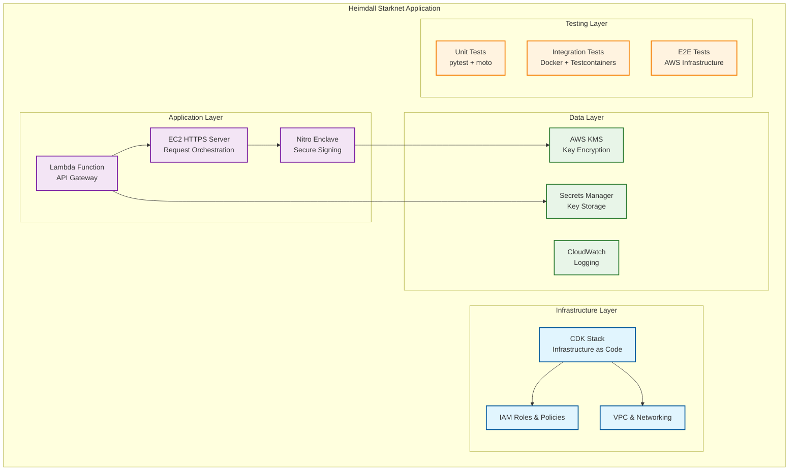
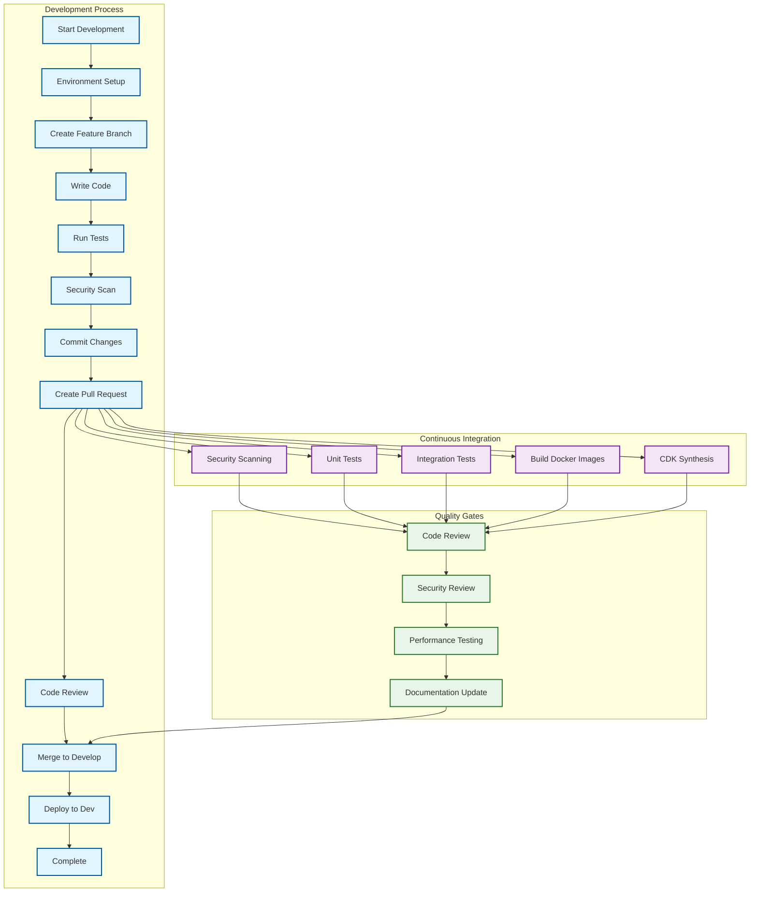

# Starknet AWS Nitro Enclaves Development Guide

A comprehensive guide for developing, testing, and deploying the Starknet AWS Nitro Enclaves secure wallet application.

## Table of Contents

1. [Development Environment Setup](#development-environment-setup)
2. [Project Structure & Architecture](#project-structure--architecture)
3. [Local Development Workflow](#local-development-workflow)
4. [Code Standards & Best Practices](#code-standards--best-practices)
5. [Testing Strategy](#testing-strategy)
6. [Dependency Management](#dependency-management)
7. [Build & Deployment Pipeline](#build--deployment-pipeline)
8. [Debugging & Profiling](#debugging--profiling)
9. [Contributing Guidelines](#contributing-guidelines)
10. [Development Tools & Utilities](#development-tools--utilities)

## Development Environment Setup

### Local Development Requirements

**System Dependencies:**
```bash
# AWS CLI v2
curl "https://awscli.amazonaws.com/awscli-exe-linux-x86_64.zip" -o "awscliv2.zip"
unzip awscliv2.zip && sudo ./aws/install

# Docker Engine
sudo apt-get update
sudo apt-get install docker.io docker-compose

# Node.js (for AWS CDK)
curl -fsSL https://deb.nodesource.com/setup_18.x | sudo -E bash -
sudo apt-get install -y nodejs

# AWS CDK v2
npm install -g aws-cdk@2.98.0
```

**Python Environment:**
```bash
# Python 3.8+ required
python3 --version  # Ensure >= 3.8

# Virtual environment setup
python3 -m venv venv
source venv/bin/activate  # Linux/macOS
# or
venv\Scripts\activate     # Windows

# Install dependencies
pip install --upgrade pip
pip install -r requirements.txt -r requirements-dev.txt
```

### AWS CLI Configuration for Testing

**Configure AWS Credentials:**
```bash
# For development environment
aws configure set aws_access_key_id YOUR_ACCESS_KEY
aws configure set aws_secret_access_key YOUR_SECRET_KEY
aws configure set default.region us-east-1

# Verify configuration
aws sts get-caller-identity
```

**Environment Variables:**
```bash
# Required for CDK deployment
export CDK_DEPLOY_REGION=us-east-1
export CDK_DEPLOY_ACCOUNT=$(aws sts get-caller-identity --query Account --output text)
export CDK_APPLICATION_TYPE=starknet
export CDK_PREFIX=dev

# Testing configuration
export AWS_DEFAULT_REGION=us-east-1
export LOG_LEVEL=DEBUG
export __DEV_MODE__=test
```

### Docker Development Setup

**Docker Configuration:**
```bash
# Enable Docker daemon
sudo systemctl start docker
sudo systemctl enable docker

# Add user to docker group (requires logout/login)
sudo usermod -aG docker $USER

# Verify Docker installation
docker --version
docker-compose --version
```

**Build Development Images:**
```bash
# Build Starknet server image
make docker-build-starknet-server

# Build Starknet enclave image
make docker-build-starknet-enclave

# Verify images
docker images | grep nitro-starknet
```

### IDE Configuration Recommendations

**Visual Studio Code Extensions:**
```json
{
  "recommendations": [
    "ms-python.python",
    "ms-python.flake8",
    "ms-python.black-formatter",
    "ms-python.isort",
    "ms-python.mypy-type-checker",
    "amazonwebservices.aws-toolkit-vscode",
    "ms-azuretools.vscode-docker",
    "ms-vscode.makefile-tools"
  ]
}
```

**VS Code Settings (`.vscode/settings.json`):**
```json
{
  "python.defaultInterpreterPath": "./venv/bin/python",
  "python.formatting.provider": "black",
  "python.linting.enabled": true,
  "python.linting.flake8Enabled": true,
  "python.linting.mypyEnabled": true,
  "python.testing.pytestEnabled": true,
  "python.testing.pytestArgs": ["tests"],
  "files.associations": {
    "*.yml": "yaml",
    "Dockerfile*": "dockerfile"
  }
}
```

**PyCharm Configuration:**
- Configure Python interpreter to `./venv/bin/python`
- Enable Black formatter in Tools → External Tools
- Configure pytest as default test runner
- Install AWS Toolkit plugin

## Project Structure & Architecture

### Code Organization and Patterns



### Module Dependencies and Relationships

**Core Application Structure:**
```
application/starknet/
├── lambda/
│   └── lambda_function.py     # API Gateway integration
├── server/
│   ├── app.py                 # HTTPS server implementation
│   ├── Dockerfile             # Server container configuration
│   └── requirements.txt       # Server dependencies
├── enclave/
│   ├── server.py              # Secure signing implementation
│   ├── Dockerfile             # Enclave container configuration
│   └── requirements.txt       # Enclave dependencies
└── user_data/
    └── user_data.sh           # EC2 initialization script
```

**Infrastructure Code:**
```
nitro_wallet/
├── __init__.py
├── nitro_wallet_stack.py      # Main CDK stack
├── nitro_https_web_server_stack.py
├── nitro_rds_integration_stack.py
├── nitro_socat_stack.py
└── nitro_wireguard_stack.py
```

**Testing Structure:**
```
tests/
├── conftest.py                # Shared test fixtures
├── factories.py               # Test data factories (Ethereum)
├── starknet_factories.py      # Test data factories (Starknet)
├── starknet_multiuser_factories.py  # Multi-user test scenarios
├── unit/                      # Unit tests with mocks
├── integration/               # Integration tests with Docker
└── pytest.ini               # pytest configuration
```

### Configuration Management

**Environment-Based Configuration:**
```python
# Environment variables for different deployment stages
DEVELOPMENT = {
    "LOG_LEVEL": "DEBUG",
    "REGION": "us-east-1",
    "CDK_PREFIX": "dev",
    "KMS_KEY_SPEC": "ECC_NIST_P256"
}

STAGING = {
    "LOG_LEVEL": "INFO", 
    "REGION": "us-east-1",
    "CDK_PREFIX": "staging",
    "KMS_KEY_SPEC": "ECC_NIST_P256"
}

PRODUCTION = {
    "LOG_LEVEL": "WARNING",
    "REGION": "us-east-1", 
    "CDK_PREFIX": "prod",
    "KMS_KEY_SPEC": "ECC_NIST_P256"
}
```

**CDK Configuration Pattern:**
```python
# app.py - Environment-driven stack deployment
prefix = os.getenv("CDK_PREFIX", "dev")
application_type = os.getenv("CDK_APPLICATION_TYPE", "starknet")

if application_type == "starknet":
    NitroWalletStack(
        app,
        f"{prefix}NitroWalletStarknet",
        params={"deployment": prefix, "application_type": application_type},
        env=Environment(
            region=os.environ.get("CDK_DEPLOY_REGION"),
            account=os.environ.get("CDK_DEPLOY_ACCOUNT")
        ),
    )
```

## Local Development Workflow

### Setting up Local Testing Environment

**Quick Start Commands:**
```bash
# Complete development setup
make setup-dev

# Install production dependencies only  
make install

# Validate configuration
make validate-config
```

**Manual Setup Steps:**
```bash
# 1. Clone and setup repository
git clone <repository-url>
cd heimdall
python3 -m venv venv
source venv/bin/activate

# 2. Install dependencies
pip install -r requirements.txt -r requirements-dev.txt

# 3. Setup pre-commit hooks
pre-commit install

# 4. Build kmstool for enclave operations
export CDK_APPLICATION_TYPE=starknet
./scripts/build_kmstool_enclave_cli.sh

# 5. Run tests to verify setup
make test-local
```

### Mock Services for AWS Dependencies

**Local AWS Service Mocking:**

The project uses `moto` for mocking AWS services during development:

```python
# conftest.py - AWS mocking setup
@pytest.fixture(scope="session") 
def aws_credentials():
    """Mock AWS credentials for testing."""
    os.environ["AWS_ACCESS_KEY_ID"] = "testing"
    os.environ["AWS_SECRET_ACCESS_KEY"] = "testing"
    os.environ["AWS_SECURITY_TOKEN"] = "testing"
    os.environ["AWS_SESSION_TOKEN"] = "testing"
    os.environ["AWS_DEFAULT_REGION"] = "us-east-1"

@pytest.fixture
def mock_kms_client():
    """Mock KMS client for testing."""
    with mock_aws():
        yield boto3.client("kms", region_name="us-east-1")
```

**Testing with Mock Services:**
```bash
# Run tests with AWS service mocks
pytest -m "unit and aws" -v

# Run tests without AWS dependencies
pytest -m "unit and not aws" -v

# Run specific Starknet tests
pytest -m starknet -v
```

### Local Docker Container Development

**Container-Based Development:**
```bash
# Build and test containers locally
docker build -t starknet-server ./application/starknet/server/
docker build -t starknet-enclave ./application/starknet/enclave/

# Run containers in development mode
docker run -p 443:443 \
  -e REGION=us-east-1 \
  -e LOG_LEVEL=DEBUG \
  starknet-server

# Test container networking
docker network create nitro-dev
docker run --network nitro-dev --name server starknet-server
docker run --network nitro-dev --name enclave starknet-enclave
```

**Docker Compose for Local Development:**
```yaml
# docker-compose.dev.yml
version: '3.8'
services:
  starknet-server:
    build: ./application/starknet/server/
    ports:
      - "443:443"
    environment:
      - REGION=us-east-1
      - LOG_LEVEL=DEBUG
    volumes:
      - ./certs:/etc/pki/tls/certs
      
  starknet-enclave:
    build: ./application/starknet/enclave/
    environment:
      - REGION=us-east-1
    depends_on:
      - starknet-server
```

### Debugging Techniques and Tools

**Python Debugging:**
```python
# Using pdb for interactive debugging
import pdb; pdb.set_trace()

# Using logging for runtime debugging
import logging
logging.basicConfig(level=logging.DEBUG)
logger = logging.getLogger(__name__)
logger.debug("Debug message with context", extra={"user_id": user_id})
```

**AWS Debugging Tools:**
```bash
# CloudWatch logs for Lambda
aws logs tail /aws/lambda/starknet-wallet --follow

# EC2 instance debugging
aws ec2 describe-instances --filters "Name=tag:Application,Values=starknet-wallet"
aws ssm start-session --target i-1234567890abcdef0

# KMS debugging
aws kms describe-key --key-id alias/starknet-wallet-key
aws kms get-key-policy --key-id alias/starknet-wallet-key --policy-name default
```

**Enclave Debugging:**
```bash
# Check enclave status
sudo nitro-cli describe-enclaves

# View enclave console output
sudo nitro-cli console --enclave-id i-1234567890abcdef0-enc-1234567890abcdef0

# Get enclave measurements
sudo nitro-cli get-attestation-document --enclave-id <enclave-id>
```

## Code Standards & Best Practices

### Python Coding Standards

**Code Formatting:**
```bash
# Format code with Black
black .

# Sort imports with isort
isort .

# Check formatting (used in CI)
black --check .
isort --check-only .
```

**Linting and Type Checking:**
```bash
# Run all linting tools
make lint

# Individual tools
flake8 .                           # Style guide enforcement
pylint nitro_wallet/ application/  # Code quality analysis
mypy nitro_wallet/                 # Static type checking
```

**Code Style Configuration (`.flake8`):**
```ini
[flake8]
max-line-length = 88
extend-ignore = E203, W503
exclude = 
    .git,
    __pycache__,
    venv,
    .venv,
    build,
    dist
```

### Security Coding Practices

**Secure Key Handling:**
```python
# ✅ Good: Secure memory cleanup
try:
    private_key = decrypt_key(encrypted_key)
    signature = sign_transaction(private_key, transaction)
    return signature
finally:
    # Overwrite sensitive data
    if 'private_key' in locals():
        private_key = "0" * len(private_key)
        del private_key
```

**Input Validation:**
```python
# ✅ Good: Comprehensive validation
def validate_starknet_address(address: str) -> str:
    """Validate and normalize Starknet address."""
    if not isinstance(address, str):
        raise ValueError("Address must be a string")
    
    # Normalize hex format
    if not address.startswith("0x"):
        address = "0x" + address
    
    # Validate hex format
    try:
        int(address, 16)
    except ValueError:
        raise ValueError("Invalid address format")
    
    return address
```

**Error Handling Patterns:**
```python
# ✅ Good: Comprehensive error handling
try:
    result = aws_operation()
except ClientError as e:
    error_code = e.response['Error']['Code']
    if error_code == 'AccessDenied':
        logger.error("AWS access denied", extra={"operation": "kms_decrypt"})
        raise SecurityError("Access denied")
    elif error_code == 'KeyUnavailableException':
        logger.error("KMS key unavailable")
        raise ServiceUnavailableError("Encryption service unavailable")
    else:
        logger.error("Unexpected AWS error", extra={"error_code": error_code})
        raise InternalError("Service error")
```

### Logging and Monitoring Practices

**Structured Logging:**
```python
# ✅ Good: Structured logging with security considerations
import logging
import json

class SecurityRedactingFormatter(logging.Formatter):
    """Custom formatter that redacts sensitive information."""
    
    REDACTED_FIELDS = {'private_key', 'secret', 'token', 'password'}
    
    def format(self, record):
        # Redact sensitive fields from log messages
        if hasattr(record, 'extra'):
            for field in self.REDACTED_FIELDS:
                if field in record.extra:
                    record.extra[field] = '[REDACTED]'
        return super().format(record)

# Usage
logger = logging.getLogger(__name__)
logger.info("Transaction signed", extra={
    "transaction_hash": tx_hash,
    "contract_address": contract_addr,
    "private_key": private_key  # Will be redacted
})
```

**Monitoring Integration:**
```python
# CloudWatch metrics integration
import boto3

def emit_custom_metric(metric_name: str, value: float, unit: str = 'Count'):
    """Emit custom CloudWatch metric."""
    cloudwatch = boto3.client('cloudwatch')
    cloudwatch.put_metric_data(
        Namespace='Starknet/Wallet',
        MetricData=[{
            'MetricName': metric_name,
            'Value': value,
            'Unit': unit,
            'Timestamp': datetime.utcnow()
        }]
    )

# Usage
emit_custom_metric('TransactionsSignedPerMinute', 1)
emit_custom_metric('EncryptionLatency', encryption_time_ms, 'Milliseconds')
```

### Documentation Standards

**Docstring Standards:**
```python
def sign_starknet_transaction(
    private_key: str,
    contract_address: str,
    function_name: str,
    calldata: List[str],
    max_fee: str,
    nonce: int,
    chain_id: str
) -> Dict[str, Any]:
    """
    Sign a Starknet transaction using the provided private key.
    
    This function performs secure transaction signing within the Nitro Enclave
    environment, ensuring that private keys never exist in plaintext outside
    the secure enclave boundary.
    
    Args:
        private_key: Hex-encoded Starknet private key (STARK curve)
        contract_address: Target contract address (hex format)
        function_name: Contract function to invoke
        calldata: List of function arguments (hex strings)
        max_fee: Maximum transaction fee (hex string)
        nonce: Account nonce for transaction ordering
        chain_id: Target Starknet chain ('mainnet', 'testnet', 'testnet2')
    
    Returns:
        Dictionary containing:
        - transaction_signed: Hex-encoded signature (r,s components)
        - transaction_hash: Hex-encoded transaction hash
        - contract_address: Normalized contract address
        - function_name: Invoked function name
        - success: Boolean indicating operation success
    
    Raises:
        ValueError: If input parameters are invalid
        SecurityError: If key decryption fails
        NetworkError: If Starknet RPC communication fails
        
    Example:
        >>> result = sign_starknet_transaction(
        ...     private_key="0x123...",
        ...     contract_address="0x456...",
        ...     function_name="transfer",
        ...     calldata=["0x789...", "1000", "0"],
        ...     max_fee="0x1000000000000",
        ...     nonce=0,
        ...     chain_id="testnet"
        ... )
        >>> print(result['success'])
        True
    """
```

## Testing Strategy

### Unit Testing Approach

**Test Structure and Organization:**
```bash
tests/
├── unit/                          # Fast, isolated tests
│   ├── test_lambda_function.py    # Lambda logic tests
│   ├── test_server_app.py         # Server logic tests
│   └── test_enclave_server.py     # Enclave logic tests (mocked)
├── integration/                   # Component interaction tests
│   ├── test_docker_containers.py # Container integration
│   └── test_starknet_basic.py     # End-to-end flow
└── conftest.py                   # Shared fixtures and setup
```

**Unit Test Examples:**
```python
# tests/unit/test_starknet_validation.py
import pytest
from application.starknet.lambda_function import validate_starknet_private_key

class TestStarknetValidation:
    """Test Starknet-specific validation functions."""
    
    def test_valid_private_key_formats(self):
        """Test that valid private keys are accepted."""
        valid_keys = [
            "0x0123456789abcdef0123456789abcdef0123456789abcdef0123456789abcdef",
            "0x1111111111111111111111111111111111111111111111111111111111111111",
            "0x7fffffffffffffffffffffffffffffffffffffffffffffffffffffffffffffff"
        ]
        
        for key in valid_keys:
            assert validate_starknet_private_key(key) is True
    
    def test_invalid_private_key_formats(self):
        """Test that invalid private keys are rejected."""
        invalid_keys = [
            "0x0",  # Zero
            "0x800000000000010FFFFFFFFFFFFFFFFB781126DCAE7B2321E66A241ADC64D2F",  # Order
            "invalid_key",  # Not hex
            "123456"  # Missing 0x prefix
        ]
        
        for key in invalid_keys:
            with pytest.raises(ValueError):
                validate_starknet_private_key(key)
```

### Integration Testing Setup

**Docker-Based Integration Tests:**
```python
# tests/integration/test_starknet_basic.py
import pytest
import docker
from testcontainers.core.container import DockerContainer

@pytest.mark.integration
@pytest.mark.docker
class TestStarknetDockerIntegration:
    """Integration tests using Docker containers."""
    
    @pytest.fixture(scope="class")
    def starknet_server_container(self):
        """Start Starknet server container for testing."""
        container = DockerContainer("nitro-starknet-server:latest")
        container.with_exposed_ports(443)
        container.with_env("REGION", "us-east-1")
        container.with_env("LOG_LEVEL", "DEBUG")
        
        with container:
            yield container
    
    def test_server_health_check(self, starknet_server_container):
        """Test that server container starts and responds."""
        port = starknet_server_container.get_exposed_port(443)
        host = starknet_server_container.get_container_host_ip()
        
        # Test health endpoint
        response = requests.get(
            f"https://{host}:{port}/health",
            verify=False,  # Self-signed cert in test
            timeout=30
        )
        assert response.status_code == 200
```

### Security Testing Procedures

**Security Test Categories:**
```bash
# Security scanning with bandit
make security-scan

# Dependency vulnerability scanning
pip-audit

# Container security scanning
docker run --rm -v /var/run/docker.sock:/var/run/docker.sock \
  -v $(pwd):/workspace \
  aquasec/trivy image nitro-starknet-enclave:latest
```

**Cryptographic Testing:**
```python
# tests/unit/test_starknet_crypto.py
import pytest
from starknet_py.net.signer.stark_curve_signer import StarkCurveSigner

@pytest.mark.crypto
class TestStarknetCryptography:
    """Test Starknet cryptographic operations."""
    
    def test_stark_curve_signing(self, test_starknet_private_key):
        """Test STARK curve signature generation."""
        private_key_int = int(test_starknet_private_key, 16)
        
        signer = StarkCurveSigner(
            account_address=0x123,
            key_pair=private_key_int,
            chain_id=StarknetChainId.TESTNET
        )
        
        # Test message signing
        message_hash = 0x456789abcdef
        signature = signer.sign(message_hash)
        
        assert len(signature) == 2  # r, s components
        assert isinstance(signature[0], int)
        assert isinstance(signature[1], int)
        assert signature[0] > 0
        assert signature[1] > 0
```

### Performance Testing Guidelines

**Load Testing Setup:**
```python
# tests/performance/test_starknet_load.py
import pytest
import asyncio
from concurrent.futures import ThreadPoolExecutor
import time

@pytest.mark.slow
@pytest.mark.performance
class TestStarknetPerformance:
    """Performance and load testing."""
    
    def test_signing_throughput(self, starknet_signing_service):
        """Test transaction signing throughput."""
        num_transactions = 100
        start_time = time.time()
        
        with ThreadPoolExecutor(max_workers=10) as executor:
            futures = []
            for i in range(num_transactions):
                future = executor.submit(
                    starknet_signing_service.sign_transaction,
                    transaction_payload=self.generate_test_transaction()
                )
                futures.append(future)
            
            # Wait for all transactions to complete
            results = [future.result() for future in futures]
        
        end_time = time.time()
        duration = end_time - start_time
        throughput = num_transactions / duration
        
        assert all(result['success'] for result in results)
        assert throughput > 10  # Minimum 10 transactions per second
        
        print(f"Throughput: {throughput:.2f} transactions/second")
```

### Test Data Management

**Test Factories for Starknet:**
```python
# tests/starknet_factories.py
import factory
from factory import fuzzy
import secrets

class StarknetPrivateKeyFactory(factory.Factory):
    """Factory for generating valid Starknet private keys."""
    
    class Meta:
        model = str
    
    @factory.LazyFunction
    def private_key():
        # Generate cryptographically secure random key within STARK curve order
        stark_order = 0x800000000000010FFFFFFFFFFFFFFFFB781126DCAE7B2321E66A241ADC64D2F
        key = secrets.randbelow(stark_order - 1) + 1
        return f"0x{key:064x}"

class StarknetTransactionFactory(factory.Factory):
    """Factory for generating Starknet transaction payloads."""
    
    class Meta:
        model = dict
    
    contract_address = factory.LazyFunction(
        lambda: f"0x{secrets.randbits(251):063x}"
    )
    function_name = factory.fuzzy.FuzzyChoice([
        "transfer", "approve", "mint", "burn", "swap"
    ])
    calldata = factory.LazyFunction(
        lambda: [f"0x{secrets.randbits(251):063x}" for _ in range(3)]
    )
    max_fee = "0x1000000000000"
    nonce = factory.fuzzy.FuzzyInteger(0, 1000)
    chain_id = factory.fuzzy.FuzzyChoice(["mainnet", "testnet", "testnet2"])
```

## Dependency Management

### Python Requirements Analysis

**Core Dependencies:**
```python
# requirements.txt - Production dependencies
aws-cdk-lib==2.98.0          # Infrastructure as Code
constructs==10.1.271          # CDK constructs
boto3>=1.28.0                 # AWS SDK
cdk-nag==2.27.88             # CDK security scanning

# Application-specific
starknet-py==0.21.0          # Starknet blockchain integration (enclave)
starknet-py==0.24.2          # Starknet integration (tests - newer version)
```

**Development Dependencies:**
```python
# requirements-dev.txt - Development and testing
black==24.3.0                # Code formatting
bandit==1.7.5                # Security linting
pytest>=7.4.0               # Testing framework
pytest-cov>=4.1.0           # Coverage reporting
pytest-asyncio>=0.21.0      # Async testing
pytest-mock>=3.11.0         # Mock utilities
moto[kms,secretsmanager,ec2,autoscaling]>=4.2.0  # AWS mocking
testcontainers>=3.7.0       # Docker integration testing
mypy>=1.5.0                 # Static type checking
pylint>=3.0.0               # Code quality
pre-commit>=3.4.0           # Git hooks
```

**Version Pinning Strategy:**
- **Exact versions** for critical security dependencies (boto3, cryptographic libraries)
- **Compatible versions** (`>=`) for development tools that need flexibility
- **Separate versions** for different environments (enclave vs test environments)

### Docker Base Image Selection

**Enclave Image (Security-First):**
```dockerfile
# application/starknet/enclave/Dockerfile
FROM amazonlinux:2

# Minimal package installation for security
RUN yum install gcc python3 python3-devel net-tools -y

# Security: Remove package manager after installation
RUN yum clean all && rm -rf /var/cache/yum
```

**Server Image (Standard Python):**
```dockerfile
# application/starknet/server/Dockerfile  
FROM python:3.8

# Standard Python environment for HTTP server
WORKDIR /usr/src/app
```

**Image Security Considerations:**
- Use official base images from trusted sources
- Minimize package installation surface area
- Regular base image updates through automated CI/CD
- Vulnerability scanning in pipeline

### AWS SDK Version Management

**Boto3 Version Strategy:**
```python
# Different environments may require different boto3 versions
BOTO3_VERSIONS = {
    "enclave": "boto3==1.17.103",     # Tested stable version for enclave
    "server": "boto3==1.17.103",     # Match enclave version
    "lambda": "boto3>=1.28.0",       # Latest for Lambda runtime
    "development": "boto3>=1.28.0"    # Latest for development
}
```

**Version Compatibility Testing:**
```bash
# Test with multiple boto3 versions
pip install boto3==1.17.103
pytest tests/unit/test_aws_integration.py

pip install boto3==1.28.0  
pytest tests/unit/test_aws_integration.py
```

### Security Dependency Scanning

**Automated Vulnerability Scanning:**
```bash
# Package vulnerability scanning
pip-audit --requirement requirements.txt --requirement requirements-dev.txt

# Container vulnerability scanning
docker run --rm -v $(pwd):/workspace aquasec/trivy fs /workspace

# Python security linting
bandit -r nitro_wallet/ application/ -f json -o bandit-report.json
```

**Pre-commit Security Hooks:**
```yaml
# .pre-commit-config.yaml
repos:
  - repo: https://github.com/PyCQA/bandit
    rev: '1.7.5'
    hooks:
      - id: bandit
        args: ['-r', 'nitro_wallet/', 'application/', '--skip', 'B101']
  
  - repo: https://github.com/pypa/pip-audit
    rev: 'v2.6.1'
    hooks:
      - id: pip-audit
        args: ['--requirement', 'requirements.txt']
```

## Build & Deployment Pipeline

### CI/CD Pipeline Setup

**GitHub Actions Workflow:**
```yaml
# .github/workflows/starknet-ci.yml
name: Starknet CI/CD Pipeline

on:
  push:
    branches: [main, develop]
    paths: ['application/starknet/**', 'nitro_wallet/**', 'tests/**']
  pull_request:
    branches: [main]

env:
  CDK_APPLICATION_TYPE: starknet
  AWS_DEFAULT_REGION: us-east-1

jobs:
  security-scan:
    runs-on: ubuntu-latest
    steps:
      - uses: actions/checkout@v4
      - name: Set up Python
        uses: actions/setup-python@v4
        with:
          python-version: '3.8'
      
      - name: Install dependencies
        run: |
          pip install -r requirements-dev.txt
      
      - name: Security scan with bandit
        run: bandit -r nitro_wallet/ application/ -f json -o bandit-report.json
      
      - name: Upload security report
        uses: actions/upload-artifact@v3
        with:
          name: security-report
          path: bandit-report.json

  unit-tests:
    runs-on: ubuntu-latest
    strategy:
      matrix:
        python-version: ['3.8', '3.9', '3.10']
    
    steps:
      - uses: actions/checkout@v4
      - name: Set up Python ${{ matrix.python-version }}
        uses: actions/setup-python@v4
        with:
          python-version: ${{ matrix.python-version }}
      
      - name: Install dependencies
        run: |
          pip install -r requirements.txt -r requirements-dev.txt
      
      - name: Run unit tests
        run: |
          pytest -m "unit and not integration" --cov=nitro_wallet --cov=application
      
      - name: Upload coverage reports
        uses: codecov/codecov-action@v3

  integration-tests:
    runs-on: ubuntu-latest
    services:
      docker:
        image: docker:dind
        options: --privileged
    
    steps:
      - uses: actions/checkout@v4
      - name: Set up Python
        uses: actions/setup-python@v4
        with:
          python-version: '3.8'
      
      - name: Build Docker images
        run: |
          docker build -t nitro-starknet-server ./application/starknet/server/
          docker build -t nitro-starknet-enclave ./application/starknet/enclave/
      
      - name: Run integration tests
        run: |
          pip install -r requirements-dev.txt
          pytest -m integration -v

  cdk-synth:
    runs-on: ubuntu-latest
    steps:
      - uses: actions/checkout@v4
      - name: Set up Node.js
        uses: actions/setup-node@v3
        with:
          node-version: '18'
      
      - name: Install CDK
        run: npm install -g aws-cdk@2.98.0
      
      - name: Set up Python
        uses: actions/setup-python@v4
        with:
          python-version: '3.8'
      
      - name: Install Python dependencies
        run: pip install -r requirements.txt
      
      - name: CDK synth
        run: |
          export CDK_APPLICATION_TYPE=starknet
          cdk synth
      
      - name: Upload CDK templates
        uses: actions/upload-artifact@v3
        with:
          name: cdk-templates
          path: cdk.out/
```

### Docker Build Optimization

**Multi-stage Build Pattern:**
```dockerfile
# Optimized Dockerfile for production
FROM python:3.8-slim as builder

# Install build dependencies
RUN apt-get update && apt-get install -y \
    gcc \
    python3-dev \
    && rm -rf /var/lib/apt/lists/*

# Install Python dependencies
COPY requirements.txt .
RUN pip install --user --no-cache-dir -r requirements.txt

# Production stage
FROM python:3.8-slim

# Copy installed packages from builder
COPY --from=builder /root/.local /root/.local
ENV PATH=/root/.local/bin:$PATH

# Copy application code
WORKDIR /usr/src/app
COPY app.py .

# Security: Run as non-root user
RUN groupadd -r appuser && useradd -r -g appuser appuser
USER appuser

CMD ["python", "./app.py"]
```

**Image Size Optimization:**
```bash
# Build optimized images
docker build --target production -t nitro-starknet-server:optimized .

# Check image sizes
docker images | grep nitro-starknet

# Layer analysis
docker history nitro-starknet-server:optimized
```

### Automated Testing Integration

**Test Automation in Pipeline:**
```bash
# Makefile targets for CI/CD
ci-setup: ## Setup for CI environment
	pip install --upgrade pip
	pip install -r requirements.txt -r requirements-dev.txt

ci-test: ## Run tests for CI pipeline
	pytest --junitxml=junit.xml --cov-report=xml

ci-security: ## Run security checks
	bandit -r nitro_wallet/ application/ -f json -o bandit-report.json
	pip-audit --requirement requirements.txt --output-format json --output-file pip-audit-report.json

ci-build: ## Build and test Docker images
	docker build -t nitro-starknet-server:ci ./application/starknet/server/
	docker build -t nitro-starknet-enclave:ci ./application/starknet/enclave/
	docker run --rm nitro-starknet-server:ci python -c "import app; print('Server image OK')"
```

### Security Scanning in Pipeline

**Container Security Pipeline:**
```yaml
# Security scanning job
container-security:
  runs-on: ubuntu-latest
  steps:
    - name: Build images
      run: |
        docker build -t starknet-server ./application/starknet/server/
        docker build -t starknet-enclave ./application/starknet/enclave/
    
    - name: Run Trivy vulnerability scanner
      uses: aquasecurity/trivy-action@master
      with:
        image-ref: 'starknet-server'
        format: 'sarif'
        output: 'trivy-results.sarif'
    
    - name: Upload Trivy scan results
      uses: github/codeql-action/upload-sarif@v2
      with:
        sarif_file: 'trivy-results.sarif'
    
    - name: Scan for secrets
      uses: trufflesecurity/trufflehog@main
      with:
        path: ./
        base: main
        head: HEAD
```

### Deployment Automation

**CDK Deployment Pipeline:**
```bash
# Deploy to development environment
deploy-dev-starknet: ## Deploy Starknet to development environment
	@echo "Deploying Starknet to development environment..."
	export CDK_DEPLOY_REGION=us-east-1 && \
	export CDK_DEPLOY_ACCOUNT=$$(aws sts get-caller-identity --query Account --output text) && \
	export CDK_APPLICATION_TYPE=starknet && \
	export CDK_PREFIX=dev && \
	./scripts/build_kmstool_enclave_cli.sh && \
	pytest -m "unit and not slow and not ethereum" && \
	cdk deploy devNitroWalletStarknet --require-approval never

# Production deployment with additional checks
deploy-prod-starknet:
	@echo "Deploying Starknet to production environment..."
	@./scripts/pre-production-checks.sh
	export CDK_PREFIX=prod && \
	export CDK_APPLICATION_TYPE=starknet && \
	cdk deploy prodNitroWalletStarknet --require-approval always
```

## Debugging & Profiling

### Local Debugging Setup

**VS Code Debug Configuration:**
```json
{
  "version": "0.2.0",
  "configurations": [
    {
      "name": "Debug Starknet Lambda",
      "type": "python",
      "request": "launch",
      "program": "${workspaceFolder}/application/starknet/lambda/lambda_function.py",
      "console": "integratedTerminal",
      "env": {
        "AWS_REGION": "us-east-1",
        "LOG_LEVEL": "DEBUG",
        "__DEV_MODE__": "test"
      },
      "args": []
    },
    {
      "name": "Debug Starknet Server",
      "type": "python", 
      "request": "launch",
      "program": "${workspaceFolder}/application/starknet/server/app.py",
      "console": "integratedTerminal",
      "env": {
        "REGION": "us-east-1",
        "LOG_LEVEL": "DEBUG"
      }
    },
    {
      "name": "Debug Tests",
      "type": "python",
      "request": "launch",
      "module": "pytest",
      "args": [
        "tests/unit/",
        "-v",
        "--tb=short"
      ],
      "console": "integratedTerminal"
    }
  ]
}
```

**Python Remote Debugging (for containers):**
```python
# For debugging inside Docker containers
import debugpy

# Enable remote debugging
debugpy.listen(("0.0.0.0", 5678))
print("Waiting for debugger attach...")
debugpy.wait_for_client()

# Your application code here
```

### Remote Debugging Techniques (Safe Methods)

**CloudWatch Logs Debugging:**
```python
# Enhanced logging for production debugging
import logging
import json
from datetime import datetime

class StructuredLogger:
    """Production-safe structured logger."""
    
    def __init__(self, name: str):
        self.logger = logging.getLogger(name)
        self.logger.setLevel(logging.INFO)
        
        handler = logging.StreamHandler()
        formatter = logging.Formatter(
            '%(asctime)s [%(levelname)s] %(name)s: %(message)s'
        )
        handler.setFormatter(formatter)
        self.logger.addHandler(handler)
    
    def debug_transaction(self, tx_hash: str, operation: str, **kwargs):
        """Log transaction debugging information."""
        log_data = {
            'timestamp': datetime.utcnow().isoformat(),
            'transaction_hash': tx_hash,
            'operation': operation,
            'metadata': kwargs
        }
        self.logger.info(f"Transaction debug: {json.dumps(log_data)}")

# Usage
logger = StructuredLogger('starknet.debug')
logger.debug_transaction(
    tx_hash=tx_hash,
    operation='sign_transaction',
    contract_address=contract_addr,
    function_name=function_name,
    processing_time_ms=processing_time
)
```

**AWS X-Ray Tracing:**
```python
# Add X-Ray tracing for distributed debugging
from aws_xray_sdk.core import xray_recorder

@xray_recorder.capture('starknet_sign_transaction')
def sign_transaction(transaction_payload):
    """Sign transaction with X-Ray tracing."""
    
    # Add metadata to X-Ray trace
    xray_recorder.put_metadata('starknet', {
        'contract_address': transaction_payload['contract_address'],
        'function_name': transaction_payload['function_name'],
        'chain_id': transaction_payload.get('chain_id', 'testnet')
    })
    
    try:
        result = perform_signing(transaction_payload)
        xray_recorder.put_annotation('success', True)
        return result
    except Exception as e:
        xray_recorder.put_annotation('success', False)
        xray_recorder.put_annotation('error_type', type(e).__name__)
        raise
```

### Performance Profiling

**Memory Profiling:**
```python
# Memory usage profiling
import tracemalloc
import psutil
import os

class MemoryProfiler:
    """Memory usage profiler for security-sensitive operations."""
    
    def __init__(self):
        self.process = psutil.Process(os.getpid())
        
    def start_profiling(self):
        """Start memory profiling."""
        tracemalloc.start()
        self.start_memory = self.process.memory_info().rss
        
    def stop_profiling(self):
        """Stop profiling and return statistics."""
        current, peak = tracemalloc.get_traced_memory()
        tracemalloc.stop()
        
        end_memory = self.process.memory_info().rss
        
        return {
            'tracemalloc_current': current,
            'tracemalloc_peak': peak,
            'rss_start': self.start_memory,
            'rss_end': end_memory,
            'rss_delta': end_memory - self.start_memory
        }

# Usage in signing operations
profiler = MemoryProfiler()
profiler.start_profiling()

try:
    result = sign_transaction(payload)
finally:
    memory_stats = profiler.stop_profiling()
    logger.info("Memory usage", extra=memory_stats)
```

**Performance Monitoring:**
```python
# Transaction timing profiler
import time
import statistics
from collections import defaultdict

class PerformanceMonitor:
    """Monitor performance of critical operations."""
    
    def __init__(self):
        self.timings = defaultdict(list)
    
    def time_operation(self, operation_name: str):
        """Context manager for timing operations."""
        return self.TimingContext(self, operation_name)
    
    class TimingContext:
        def __init__(self, monitor, operation_name):
            self.monitor = monitor
            self.operation_name = operation_name
            self.start_time = None
        
        def __enter__(self):
            self.start_time = time.perf_counter()
            return self
        
        def __exit__(self, exc_type, exc_val, exc_tb):
            duration = time.perf_counter() - self.start_time
            self.monitor.timings[self.operation_name].append(duration)
    
    def get_stats(self, operation_name: str):
        """Get performance statistics for an operation."""
        timings = self.timings[operation_name]
        if not timings:
            return None
        
        return {
            'count': len(timings),
            'mean': statistics.mean(timings),
            'median': statistics.median(timings),
            'std_dev': statistics.stdev(timings) if len(timings) > 1 else 0,
            'min': min(timings),
            'max': max(timings)
        }

# Usage
monitor = PerformanceMonitor()

with monitor.time_operation('kms_decrypt'):
    decrypted_key = kms_decrypt(encrypted_key)

with monitor.time_operation('starknet_sign'):
    signature = sign_with_starknet(decrypted_key, transaction)

# Log performance statistics
stats = monitor.get_stats('kms_decrypt')
logger.info("KMS decrypt performance", extra=stats)
```

### Memory Leak Detection

**Memory Leak Detection for Crypto Operations:**
```python
# Memory leak detector for cryptographic operations
import gc
import weakref
from typing import List, Any

class SecureMemoryTracker:
    """Track and detect potential memory leaks in cryptographic operations."""
    
    def __init__(self):
        self.tracked_objects: List[weakref.ref] = []
    
    def track_sensitive_object(self, obj: Any, name: str = None):
        """Track a sensitive object for potential leaks."""
        def cleanup_callback(ref):
            print(f"Sensitive object {name or 'unknown'} was garbage collected")
        
        ref = weakref.ref(obj, cleanup_callback)
        self.tracked_objects.append(ref)
        return obj
    
    def force_cleanup_and_check(self):
        """Force garbage collection and check for leaks."""
        # Force multiple garbage collection cycles
        for _ in range(3):
            gc.collect()
        
        # Check for leaked objects
        alive_objects = [ref for ref in self.tracked_objects if ref() is not None]
        
        if alive_objects:
            logger.warning(f"Potential memory leak: {len(alive_objects)} sensitive objects still in memory")
            return False
        return True

# Usage in enclave operations
tracker = SecureMemoryTracker()

try:
    private_key = tracker.track_sensitive_object(decrypt_key(encrypted_key), "private_key")
    signature = sign_transaction(private_key, transaction)
finally:
    # Explicit cleanup
    if 'private_key' in locals():
        private_key = "0" * len(private_key)
        del private_key
    
    # Check for leaks
    cleanup_success = tracker.force_cleanup_and_check()
    if not cleanup_success:
        logger.error("Memory leak detected in cryptographic operation")
```

### Security Vulnerability Assessment

**Runtime Security Monitoring:**
```python
# Runtime security monitoring
import hashlib
import time
from typing import Dict, Any

class SecurityMonitor:
    """Monitor security-relevant events and anomalies."""
    
    def __init__(self):
        self.operation_history = []
        self.anomaly_thresholds = {
            'max_operations_per_minute': 100,
            'max_consecutive_failures': 5
        }
    
    def log_security_event(self, event_type: str, details: Dict[str, Any]):
        """Log a security-relevant event."""
        event = {
            'timestamp': time.time(),
            'event_type': event_type,
            'details': details,
            'hash': self._compute_event_hash(event_type, details)
        }
        
        self.operation_history.append(event)
        self._check_for_anomalies(event)
    
    def _compute_event_hash(self, event_type: str, details: Dict[str, Any]) -> str:
        """Compute hash of event for integrity checking."""
        event_string = f"{event_type}:{sorted(details.items())}"
        return hashlib.sha256(event_string.encode()).hexdigest()
    
    def _check_for_anomalies(self, current_event: Dict[str, Any]):
        """Check for security anomalies."""
        now = time.time()
        recent_events = [
            e for e in self.operation_history 
            if now - e['timestamp'] < 60  # Last minute
        ]
        
        # Check rate limiting
        if len(recent_events) > self.anomaly_thresholds['max_operations_per_minute']:
            logger.warning("Potential DoS attack: Too many operations per minute")
        
        # Check for consecutive failures
        recent_failures = [
            e for e in recent_events[-5:] 
            if e['event_type'] == 'operation_failed'
        ]
        
        if len(recent_failures) >= self.anomaly_thresholds['max_consecutive_failures']:
            logger.error("Security alert: Multiple consecutive operation failures")

# Usage
security_monitor = SecurityMonitor()

try:
    result = sign_transaction(payload)
    security_monitor.log_security_event('transaction_signed', {
        'contract_address': payload['contract_address'],
        'success': True
    })
except Exception as e:
    security_monitor.log_security_event('operation_failed', {
        'error_type': type(e).__name__,
        'operation': 'sign_transaction'
    })
    raise
```

## Contributing Guidelines

### Code Review Process

**Pull Request Template:**
```markdown
## Pull Request Description

### Summary
Brief description of changes and their purpose.

### Changes Made
- [ ] Lambda function modifications
- [ ] Server application changes  
- [ ] Enclave security updates
- [ ] Infrastructure (CDK) changes
- [ ] Test additions/modifications
- [ ] Documentation updates

### Security Considerations
- [ ] No sensitive data in logs
- [ ] Proper input validation added
- [ ] Memory cleanup implemented
- [ ] Cryptographic operations reviewed

### Testing
- [ ] Unit tests pass locally
- [ ] Integration tests pass
- [ ] Security scan (bandit) passes
- [ ] Manual testing completed

### Deployment Impact
- [ ] No breaking changes
- [ ] Database migrations needed
- [ ] Configuration updates required
- [ ] Infrastructure changes needed

### Checklist
- [ ] Code follows project style guidelines
- [ ] Self-review completed
- [ ] Documentation updated
- [ ] Tests added for new functionality
- [ ] Security review completed
```

**Code Review Guidelines:**

1. **Security Review Priority:**
   - Review all cryptographic operations
   - Verify input validation and sanitization
   - Check for sensitive data in logs
   - Validate memory cleanup procedures

2. **Code Quality Checks:**
   - Adherence to Python style guidelines (Black, flake8)
   - Proper error handling and logging
   - Type hints and documentation
   - Test coverage for new code

3. **Architecture Consistency:**
   - Follows established patterns
   - Proper separation of concerns
   - AWS service integration best practices
   - Enclave security boundaries respected

### Git Workflow and Branching Strategy

**Branching Model:**
```
main                    # Production-ready code
├── develop             # Integration branch
├── feature/starknet-*  # Feature branches
├── hotfix/security-*   # Critical security fixes
└── release/v*.*.*      # Release preparation
```

**Git Workflow:**
```bash
# Feature development workflow
git checkout develop
git pull origin develop
git checkout -b feature/starknet-enhanced-validation

# Make changes, commit frequently
git add .
git commit -m "feat: add enhanced Starknet private key validation"

# Push and create pull request
git push origin feature/starknet-enhanced-validation

# After review and approval
git checkout develop
git pull origin develop
git merge --no-ff feature/starknet-enhanced-validation
git push origin develop

# Release workflow
git checkout -b release/v1.2.0
# Prepare release (version bumps, changelog)
git commit -m "chore: prepare release v1.2.0"
git checkout main
git merge --no-ff release/v1.2.0
git tag v1.2.0
git push origin main --tags
```

**Commit Message Convention:**
```
type(scope): description

feat(starknet): add support for Cairo 2.0 contracts
fix(enclave): resolve memory leak in key cleanup
docs(api): update Starknet integration examples
test(unit): add comprehensive validation tests
refactor(lambda): improve error handling structure
security(kms): update key rotation procedures
```

### Pull Request Templates

**Security-Focused PR Template:**
```markdown
## Security Impact Assessment

### Cryptographic Changes
- [ ] No new cryptographic implementations
- [ ] Uses established, audited libraries
- [ ] Proper key lifecycle management
- [ ] Secure memory handling implemented

### Data Protection
- [ ] No PII in logs or error messages
- [ ] Input validation for all user data
- [ ] Output sanitization implemented
- [ ] Secure data transmission

### Access Control
- [ ] Proper IAM permissions
- [ ] Least privilege principle followed
- [ ] No hardcoded credentials
- [ ] Audit trail maintained

### Attack Surface
- [ ] No new external endpoints
- [ ] Input surface area minimized  
- [ ] Error messages don't leak information
- [ ] Rate limiting considered
```

### Issue Reporting Guidelines

**Bug Report Template:**
```markdown
## Bug Report

### Environment
- **Component**: Lambda/Server/Enclave
- **Version**: v1.x.x
- **AWS Region**: us-east-1
- **Deployment Type**: Development/Staging/Production

### Description
Clear description of the bug and expected behavior.

### Steps to Reproduce
1. Step one
2. Step two
3. Step three

### Actual Result
What actually happened.

### Expected Result
What should have happened.

### Logs/Error Messages
```
[Paste relevant logs here - ensure no sensitive data]
```

### Additional Context
Any additional information that might be helpful.

### Security Considerations
- [ ] Bug does not expose sensitive data
- [ ] No security implications identified
- [ ] Potential security impact described
```

**Feature Request Template:**
```markdown
## Feature Request

### Summary
Brief description of the proposed feature.

### Use Case
Describe the problem this feature would solve.

### Proposed Solution
Detailed description of the proposed implementation.

### Security Considerations
- Impact on current security model
- New attack vectors introduced
- Mitigation strategies

### Implementation Complexity
- [ ] Low (< 1 week)
- [ ] Medium (1-4 weeks)  
- [ ] High (> 1 month)

### Dependencies
List any external dependencies or prerequisites.
```

### Security Disclosure Process

**Security Issue Reporting:**

1. **DO NOT** create public issues for security vulnerabilities
2. Send security reports to: [security@organization.com] 
3. Include:
   - Vulnerability description
   - Steps to reproduce
   - Potential impact assessment
   - Suggested mitigation

**Security Response Timeline:**
- **Acknowledgment**: Within 24 hours
- **Initial Assessment**: Within 72 hours
- **Fix Development**: Based on severity
- **Public Disclosure**: After fix deployment

**Severity Classification:**
- **Critical**: Remote code execution, privilege escalation
- **High**: Sensitive data exposure, authentication bypass
- **Medium**: Information disclosure, denial of service
- **Low**: Minor information leaks, non-security bugs

## Development Tools & Utilities

### Recommended Development Tools

**Essential Tools:**
```bash
# Code Quality Tools
pip install black isort flake8 mypy pylint bandit

# Testing Tools  
pip install pytest pytest-cov pytest-mock pytest-asyncio

# AWS Development Tools
pip install aws-cli awscli-local localstack

# Security Tools
pip install pip-audit safety detect-secrets

# Documentation Tools
pip install mkdocs mkdocs-material sphinx
```

**VS Code Extensions:**
```json
{
  "recommendations": [
    "ms-python.python",
    "ms-python.black-formatter",
    "ms-python.flake8", 
    "ms-python.mypy-type-checker",
    "amazonwebservices.aws-toolkit-vscode",
    "ms-azuretools.vscode-docker",
    "github.vscode-pull-request-github",
    "ms-vscode.makefile-tools",
    "redhat.vscode-yaml",
    "ms-vscode.vscode-json"
  ]
}
```

### Code Formatting and Linting

**Automated Code Formatting:**
```bash
# Format all Python code
make format

# Check formatting without changes
black --check .
isort --check-only .

# Manual formatting commands
black application/ nitro_wallet/ tests/
isort application/ nitro_wallet/ tests/
```

**Linting Configuration:**
```ini
# .flake8
[flake8]
max-line-length = 88
extend-ignore = E203, W503, E501
exclude = 
    .git,
    __pycache__,
    venv,
    .venv,
    build,
    dist,
    *.egg-info

# pyproject.toml
[tool.black]
line-length = 88
target-version = ['py38']
include = '\.pyi?$'

[tool.isort]
profile = "black"
multi_line_output = 3
line_length = 88
```

### Pre-commit Hooks Setup

**Pre-commit Configuration (`.pre-commit-config.yaml`):**
```yaml
repos:
  - repo: https://github.com/pre-commit/pre-commit-hooks
    rev: v4.4.0
    hooks:
      - id: trailing-whitespace
      - id: end-of-file-fixer
      - id: check-yaml
      - id: check-json
      - id: check-merge-conflict
      - id: check-added-large-files

  - repo: https://github.com/psf/black
    rev: 24.3.0
    hooks:
      - id: black
        language_version: python3

  - repo: https://github.com/pycqa/isort
    rev: 5.12.0
    hooks:
      - id: isort

  - repo: https://github.com/pycqa/flake8
    rev: 6.0.0
    hooks:
      - id: flake8

  - repo: https://github.com/PyCQA/bandit
    rev: 1.7.5
    hooks:
      - id: bandit
        args: ['-r', 'nitro_wallet/', 'application/', '--skip', 'B101']

  - repo: https://github.com/pre-commit/mirrors-mypy
    rev: v1.5.0
    hooks:
      - id: mypy
        additional_dependencies: [types-requests]
```

**Setup Pre-commit Hooks:**
```bash
# Install pre-commit
pip install pre-commit

# Install git hooks
pre-commit install

# Run on all files manually
pre-commit run --all-files
```

### Documentation Generation

**API Documentation with Sphinx:**
```bash
# Install documentation tools
pip install sphinx sphinx-autodoc-typehints sphinx-rtd-theme

# Initialize Sphinx documentation
sphinx-quickstart docs/

# Generate API documentation
sphinx-apidoc -o docs/source/ nitro_wallet/ application/

# Build HTML documentation
cd docs/
make html
```

**Markdown Documentation with MkDocs:**
```bash
# Install MkDocs
pip install mkdocs mkdocs-material

# Initialize MkDocs project
mkdocs new docs-site
cd docs-site

# Serve documentation locally
mkdocs serve

# Build static site
mkdocs build
```

### Dependency Security Scanning

**Automated Security Scanning:**
```bash
# Scan requirements for vulnerabilities
pip-audit --requirement requirements.txt --requirement requirements-dev.txt

# Alternative vulnerability scanner
safety check --requirement requirements.txt

# Scan for secrets in codebase
detect-secrets scan --all-files --baseline .secrets.baseline

# Update secrets baseline
detect-secrets scan --update .secrets.baseline
```

**Container Security Scanning:**
```bash
# Scan Docker images for vulnerabilities
docker run --rm -v /var/run/docker.sock:/var/run/docker.sock \
  -v $(pwd):/workspace \
  aquasec/trivy image nitro-starknet-enclave:latest

# Scan for misconfigurations
docker run --rm -v $(pwd):/workspace \
  aquasec/trivy config /workspace

# Scan filesystem for vulnerabilities
docker run --rm -v $(pwd):/workspace \
  aquasec/trivy fs /workspace
```

---

## Development Workflow Summary



This comprehensive development guide provides everything needed to contribute effectively to the Starknet AWS Nitro Enclaves project while maintaining the highest security and code quality standards. The guide emphasizes security-first development practices, comprehensive testing, and proper AWS cloud-native development patterns.

Remember to always prioritize security in every aspect of development, from initial design through deployment and maintenance. The sensitive nature of cryptographic key management requires constant vigilance and adherence to security best practices.