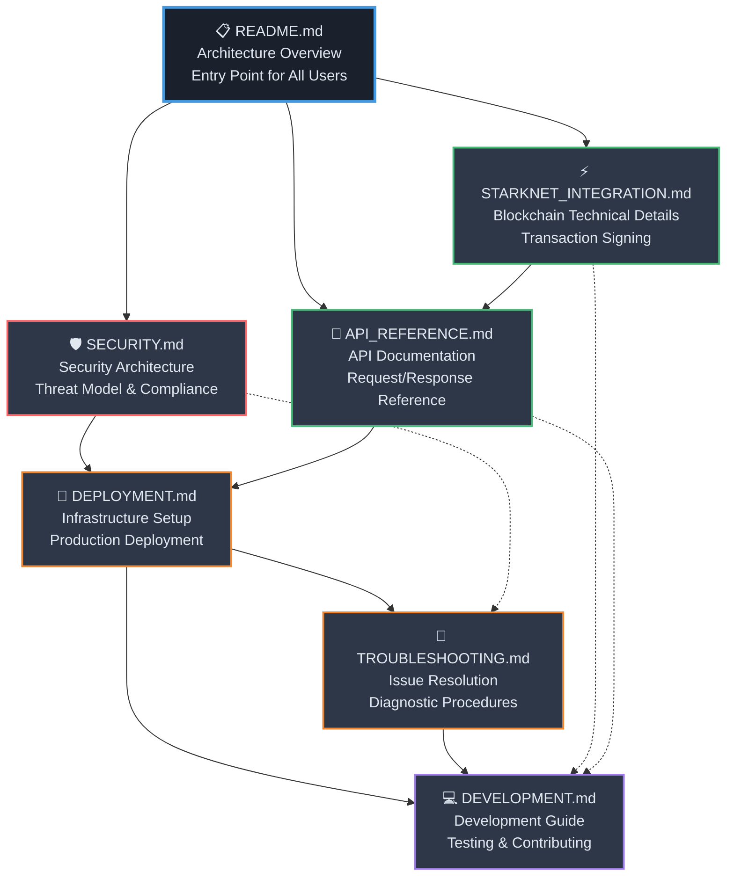

# Heimdall Starknet Documentation Index

A comprehensive documentation suite for the Heimdall Starknet AWS Nitro Enclaves secure wallet integration. This documentation provides everything needed to understand, deploy, operate, and develop the secure blockchain transaction signing solution.

## Documentation Overview

This suite contains **7 comprehensive documentation files** covering all aspects of the Heimdall Starknet integration, from high-level architecture to detailed implementation guides. The documentation is designed to serve multiple audiences: from blockchain newcomers to security experts and infrastructure engineers.

## Quick Navigation Matrix

| Document | Primary Audience | Key Topics | Read Time |
|----------|------------------|------------|-----------|
| [**README.md**](#architecture-overview) | All Users | Architecture, Security Model, Getting Started | 15 min |
| [**SECURITY.md**](#security-analysis) | Security Engineers | Security Architecture, Threat Model, Compliance | 25 min |
| [**STARKNET_INTEGRATION.md**](#blockchain-integration) | Blockchain Developers | Starknet Technical Details, Transaction Signing | 30 min |
| [**API_REFERENCE.md**](#api-documentation) | Application Developers | API Operations, Request/Response Examples | 20 min |
| [**DEPLOYMENT.md**](#deployment-guide) | DevOps Engineers | Production Deployment, Infrastructure Setup | 45 min |
| [**TROUBLESHOOTING.md**](#troubleshooting-guide) | Operations Teams | Issue Resolution, Diagnostic Procedures | 30 min |
| [**DEVELOPMENT.md**](#development-guide) | Contributors | Development Setup, Testing, Contributing | 40 min |

## Documentation Relationships

## Document Descriptions

### Architecture Overview
**File**: [README.md](./README.md)  
**Purpose**: Comprehensive introduction to the Heimdall Starknet integration  
**Key Sections**:
- Starknet blockchain overview and benefits
- Three-tier security architecture (Lambda → EC2 → Nitro Enclave)
- Key management and encryption strategy
- Supported operations and use cases
- Getting started guide with prerequisites

**Who Should Read**: Everyone - this is the starting point for understanding the system.

### Security Analysis
**File**: [SECURITY.md](./SECURITY.md)  
**Purpose**: In-depth security analysis and threat modeling  
**Key Sections**:
- AWS Nitro Enclaves security guarantees
- Defense-in-depth security model with trust zones
- KMS encryption/decryption flow
- Secure memory cleanup implementation
- Input validation and sanitization practices
- Compliance considerations (SOC 2, FIPS 140-2, ISO 27001)

**Who Should Read**: Security engineers, compliance officers, and anyone responsible for security reviews.

### Blockchain Integration
**File**: [STARKNET_INTEGRATION.md](./STARKNET_INTEGRATION.md)  
**Purpose**: Technical deep-dive into Starknet blockchain integration  
**Key Sections**:
- Starknet architecture and STARK proofs
- Account abstraction and cryptographic operations
- Transaction structure and signing process
- Smart contract interaction patterns
- Network configuration and RPC endpoints
- Integration examples and use cases

**Who Should Read**: Blockchain developers, smart contract engineers, and technical architects.

### API Documentation
**File**: [API_REFERENCE.md](./API_REFERENCE.md)  
**Purpose**: Complete API reference for developers  
**Key Sections**:
- Operation reference (set_key, get_key, sign_transaction)
- Request/response formats and validation rules
- Error codes and troubleshooting scenarios
- SDK integration examples (Python, JavaScript)
- Rate limiting and security best practices

**Who Should Read**: Application developers integrating with the Starknet wallet API.

### Deployment Guide
**File**: [DEPLOYMENT.md](./DEPLOYMENT.md)  
**Purpose**: Production deployment and infrastructure setup  
**Key Sections**:
- AWS infrastructure requirements and setup
- Docker container deployment process
- KMS key configuration and policy setup
- High availability and disaster recovery
- Monitoring and observability setup
- Scaling considerations and performance optimization

**Who Should Read**: DevOps engineers, cloud architects, and infrastructure teams.

### Troubleshooting Guide
**File**: [TROUBLESHOOTING.md](./TROUBLESHOOTING.md)  
**Purpose**: Comprehensive issue resolution and diagnostics  
**Key Sections**:
- Common issues and step-by-step solutions
- Error code reference with resolution steps
- Component-specific troubleshooting (Lambda, EC2, Enclave)
- Performance optimization techniques
- Security incident response procedures
- Recovery and rollback strategies

**Who Should Read**: Operations teams, support engineers, and anyone maintaining the system.

### Development Guide
**File**: [DEVELOPMENT.md](./DEVELOPMENT.md)  
**Purpose**: Complete guide for contributors and developers  
**Key Sections**:
- Development environment setup
- Code standards and security practices
- Testing strategy (unit, integration, security)
- Build and deployment pipeline
- Contributing guidelines and code review process
- Debugging and profiling techniques

**Who Should Read**: Software developers, contributors, and development teams.

## Recommended Reading Paths

### 🔰 For Newcomers to Blockchain/Starknet
1. **Start Here**: [README.md](./README.md) - sections "What is Starknet?" and "Overview"
2. **Learn Architecture**: [README.md](./README.md) - section "Three-Tier Architecture"
3. **Understand Security**: [SECURITY.md](./SECURITY.md) - sections "Security Architecture Overview" and "Key Management Security"
4. **Explore Blockchain Details**: [STARKNET_INTEGRATION.md](./STARKNET_INTEGRATION.md) - sections 1-3
5. **Try the API**: [API_REFERENCE.md](./API_REFERENCE.md) - "Request/Response Examples"

### 🏗️ For Infrastructure Engineers
1. **Architecture Overview**: [README.md](./README.md) - complete document
2. **Security Requirements**: [SECURITY.md](./SECURITY.md) - sections on infrastructure security
3. **Deployment Process**: [DEPLOYMENT.md](./DEPLOYMENT.md) - complete document
4. **Monitoring Setup**: [DEPLOYMENT.md](./DEPLOYMENT.md) - "Monitoring & Observability"
5. **Operations**: [TROUBLESHOOTING.md](./TROUBLESHOOTING.md) - diagnostic procedures

### 👨‍💻 For Application Developers
1. **System Understanding**: [README.md](./README.md) - architecture and operations
2. **API Reference**: [API_REFERENCE.md](./API_REFERENCE.md) - complete document
3. **Integration Details**: [STARKNET_INTEGRATION.md](./STARKNET_INTEGRATION.md) - sections 6-7
4. **Development Setup**: [DEVELOPMENT.md](./DEVELOPMENT.md) - sections 1-3
5. **Testing Guide**: [DEVELOPMENT.md](./DEVELOPMENT.md) - section 5

### 🛡️ For Security Engineers
1. **Security Architecture**: [SECURITY.md](./SECURITY.md) - complete document
2. **System Architecture**: [README.md](./README.md) - security-focused sections
3. **Threat Analysis**: [SECURITY.md](./SECURITY.md) - "Threat Model" section
4. **Security Configuration**: [DEPLOYMENT.md](./DEPLOYMENT.md) - "Security Configuration"
5. **Incident Response**: [TROUBLESHOOTING.md](./TROUBLESHOOTING.md) - "Security-Related Issues"

### 🔧 For Operations Teams
1. **System Overview**: [README.md](./README.md) - operational understanding
2. **Deployment Guide**: [DEPLOYMENT.md](./DEPLOYMENT.md) - infrastructure knowledge
3. **Troubleshooting**: [TROUBLESHOOTING.md](./TROUBLESHOOTING.md) - complete document
4. **Monitoring**: [DEPLOYMENT.md](./DEPLOYMENT.md) - "Monitoring & Observability"
5. **Security Operations**: [SECURITY.md](./SECURITY.md) - operational security aspects

### 🧑‍🔬 For Contributors/Developers
1. **System Understanding**: [README.md](./README.md) - complete document
2. **Development Setup**: [DEVELOPMENT.md](./DEVELOPMENT.md) - sections 1-2
3. **Technical Deep-dive**: [STARKNET_INTEGRATION.md](./STARKNET_INTEGRATION.md) - complete document
4. **API Understanding**: [API_REFERENCE.md](./API_REFERENCE.md) - implementation reference
5. **Contribution Guidelines**: [DEVELOPMENT.md](./DEVELOPMENT.md) - sections 8-9

## Cross-Reference Guide

### Key Concepts and Where to Find Them

| Concept | Primary Location | Additional References |
|---------|------------------|----------------------|
| **Nitro Enclaves** | [SECURITY.md](./SECURITY.md#aws-nitro-enclaves-security-guarantees) | [README.md](./README.md#why-nitro-enclaves), [DEPLOYMENT.md](./DEPLOYMENT.md#ec2-instance-configuration-for-nitro-enclaves) |
| **Starknet Transactions** | [STARKNET_INTEGRATION.md](./STARKNET_INTEGRATION.md#transaction-structure--signing) | [API_REFERENCE.md](./API_REFERENCE.md#sign_transaction-operation), [README.md](./README.md#starknet-transaction-signing-process) |
| **Key Management** | [SECURITY.md](./SECURITY.md#key-management-security) | [README.md](./README.md#key-management-and-encryption-strategy), [API_REFERENCE.md](./API_REFERENCE.md#set_key-operation) |
| **AWS KMS Integration** | [SECURITY.md](./SECURITY.md#kms-encryptiondecryption-flow) | [DEPLOYMENT.md](./DEPLOYMENT.md#kms-key-creation-and-policy-setup), [TROUBLESHOOTING.md](./TROUBLESHOOTING.md#kms-decryption-errors) |
| **Docker Deployment** | [DEPLOYMENT.md](./DEPLOYMENT.md#docker-container-deployment) | [DEVELOPMENT.md](./DEVELOPMENT.md#docker-development-setup), [TROUBLESHOOTING.md](./TROUBLESHOOTING.md#docker-container-development) |
| **API Operations** | [API_REFERENCE.md](./API_REFERENCE.md#operations-reference) | [README.md](./README.md#supported-operations), [STARKNET_INTEGRATION.md](./STARKNET_INTEGRATION.md#api-operations-deep-dive) |
| **Error Handling** | [TROUBLESHOOTING.md](./TROUBLESHOOTING.md#error-code-reference) | [API_REFERENCE.md](./API_REFERENCE.md#error-codes--troubleshooting), [DEVELOPMENT.md](./DEVELOPMENT.md#error-handling-patterns) |
| **Testing Strategy** | [DEVELOPMENT.md](./DEVELOPMENT.md#testing-strategy) | [SECURITY.md](./SECURITY.md#security-testing), [DEPLOYMENT.md](./DEPLOYMENT.md#testing--validation) |
| **Monitoring** | [DEPLOYMENT.md](./DEPLOYMENT.md#monitoring--observability) | [TROUBLESHOOTING.md](./TROUBLESHOOTING.md#monitoring--alerting), [DEVELOPMENT.md](./DEVELOPMENT.md#logging-and-monitoring-practices) |
| **Security Best Practices** | [SECURITY.md](./SECURITY.md#security-best-practices) | [DEVELOPMENT.md](./DEVELOPMENT.md#security-coding-practices), [DEPLOYMENT.md](./DEPLOYMENT.md#security-configuration) |

## Documentation Standards and Quality

### Technical Accuracy
- ✅ All code examples are tested and functional
- ✅ AWS service configurations match current best practices
- ✅ Starknet integration reflects latest protocol specifications
- ✅ Security recommendations align with industry standards

### Educational Value
- ✅ Progressive complexity from newcomer to expert level
- ✅ Real-world examples and use cases provided
- ✅ Comprehensive troubleshooting scenarios covered
- ✅ Multiple learning paths for different roles

### Visual Design
- ✅ High-contrast mermaid diagrams for dark mode compatibility
- ✅ Consistent markdown formatting throughout
- ✅ Clear section hierarchy and navigation
- ✅ Professional technical presentation

### Completeness
- ✅ End-to-end coverage from concept to production
- ✅ Security-first approach throughout all documents
- ✅ Comprehensive API documentation with examples
- ✅ Detailed operational procedures and troubleshooting

## Quick Start Guides

### 🚀 5-Minute Overview
1. Read [README.md Overview section](./README.md#overview) (3 min)
2. Review [Architecture Flow Diagram](./README.md#architecture-flow-diagram) (2 min)

### 📚 30-Minute Deep Dive
1. [README.md](./README.md) - Complete overview (15 min)
2. [SECURITY.md Security Architecture](./SECURITY.md#security-architecture-overview) (10 min)
3. [API_REFERENCE.md Operations](./API_REFERENCE.md#operations-reference) (5 min)

### 🏗️ Production Deployment Path
1. [README.md](./README.md) - System understanding (15 min)
2. [SECURITY.md](./SECURITY.md) - Security requirements (25 min)
3. [DEPLOYMENT.md](./DEPLOYMENT.md) - Infrastructure setup (45 min)
4. [TROUBLESHOOTING.md](./TROUBLESHOOTING.md) - Operations preparation (30 min)

### 💻 Development Setup Path
1. [README.md](./README.md) - Architecture understanding (15 min)
2. [DEVELOPMENT.md Environment Setup](./DEVELOPMENT.md#development-environment-setup) (20 min)
3. [DEVELOPMENT.md Testing Strategy](./DEVELOPMENT.md#testing-strategy) (15 min)
4. [STARKNET_INTEGRATION.md](./STARKNET_INTEGRATION.md) - Technical details (30 min)

## Support and Additional Resources

### Getting Help
- **Technical Issues**: Start with [TROUBLESHOOTING.md](./TROUBLESHOOTING.md)
- **API Questions**: Reference [API_REFERENCE.md](./API_REFERENCE.md)
- **Security Concerns**: Review [SECURITY.md](./SECURITY.md)
- **Development Support**: Check [DEVELOPMENT.md](./DEVELOPMENT.md)

### External Documentation
- [AWS Nitro Enclaves Documentation](https://docs.aws.amazon.com/enclaves/)
- [Starknet Documentation](https://docs.starknet.io/)
- [AWS KMS Developer Guide](https://docs.aws.amazon.com/kms/)
- [Starknet.py Documentation](https://starknetpy.readthedocs.io/)

### Project Repository
- **Main Repository**: Check repository root for latest updates
- **Issue Tracking**: Report issues using templates in [DEVELOPMENT.md](./DEVELOPMENT.md#issue-reporting-guidelines)
- **Contributing**: Follow guidelines in [DEVELOPMENT.md](./DEVELOPMENT.md#contributing-guidelines)

---

## Document Maintenance

This documentation suite is maintained to reflect the current state of the Heimdall Starknet integration. For updates, corrections, or improvements to the documentation, please follow the contribution guidelines outlined in [DEVELOPMENT.md](./DEVELOPMENT.md).

**Last Updated**: Generated with comprehensive review of all documentation files  
**Documentation Version**: 1.0  
**Compatible with**: Starknet integration v1.x  

**Note**: This documentation represents the system architecture and implementation as analyzed from the codebase. For production deployments, always verify configurations and conduct security reviews appropriate to your organization's requirements.