# Heimdall Starknet Integration

A secure, enterprise-grade Starknet transaction signing solution leveraging AWS Nitro Enclaves for maximum security isolation. This implementation provides hardware-backed cryptographic protection for Starknet private keys and transaction signing operations.

## Overview

Heimdall's Starknet integration enables secure blockchain operations on the Starknet network by isolating sensitive cryptographic operations within AWS Nitro Enclaves. This architecture ensures that private keys never exist in plaintext outside the secure enclave environment, providing defense-in-depth security for blockchain applications.

### What is Starknet?

Starknet is a permissionless, validity rollup that operates as a Layer 2 network over Ethereum. It enables developers to build and deploy smart contracts with:

- **Scalability**: Dramatically reduced transaction costs and increased throughput
- **Security**: Inherits Ethereum's security through cryptographic proofs
- **Cairo Language**: Uses Cairo, a Turing-complete language designed for STARK-provable programs
- **Native Account Abstraction**: Advanced account models beyond traditional EOAs

## Security Architecture

### Why Nitro Enclaves?

AWS Nitro Enclaves provide a trusted execution environment (TEE) that offers:

- **Hardware-based isolation**: CPU and memory isolation from the parent EC2 instance
- **Cryptographic attestation**: Verifiable proof of code integrity and execution environment
- **No persistent storage**: Ephemeral compute environment with no disk access
- **Network isolation**: No direct internet access, communication only via secure vsock

### Defense-in-Depth Security Model

```
┌─────────────────────────────────────────────────────────────┐
│                    Internet/Client                          │
└─────────────────────┬───────────────────────────────────────┘
                      │ HTTPS/TLS
┌─────────────────────▼───────────────────────────────────────┐
│                AWS Lambda                                   │
│  • Input validation                                         │
│  • KMS encryption/decryption coordination                   │
│  • Secrets Manager integration                              │
└─────────────────────┬───────────────────────────────────────┘
                      │ HTTPS/TLS
┌─────────────────────▼───────────────────────────────────────┐
│                EC2 Instance                                 │
│  • Request validation                                       │
│  • AWS credential retrieval (IAM roles)                    │
│  • Encrypted key retrieval from Secrets Manager             │
└─────────────────────┬───────────────────────────────────────┘
                      │ vsock (secure local socket)
┌─────────────────────▼───────────────────────────────────────┐
│              Nitro Enclave                                  │
│  • Isolated CPU/memory                                      │
│  • KMS key decryption                                       │
│  • Starknet transaction signing                             │
│  • Secure memory cleanup                                    │
└─────────────────────────────────────────────────────────────┘
```

## Three-Tier Architecture

### 1. Lambda Function (External API Layer)

**File**: [`lambda/lambda_function.py`](./lambda/lambda_function.py)

**Responsibilities**:
- Provides REST API endpoints for Starknet operations
- Validates Starknet-specific parameters (private keys, contract addresses)
- Encrypts private keys using AWS KMS
- Stores encrypted keys in AWS Secrets Manager
- Forwards transaction signing requests to EC2 instance

**Supported Operations**:
- `set_key`: Store encrypted Starknet private key
- `get_key`: Retrieve encrypted private key
- `sign_transaction`: Execute secure transaction signing

**Key Features**:
- STARK curve validation for private keys
- Hexadecimal format validation for contract addresses
- Default parameter handling for Starknet transactions
- Comprehensive error handling and logging

### 2. EC2 Server (Orchestration Layer)

**File**: [`server/app.py`](./server/app.py)

**Responsibilities**:
- HTTPS server accepting requests from Lambda
- AWS credential management via EC2 instance metadata
- Encrypted key retrieval from Secrets Manager
- Secure communication with Nitro Enclave via vsock
- Request validation and error handling

**Security Features**:
- TLS/SSL encryption for external communications
- IAM role-based AWS service access
- Input sanitization and validation
- Secure credential passing to enclave

### 3. Nitro Enclave (Secure Execution Layer)

**File**: [`enclave/server.py`](./enclave/server.py)

**Responsibilities**:
- Decrypt private keys using AWS KMS (via kmstool_enclave_cli)
- Execute Starknet transaction signing operations
- Secure memory management and cleanup
- Isolated execution environment

**Starknet Integration**:
- Uses `starknet-py` library for native Starknet operations
- STARK curve cryptographic operations
- Account abstraction support
- Multiple chain support (mainnet, testnet, testnet2)

## Architecture Flow Diagram

```mermaid
graph TB
    %% Styling for dark mode compatibility
    classDef lambda fill:#2D3748,stroke:#4A5568,stroke-width:2px,color:#E2E8F0
    classDef ec2 fill:#2D3748,stroke:#4A5568,stroke-width:2px,color:#E2E8F0
    classDef enclave fill:#1A202C,stroke:#F56565,stroke-width:3px,color:#E2E8F0
    classDef aws fill:#2D3748,stroke:#48BB78,stroke-width:2px,color:#E2E8F0
    classDef external fill:#2D3748,stroke:#63B3ED,stroke-width:2px,color:#E2E8F0
    classDef flow stroke:#ED8936,stroke-width:2px,color:#ED8936
    
    %% External Layer
    Client[🌐 Client Application]
    Starknet[🏛️ Starknet Network]
    
    %% AWS Services
    KMS[🔐 AWS KMS<br/>Key Encryption]
    SM[🗄️ Secrets Manager<br/>Encrypted Storage]
    
    %% Application Tiers
    Lambda[⚡ AWS Lambda<br/>📋 Input Validation<br/>🔒 Key Management<br/>🌐 API Gateway]
    EC2[🖥️ EC2 Instance<br/>🔍 Request Validation<br/>👤 IAM Credentials<br/>📡 Orchestration]
    Enclave[🛡️ Nitro Enclave<br/>🔓 KMS Decryption<br/>✍️ Transaction Signing<br/>🧹 Memory Cleanup]
    
    %% Data Flow
    Client -->|HTTPS Request<br/>set_key/get_key/sign_transaction| Lambda
    Lambda -->|Encrypt/Decrypt Keys| KMS
    Lambda -->|Store/Retrieve Keys| SM
    Lambda -->|HTTPS<br/>Transaction Payload| EC2
    EC2 -->|Retrieve Encrypted Key| SM
    EC2 -->|vsock<br/>Secure Local Socket| Enclave
    Enclave -->|KMS Decrypt| KMS
    Enclave -->|Signed Transaction| EC2
    EC2 -->|Response| Lambda
    Lambda -->|Signed Transaction| Client
    Client -->|Broadcast Transaction| Starknet
    
    %% Apply styles
    class Client,Starknet external
    class Lambda lambda
    class EC2 ec2
    class Enclave enclave
    class KMS,SM aws
```



## Key Management and Encryption Strategy

### Encryption at Rest
1. **Primary Encryption**: Private keys encrypted with AWS KMS customer-managed keys
2. **Secondary Encryption**: Encrypted keys stored in AWS Secrets Manager (AWS-managed encryption)
3. **Zero Knowledge**: Keys never exist in plaintext outside the secure enclave

### Encryption in Transit
1. **External Communications**: TLS/HTTPS encryption
2. **Internal Communications**: vsock secure local socket communication
3. **AWS Services**: AWS SDK encryption for all service calls

### Key Lifecycle Management
```
┌─────────────┐    ┌─────────────┐    ┌─────────────┐    ┌─────────────┐
│   Generate  │───▶│   Encrypt   │───▶│    Store    │───▶│   Decrypt   │
│             │    │   (KMS)     │    │ (Secrets)   │    │ (Enclave)   │
└─────────────┘    └─────────────┘    └─────────────┘    └─────────────┘
                                                                │
                                                        ┌─────────────┐
                                                        │   Cleanup   │
                                                        │  (Memory)   │
                                                        └─────────────┘
```

## Starknet Transaction Signing Process

### Step-by-Step Process

1. **Client Request**
   ```json
   {
     "operation": "sign_transaction",
     "transaction_payload": {
       "contract_address": "0x049d36570d4e46f48e99674bd3fcc84644ddd6b96f7c741b1562b82f9e004dc7",
       "function_name": "transfer",
       "calldata": ["0x123...", "1000", "0"],
       "max_fee": "0x1000000000000",
       "nonce": 0,
       "chain_id": "testnet"
     }
   }
   ```

2. **Lambda Validation**
   - Validates contract address format (hexadecimal)
   - Ensures required fields are present
   - Sets default values for optional parameters
   - Validates Starknet-specific parameters

3. **EC2 Orchestration**
   - Retrieves encrypted private key from Secrets Manager
   - Obtains AWS credentials via instance metadata
   - Forwards request to Nitro Enclave via secure vsock

4. **Enclave Execution**
   - Decrypts private key using AWS KMS
   - Creates Starknet signer with STARK curve cryptography
   - Builds transaction call object with selector and calldata
   - Signs transaction using Starknet account abstraction
   - Performs secure memory cleanup

5. **Response**
   ```json
   {
     "transaction_signed": "0x1234...,0x5678...",
     "transaction_hash": "0xabcd...",
     "contract_address": "0x049d...",
     "function_name": "transfer",
     "success": true
   }
   ```

### Starknet-Specific Features

- **STARK Curve Cryptography**: Native support for Starknet's elliptic curve
- **Account Abstraction**: Supports advanced Starknet account models
- **Multi-Chain Support**: Compatible with mainnet, testnet, and testnet2
- **Selector Calculation**: Automatic function selector generation from names
- **Fee Management**: Configurable transaction fees with reasonable defaults

## Supported Operations

### 🔑 Key Management

#### `set_key`
Securely stores a Starknet private key with encryption.

**Request**:
```json
{
  "operation": "set_key",
  "starknet_key": "0x1234567890abcdef..."
}
```

**Features**:
- STARK curve order validation
- Automatic hex prefix handling
- KMS encryption with customer-managed keys
- Secure storage in AWS Secrets Manager

#### `get_key`
Retrieves the encrypted private key (for debugging/verification).

**Request**:
```json
{
  "operation": "get_key"
}
```

### ✍️ Transaction Signing

#### `sign_transaction`
Signs Starknet transactions within the secure enclave.

**Required Parameters**:
- `contract_address`: Target contract address
- `function_name`: Contract function to call

**Optional Parameters**:
- `calldata`: Function arguments (default: `[]`)
- `max_fee`: Maximum transaction fee (default: `0x1000000000000`)
- `nonce`: Account nonce (default: `0`)
- `chain_id`: Target chain (default: `"testnet"`)
- `rpc_url`: Starknet RPC endpoint (default: public testnet)

**Example Use Cases**:
- **Token Transfers**: ERC-20 style token operations
- **DeFi Interactions**: DEX swaps, lending protocol interactions
- **NFT Operations**: Minting, transferring, marketplace interactions
- **Custom Contract Calls**: Any Starknet smart contract function

## Starknet Blockchain Integration

### Understanding Starknet's Architecture

Starknet's unique architecture provides several advantages:

1. **Zero-Knowledge Proofs**: Transactions are bundled and proven off-chain
2. **Cairo Language**: Enables provable computation and efficient STARK proofs
3. **Account Abstraction**: More flexible account models than traditional EOAs
4. **Low Fees**: Dramatically reduced costs compared to Ethereum mainnet

### Integration Benefits

- **Native Starknet Support**: Built specifically for Starknet's requirements
- **Security First**: Hardware-backed key protection meets enterprise standards
- **Scalable Architecture**: Supports high-throughput Starknet applications
- **Future Proof**: Designed for Starknet's evolving ecosystem

### Development Considerations

When building applications with this integration:

1. **Transaction Fees**: Monitor Starknet fee markets and adjust `max_fee` accordingly
2. **Nonce Management**: Track account nonces for sequential transactions
3. **Chain Selection**: Choose appropriate network (mainnet for production)
4. **Error Handling**: Implement robust error handling for network conditions
5. **Gas Estimation**: Use Starknet RPC calls to estimate transaction costs

## Security Best Practices

### Operational Security
- Regular rotation of KMS keys
- Monitoring of AWS CloudTrail logs
- Network access controls via Security Groups
- Regular security audits and penetration testing

### Development Security
- Input validation at every layer
- Secure coding practices
- Dependency vulnerability scanning
- Regular updates of cryptographic libraries

### Infrastructure Security
- Principle of least privilege for IAM roles
- VPC isolation with private subnets
- AWS Config compliance monitoring
- Encrypted communication channels

## Getting Started

### Prerequisites
- AWS Account with appropriate permissions
- AWS CDK v2 installed
- Python 3.8+ environment
- Basic understanding of Starknet and blockchain concepts

### Deployment
1. Configure AWS credentials and region
2. Deploy the CDK stack: `cdk deploy NitroWalletStack`
3. Note the Lambda function ARN and API endpoints
4. Configure your application to use the API endpoints

### Testing
```bash
# Run Starknet-specific tests
python -m pytest tests/integration/test_starknet_basic.py -v

# Test with factory data
python run_starknet_tests.py
```

## Educational Resources

### Learning Starknet Development
- [Starknet Documentation](https://docs.starknet.io/)
- [Cairo Language Guide](https://www.cairo-lang.org/docs/)
- [Starknet.py Documentation](https://starknetpy.readthedocs.io/)

### AWS Nitro Enclaves
- [AWS Nitro Enclaves Documentation](https://docs.aws.amazon.com/enclaves/)
- [Nitro Enclaves Security Features](https://aws.amazon.com/ec2/nitro/)

### Related AWS Blog Posts
- [AWS Nitro Enclaves for Secure Blockchain Key Management - Part 1](https://aws.amazon.com/blogs/database/part-1-aws-nitro-enclaves-for-secure-blockchain-key-management/)
- [AWS Nitro Enclaves for Secure Blockchain Key Management - Part 2](https://aws.amazon.com/blogs/database/part-2-aws-nitro-enclaves-for-secure-blockchain-key-management/)
- [AWS Nitro Enclaves for Secure Blockchain Key Management - Part 3](https://aws.amazon.com/blogs/database/part-3-aws-nitro-enclaves-for-secure-blockchain-key-management/)

---

**Note**: This implementation serves as an educational example and architectural reference. For production use, conduct thorough security reviews, performance testing, and compliance validation according to your organization's requirements.