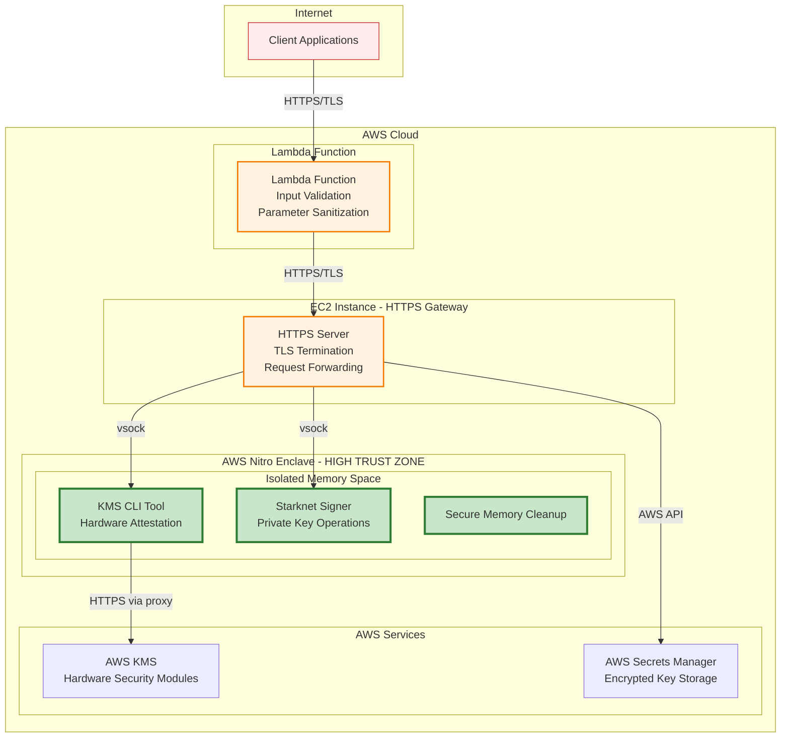
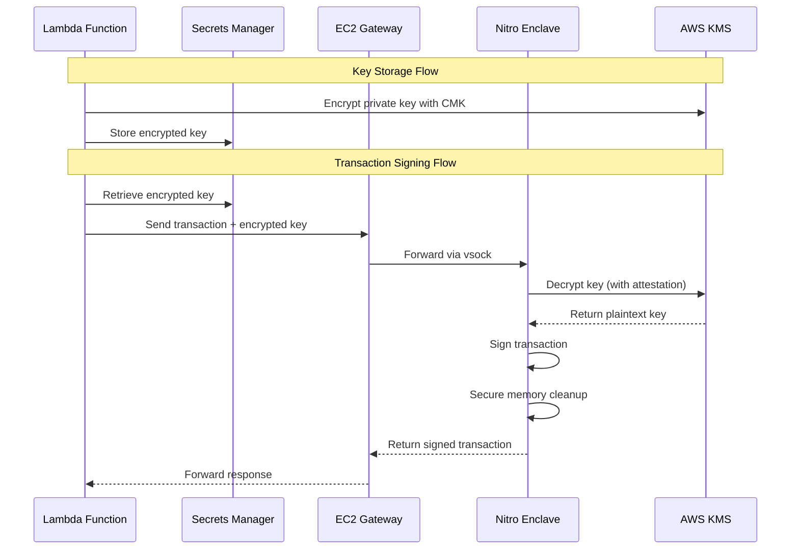

# Security Documentation: Starknet AWS Nitro Enclaves Wallet

## Table of Contents

1. [Security Architecture Overview](#security-architecture-overview)
2. [Key Management Security](#key-management-security)
3. [Communication Security](#communication-security)
4. [Memory Security](#memory-security)
5. [Input Validation & Sanitization](#input-validation--sanitization)
6. [Logging & Monitoring](#logging--monitoring)
7. [Threat Model](#threat-model)
8. [Security Configuration](#security-configuration)
9. [Compliance & Attestation](#compliance--attestation)

## Security Architecture Overview

### AWS Nitro Enclaves Security Guarantees

This Starknet wallet leverages AWS Nitro Enclaves to provide cryptographically verifiable isolation for private key operations. Nitro Enclaves offers:

- **Hardware-backed attestation**: PCR (Platform Configuration Register) measurements ensure code integrity
- **Memory isolation**: Enclave memory is encrypted and isolated from the parent EC2 instance
- **CPU isolation**: Dedicated CPU cores prevent side-channel attacks
- **No persistent storage**: Stateless design minimizes attack surface
- **Cryptographic attestation**: All operations can be verified through attestation documents

### Trust Zones and Isolation Boundaries



### Attack Surface Analysis

**Minimized Attack Surface:**
- No SSH access to enclave
- No network access except KMS via vsock proxy
- No persistent storage within enclave
- Stateless operation model
- Minimal OS footprint (Amazon Linux 2 base)

**External Interfaces:**
1. **Lambda Function**: Input validation and parameter sanitization
2. **HTTPS Gateway**: TLS termination and request forwarding
3. **vsock Communication**: Encrypted communication between EC2 and enclave
4. **KMS Integration**: Hardware-attested key decryption

## Key Management Security

### KMS Encryption/Decryption Flow

The application implements a robust key management architecture:



**Security Features:**
- **Customer Managed Keys (CMK)**: Full control over encryption keys
- **Hardware Security Modules**: KMS backed by FIPS 140-2 Level 2 HSMs
- **Attestation-based access**: Only verified enclaves can decrypt keys
- **Key rotation capabilities**: Supports automated key rotation
- **Audit trail**: All KMS operations logged in CloudTrail

### Private Key Lifecycle Management

**Key Generation:**
```python
# STARK curve order validation (from lambda_function.py:104-106)
STARK_ORDER = 0x800000000000010FFFFFFFFFFFFFFFFB781126DCAE7B2321E66A241ADC64D2F
if not (1 <= key_int < STARK_ORDER):
    raise Exception("Invalid Starknet private key format. Key must be within STARK curve order.")
```

**Key Storage:**
- Private keys encrypted using AWS KMS Customer Managed Keys
- Encrypted keys stored in AWS Secrets Manager
- No plaintext keys stored in persistent storage
- Secrets Manager provides automatic rotation capabilities

**Key Usage:**
- Keys decrypted only within Nitro Enclave
- Decryption requires hardware attestation
- Memory cleaning after each operation

## Communication Security

### vsock Communication Security

**vsock Channel Properties:**
- Hardware-isolated communication channel
- No network routing required
- Protected against network-level attacks
- Kernel-level isolation between EC2 and enclave

**Implementation Details:**
```python
# Enclave server configuration (from server.py:54-68)
s = socket.socket(socket.AF_VSOCK, socket.SOCK_STREAM)
cid = socket.VMADDR_CID_ANY  # Listen for any CID
port = 5000                  # Fixed port for predictable communication
s.bind((cid, port))
s.listen()
```

### HTTPS/TLS External Communications

**TLS Configuration:**
```python
# SSL context for Lambda->EC2 communication (from lambda_function.py:13-14)
ssl_context = ssl.SSLContext()
ssl_context.verify_mode = ssl.CERT_NONE  # Internal communication only
```

**HTTPS Server Configuration:**
```python
# EC2 HTTPS server (from app.py:151-156)
httpd.socket = ssl.wrap_socket(
    httpd.socket,
    server_side=True,
    certfile="/etc/pki/tls/certs/localhost.crt",
    ssl_version=ssl.PROTOCOL_TLS,
)
```

**KMS Communication Security:**
- HTTPS over vsock proxy to KMS endpoints
- TLS 1.2+ encryption
- Certificate validation against AWS CA
- Regional endpoint isolation

## Memory Security

### Secure Memory Cleanup Implementation

The application implements comprehensive memory cleanup to prevent key material leakage:

```python
# Secure memory cleanup (from server.py:178-186)
finally:
    # Secure memory cleanup - overwrite sensitive data
    if key_plaintext:
        # Overwrite the key in memory before deletion
        key_plaintext = "0" * len(key_plaintext)
        del key_plaintext
    if 'private_key_int' in locals():
        private_key_int = 0
        del private_key_int
```

**Memory Security Features:**
- **Immediate overwriting**: Sensitive variables overwritten with zeros
- **Explicit deletion**: Python `del` statements to remove references
- **Scope limitation**: Private keys stored in minimal scope
- **No persistent storage**: Keys never written to disk within enclave

### Prevention of Key Material Leakage

**Memory Protection Strategies:**
1. **Minimal variable lifetime**: Keys exist only during signing operations
2. **No debugging output**: Sensitive data redacted from logs
3. **Exception handling**: Cleanup occurs even during error conditions
4. **Stack protection**: Variables cleared from call stack

**Variable Overwriting Techniques:**
```python
# Multiple overwrite techniques used
key_plaintext = "0" * len(key_plaintext)  # String overwrite
private_key_int = 0                       # Integer reset
del key_plaintext                         # Reference deletion
del private_key_int                       # Reference deletion
```

## Input Validation & Sanitization

### Transaction Parameter Validation

**Starknet-Specific Validation:**

1. **Private Key Format Validation:**
```python
# Ensure hex format (from lambda_function.py:95-98)
if not key_plaintext.startswith("0x"):
    key_plaintext = "0x" + key_plaintext

# Validate hex string format
key_int = int(key_plaintext, 16)
```

2. **Contract Address Validation:**
```python
# Address format validation (from lambda_function.py:174-182)
contract_address = transaction_payload["contract_address"]
if not contract_address.startswith("0x"):
    transaction_payload["contract_address"] = "0x" + contract_address

try:
    int(transaction_payload["contract_address"], 16)
except ValueError:
    raise Exception("Invalid contract_address format. Must be a valid hexadecimal string.")
```

3. **STARK Curve Order Verification:**
```python
# Curve order validation ensures mathematical validity
STARK_ORDER = 0x800000000000010FFFFFFFFFFFFFFFFB781126DCAE7B2321E66A241ADC64D2F
if not (1 <= key_int < STARK_ORDER):
    raise Exception("Invalid Starknet private key format. Key must be within STARK curve order.")
```

### Required Field Validation

**Lambda Function Validation:**
- `operation` field required and validated
- `transaction_payload` validated for signing operations
- `secret_id` and environment variables checked

**EC2 Gateway Validation:**
- Content-Length validation
- JSON parsing with error handling
- Required field presence verification

**Enclave Validation:**
- Payload structure validation
- Cryptographic parameter validation
- Network address format validation

## Logging & Monitoring

### Security Event Logging

**Logging Configuration:**
```python
# Structured logging setup (from lambda_function.py:17-24)
LOG_LEVEL = os.getenv("LOG_LEVEL", "WARNING")
LOG_FORMAT = "%(levelname)s:%(lineno)s:%(message)s"
handler = logging.StreamHandler()

_logger = logging.getLogger("starknet_tx_manager_controller")
_logger.setLevel(LOG_LEVEL)
```

**Security Events Logged:**
- Transaction signing requests (metadata only)
- KMS decryption operations
- Authentication/authorization events
- Error conditions and exceptions
- Enclave lifecycle events

### Sensitive Data Redaction Practices

**Data Redaction Examples:**
```python
# Credential redaction (from server.py:78)
print("payload json received (credentials redacted)")

# Response content redaction (from server.py:188)
print("response sent (content redacted for security)")
```

**Redacted Information:**
- Private keys and cryptographic material
- AWS credentials and session tokens
- Transaction signatures and hashes
- Personal or financial data in calldata

### Audit Trail Considerations

**AWS CloudTrail Integration:**
- All KMS operations automatically logged
- Secrets Manager access events tracked
- Lambda function invocations recorded
- EC2 instance API calls monitored

**Custom Audit Events:**
- Transaction signing operations
- Key storage and retrieval events
- Enclave attestation validation
- Error conditions and security violations

## Threat Model

### Potential Attack Vectors

1. **Enclave Compromise Attempts**
   - **Risk**: Direct memory access attacks
   - **Mitigation**: Hardware memory encryption, CPU isolation
   - **Detection**: PCR measurement validation

2. **Network-based Attacks**
   - **Risk**: Man-in-the-middle attacks on external communications
   - **Mitigation**: TLS encryption, certificate validation
   - **Detection**: Certificate monitoring, traffic analysis

3. **Side-Channel Attacks**
   - **Risk**: Timing attacks during cryptographic operations
   - **Mitigation**: Dedicated CPU cores, constant-time operations
   - **Detection**: Performance monitoring, anomaly detection

4. **Privilege Escalation**
   - **Risk**: Escape from enclave environment
   - **Mitigation**: Hardware isolation, minimal attack surface
   - **Detection**: System call monitoring, integrity checking

5. **Supply Chain Attacks**
   - **Risk**: Compromised dependencies or base images
   - **Mitigation**: Dependency pinning, image signing, vulnerability scanning
   - **Detection**: Hash verification, attestation validation

### Mitigation Strategies

**Defense in Depth:**
1. **Hardware Security**: Nitro Enclaves hardware isolation
2. **Cryptographic Protection**: AES-256 encryption for keys at rest
3. **Network Security**: TLS encryption for data in transit
4. **Access Control**: IAM policies and KMS key policies
5. **Monitoring**: Comprehensive logging and alerting

**Incident Response:**
- **Key Rotation**: Immediate key rotation capability
- **Service Isolation**: Individual enclave termination
- **Audit Trail**: Complete transaction history
- **Forensic Capability**: Immutable log storage

### Security Assumptions

**Trusted Components:**
- AWS Nitro Enclaves hardware
- AWS KMS Hardware Security Modules
- AWS Secrets Manager encryption
- TLS/SSL cryptographic implementations

**Threat Boundaries:**
- Physical access to AWS data centers (out of scope)
- AWS service compromise (mitigated by multiple services)
- Quantum computing attacks (future consideration)

## Security Configuration

### Environment Variables

**Required Security Configuration:**
```bash
# AWS region for KMS and Secrets Manager
REGION=us-east-1

# CloudWatch logging level
LOG_LEVEL=WARNING

# Nitro Enclave specific
NITRO_INSTANCE_PRIVATE_DNS=<private-dns>
SECRET_ARN=<kms-encrypted-secret-arn>
KEY_ARN=<customer-managed-key-arn>
```

### IAM Policies and Permissions

**Lambda Execution Role:**
- KMS decrypt permissions with condition on enclave attestation
- Secrets Manager read access to encrypted keys
- CloudWatch Logs write permissions
- VPC and network interface permissions

**EC2 Instance Role:**
- Secrets Manager read access
- Instance metadata service access
- CloudWatch Logs write permissions
- Minimal EC2 permissions

**Enclave Attestation Policy:**
```json
{
  "Version": "2012-10-17",
  "Statement": [{
    "Effect": "Allow",
    "Principal": "*",
    "Action": "kms:Decrypt",
    "Resource": "*",
    "Condition": {
      "StringEquals": {
        "kms:RecipientAttestation:ImageSha384": "<enclave-image-hash>"
      }
    }
  }]
}
```

### Network Security Configuration

**vsock Proxy Configuration:**
```yaml
# /etc/nitro_enclaves/vsock-proxy.yaml
allowlist:
- {address: kms.us-east-1.amazonaws.com, port: 443}
- {address: kms-fips.us-east-1.amazonaws.com, port: 443}
```

**Security Groups:**
- Inbound: HTTPS (443) from Lambda subnets only
- Outbound: HTTPS (443) to KMS endpoints only
- No SSH or management access

## Compliance & Attestation

### PCR Measurements

**Platform Configuration Registers:**
- **PCR0**: Enclave image hash (code integrity)
- **PCR1**: Kernel and application measurements
- **PCR8**: Certificate and boot measurements

**Attestation Validation:**
```bash
# Verify enclave integrity
nitro-cli describe-enclaves
nitro-cli get-attestation-document --enclave-id <id>
```

### Compliance Considerations

**Security Standards:**
- **SOC 2 Type II**: AWS infrastructure compliance
- **FIPS 140-2 Level 2**: KMS HSM compliance
- **ISO 27001**: Security management system
- **PCI DSS**: Payment processing compliance (if applicable)

**Data Protection:**
- **GDPR**: Right to erasure through key deletion
- **CCPA**: Data privacy through encryption
- **HIPAA**: Healthcare data protection (if applicable)

### Security Testing

**Penetration Testing:**
- Network penetration testing
- Application security testing
- Enclave isolation testing
- Side-channel attack testing

**Vulnerability Management:**
- Regular dependency scanning
- Container image vulnerability assessment
- AWS Config compliance monitoring
- Security patch management

---

## Security Contact

For security issues or questions regarding this implementation:

1. **Immediate Security Concerns**: Contact AWS Security Team
2. **Implementation Questions**: Review AWS Nitro Enclaves documentation
3. **Starknet-Specific Issues**: Consult Starknet security guidelines

**Security Response:**
- Critical vulnerabilities: Immediate key rotation and service isolation
- High-risk issues: 24-hour response time
- Medium/Low risk: Standard development cycle

**Continuous Improvement:**
- Regular security assessments
- Threat model updates
- Security control testing
- Industry best practice adoption

---

*This document represents the security architecture as of the latest codebase analysis. Security measures should be regularly reviewed and updated based on emerging threats and best practices.*