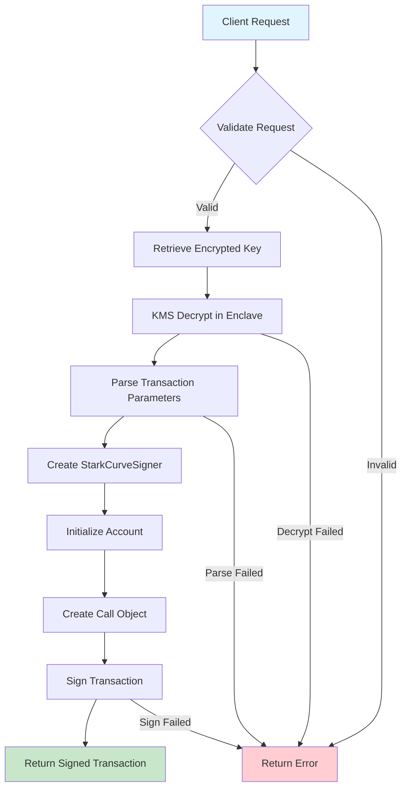
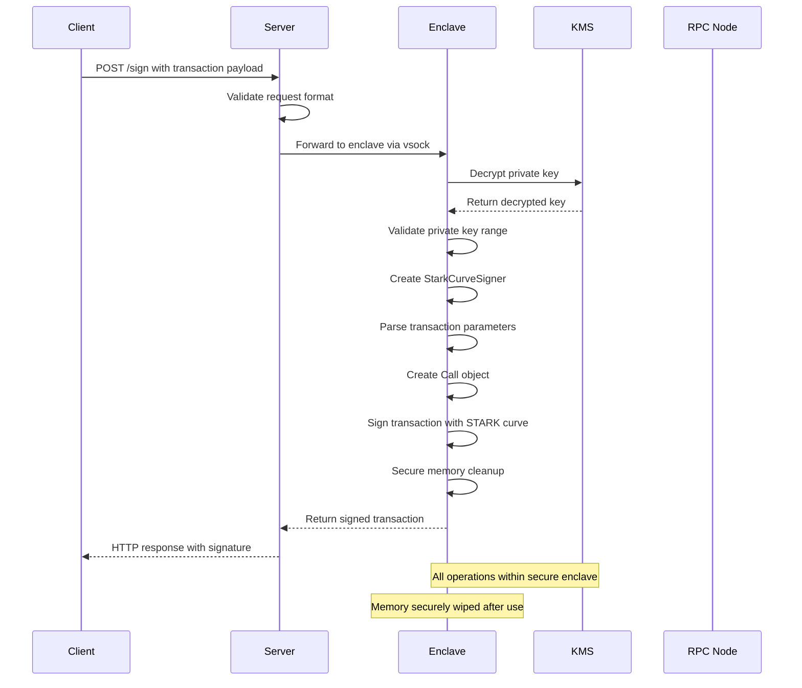
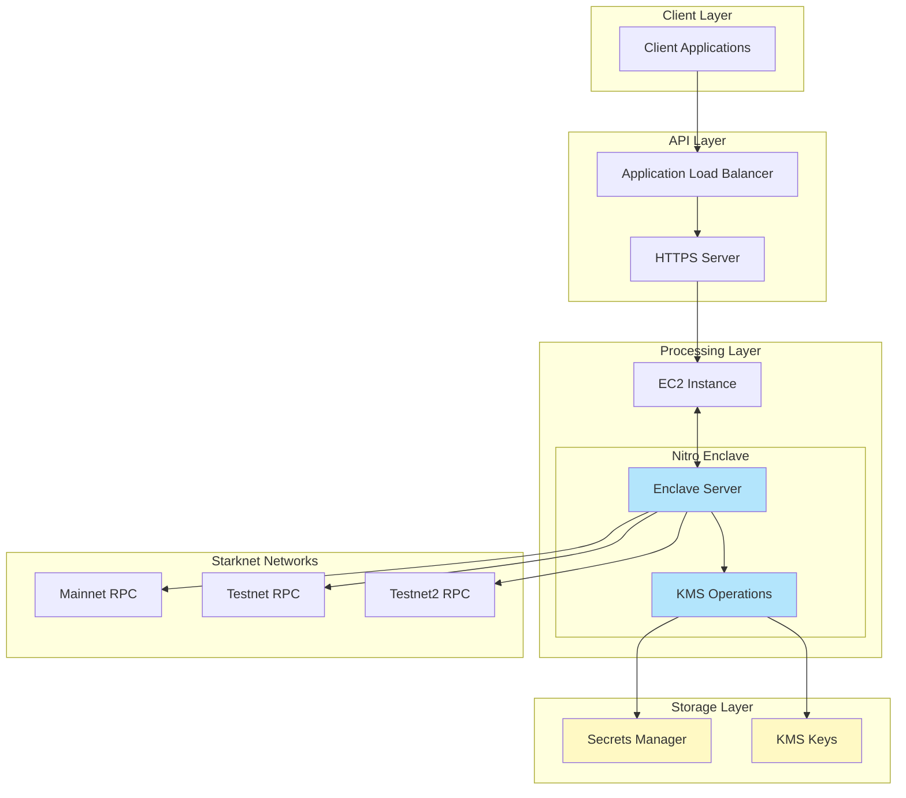

# Starknet Integration Technical Documentation

## Table of Contents
1. [Starknet Blockchain Overview](#starknet-blockchain-overview)
2. [Transaction Structure & Signing](#transaction-structure--signing)
3. [Account Management](#account-management)
4. [Smart Contract Interaction](#smart-contract-interaction)
5. [Network Configuration](#network-configuration)
6. [API Operations Deep Dive](#api-operations-deep-dive)
7. [Integration Examples](#integration-examples)
8. [Architecture Diagrams](#architecture-diagrams)

---

## 1. Starknet Blockchain Overview

### What is Starknet?

Starknet is a permissionless, decentralized validity rollup (often referred to as a "ZK-rollup") that operates as a Layer 2 (L2) network over Ethereum. It enables Ethereum to scale by moving computation off-chain while maintaining Ethereum's security guarantees through cryptographic proofs.

#### Core Technologies

**STARK Proofs (Scalable Transparent ARguments of Knowledge)**
- Zero-knowledge proof system that provides computational integrity without revealing private information
- Highly scalable with proof generation time that grows quasi-linearly with computation complexity
- Post-quantum secure, providing long-term cryptographic resilience
- Transparent setup (no trusted ceremony required)

**Cairo Language**
- Domain-specific programming language designed for writing provable programs
- Compiles to Cairo Assembly, which can be proven using STARK proofs
- Supports both Cairo 0 (legacy) and Cairo 1 (current) versions
- Enables complex smart contract logic while maintaining provability

### Account Abstraction

Unlike Ethereum's Externally Owned Accounts (EOAs), Starknet implements **native account abstraction**:

- **All accounts are smart contracts**: No distinction between user accounts and contract accounts
- **Flexible signature schemes**: Support for different cryptographic signature algorithms
- **Custom validation logic**: Accounts can implement custom transaction validation
- **Multi-signature support**: Native support for complex authentication schemes

#### Account Contract Interface

```cairo
trait AccountContract {
    fn __validate__(calls: Array<Call>) -> felt252;
    fn __execute__(calls: Array<Call>) -> Array<Span<felt252>>;
    fn __validate_declare__(class_hash: ClassHash) -> felt252;
}
```

#### STARK Curve Parameters

The implementation uses the STARK-friendly elliptic curve with these parameters:

```python
STARK_PRIME = 0x800000000000011000000000000000000000000000000000000000000000001
STARK_ORDER = 0x800000000000010FFFFFFFFFFFFFFFFB781126DCAE7B2321E66A241ADC64D2F
```

- **Field size**: 251 bits (2^251 + 17 * 2^192 + 1)
- **Curve equation**: y² = x³ + αx + β where α=1, β=0x6F21413EFBE40DE150E596D72F7A8C5609AD26C15C915C1F4CDFCB99CEE9E89

---

## 2. Transaction Structure & Signing

### Starknet Transaction Components

#### Invoke Transaction (Function Calls)
```python
class InvokeTransaction:
    contract_address: int      # Target contract address  
    function_name: str         # Function selector name
    calldata: List[int]       # Function arguments
    max_fee: int              # Maximum fee willing to pay
    nonce: int                # Account nonce for replay protection
    version: int              # Transaction version (0, 1, or 3)
    chain_id: StarknetChainId # Network identifier
```

#### STARK Curve Digital Signatures

**Signature Format**: (r, s) where both r and s are field elements
- **r**: x-coordinate of elliptic curve point
- **s**: Signature component derived from private key and message hash

**Message Hash Calculation**:
1. Construct transaction hash from transaction fields
2. Apply Pedersen hash function (STARK-friendly)
3. Use result as message for ECDSA signing

### Cryptographic Operations

#### Private Key Generation
```python
def generate_stark_private_key():
    # Generate random key in valid range [1, STARK_ORDER-1]
    key_int = secrets.randbelow(STARK_ORDER - 1) + 1
    return "0x" + format(key_int, '064x')
```

#### Signature Process
1. **Hash transaction data** using Pedersen hash
2. **Sign hash** with STARK curve ECDSA
3. **Verify signature** matches expected account validation

```python
# From server.py implementation
signer = StarkCurveSigner(
    account_address=contract_address_int,
    key_pair=private_key_int,
    chain_id=chain_id
)

signed_transaction = account.sign_invoke_transaction(
    calls=[call],
    max_fee=max_fee,
    nonce=nonce
)
```

### Nonce Management

- **Sequential nonces**: Each account maintains an incrementing nonce
- **Replay protection**: Prevents transaction resubmission
- **Account-specific**: Each account contract manages its own nonce

---

## 3. Account Management

### Account Address Derivation

Starknet account addresses are deterministically derived from:
- **Class hash**: Hash of the account contract class
- **Constructor calldata**: Arguments used during deployment
- **Salt**: Random value for address uniqueness
- **Deployer address**: Address initiating the deployment

```python
def calculate_contract_address(
    class_hash: int,
    constructor_calldata: List[int],
    salt: int,
    deployer_address: int = 0
) -> int:
    # Simplified version - actual implementation uses Pedersen hash
    return pedersen_hash(class_hash, salt, constructor_calldata, deployer_address)
```

### Private Key Requirements and Validation

#### Key Format Validation
```python
def validate_stark_private_key(key: str) -> bool:
    try:
        if not key.startswith('0x'):
            return False
        key_int = int(key, 16)
        return 1 <= key_int < STARK_ORDER
    except ValueError:
        return False
```

#### Secure Key Handling
```python
# From server.py - Secure memory cleanup
finally:
    if key_plaintext:
        # Overwrite the key in memory before deletion
        key_plaintext = "0" * len(key_plaintext)
        del key_plaintext
    if 'private_key_int' in locals():
        private_key_int = 0
        del private_key_int
```

### Signer Initialization Process

```python
# Create StarkCurveSigner instance
signer = StarkCurveSigner(
    account_address=account_address,
    key_pair=private_key_int,
    chain_id=chain_id
)

# Create Account instance
account = Account(
    address=account_address,
    client=full_node_client,
    signer=signer,
    chain=chain_id
)
```

---

## 4. Smart Contract Interaction

### Contract Address Formatting

```python
def normalize_contract_address(address: str) -> int:
    # Ensure hex prefix
    if not address.startswith("0x"):
        address = "0x" + address
    
    # Convert to integer and validate range
    address_int = int(address, 16)
    if address_int >= STARK_PRIME:
        raise ValueError("Address exceeds field prime")
    
    return address_int
```

### Function Selector Calculation

Starknet uses **Keccak256** hash for function selectors:

```python
from starknet_py.hash.selector import get_selector_from_name

# Calculate function selector
function_selector = get_selector_from_name("transfer")
# Returns: integer representation of keccak256("transfer")[:31]
```

### Calldata Structure and Encoding

#### Simple Call Structure
```python
call = Call(
    to_addr=contract_address_int,
    selector=get_selector_from_name(function_name),
    calldata=calldata  # Array of field elements
)
```

#### Complex Calldata Examples
```python
# ERC20 Transfer
transfer_calldata = [
    recipient_address,  # to
    amount_low,         # amount (low 128 bits)
    amount_high         # amount (high 128 bits)
]

# Multi-call transaction
calls = [
    Call(to_addr=erc20_contract, selector=approve_selector, calldata=[spender, amount_low, amount_high]),
    Call(to_addr=dex_contract, selector=swap_selector, calldata=[token_in, token_out, amount_low, amount_high])
]
```

### Fee Estimation and Management

```python
# Fee handling in transaction
max_fee = transaction_dict.get("max_fee", "0x1000000000000")  # Default 1 ETH
if isinstance(max_fee, str):
    max_fee = int(max_fee, 16) if max_fee.startswith("0x") else int(max_fee)

# Fee estimation (not implemented in current codebase)
estimated_fee = await account.estimate_fee(calls)
```

---

## 5. Network Configuration

### Supported Networks

```python
# Chain ID mapping
chain_id_map = {
    "mainnet": StarknetChainId.MAINNET,
    "testnet": StarknetChainId.TESTNET,     # Goerli
    "testnet2": StarknetChainId.TESTNET2    # Goerli2
}
```

#### Network Specifications

| Network | Chain ID | Description | RPC Endpoint |
|---------|----------|-------------|--------------|
| Mainnet | SN_MAIN | Production network | https://starknet-mainnet.public.blastapi.io |
| Testnet | SN_GOERLI | Goerli testnet | https://starknet-testnet.public.blastapi.io |
| Testnet2 | SN_GOERLI2 | Goerli2 testnet | https://starknet-testnet2.public.blastapi.io |

### RPC Endpoint Configuration

```python
# Default RPC configuration
default_rpc_urls = {
    StarknetChainId.MAINNET: "https://starknet-mainnet.public.blastapi.io",
    StarknetChainId.TESTNET: "https://starknet-testnet.public.blastapi.io",
    StarknetChainId.TESTNET2: "https://starknet-testnet2.public.blastapi.io"
}

# Create client with custom RPC
rpc_url = transaction_dict.get("rpc_url", default_rpc_urls[chain_id])
client = FullNodeClient(node_url=rpc_url)
```

### Chain ID Validation

```python
def validate_chain_id(chain_id) -> StarknetChainId:
    if isinstance(chain_id, str):
        chain_id_map = {
            "mainnet": StarknetChainId.MAINNET,
            "testnet": StarknetChainId.TESTNET,
            "testnet2": StarknetChainId.TESTNET2
        }
        return chain_id_map.get(chain_id.lower(), StarknetChainId.TESTNET)
    return chain_id
```

---

## 6. API Operations Deep Dive

### set_key: Private Key Encryption and Storage

**Process Flow:**
1. Receive private key from client
2. Validate key format and range
3. Encrypt using AWS KMS
4. Store encrypted key in AWS Secrets Manager

```python
# Validation
if not key_plaintext.startswith("0x"):
    key_plaintext = "0x" + key_plaintext
private_key_int = int(key_plaintext, 16)

# Range validation
if not (1 <= private_key_int < STARK_ORDER):
    raise ValueError("Private key out of valid range")
```

### get_key: Secure Key Retrieval

**Process Flow:**
1. Retrieve encrypted key from Secrets Manager
2. Decrypt using KMS within secure enclave
3. Return decrypted key (base64 encoded)

```python
def kms_call(credential, ciphertext):
    subprocess_args = [
        "/app/kmstool_enclave_cli",
        "decrypt",
        "--region", os.getenv("REGION"),
        "--proxy-port", "8000",
        "--aws-access-key-id", credential["access_key_id"],
        "--aws-secret-access-key", credential["secret_access_key"],
        "--aws-session-token", credential["token"],
        "--ciphertext", ciphertext,
    ]
    
    proc = subprocess.Popen(subprocess_args, stdout=subprocess.PIPE)
    result_b64 = proc.communicate()[0].decode()
    return result_b64.split(":")[1].strip()
```

### sign_transaction: Complete Signing Workflow

**Input Validation:**
```python
# Required fields validation
required_fields = ["contract_address", "function_name"]
for field in required_fields:
    if field not in transaction_payload:
        raise ValueError(f"Missing required field: {field}")
```

**Signing Process:**
```python
# 1. Parse and validate transaction parameters
contract_address_int = int(contract_address, 16)
function_selector = get_selector_from_name(function_name)
calldata = transaction_dict.get("calldata", [])
max_fee = int(transaction_dict.get("max_fee", "0x1000000000000"), 16)
nonce = transaction_dict.get("nonce", 0)

# 2. Create signer and account
signer = StarkCurveSigner(
    account_address=contract_address_int,
    key_pair=private_key_int,
    chain_id=chain_id
)

account = Account(
    address=contract_address_int,
    client=FullNodeClient(node_url=rpc_url),
    signer=signer,
    chain=chain_id
)

# 3. Create call and sign transaction
call = Call(
    to_addr=contract_address_int,
    selector=function_selector,
    calldata=calldata
)

signed_transaction = account.sign_invoke_transaction(
    calls=[call],
    max_fee=max_fee,
    nonce=nonce
)

# 4. Return structured response
response = {
    "transaction_signed": f"{hex(signed_transaction.signature[0])},{hex(signed_transaction.signature[1])}",
    "transaction_hash": hex(signed_transaction.transaction_hash),
    "contract_address": hex(contract_address_int),
    "function_name": function_name,
    "calldata": calldata,
    "max_fee": hex(max_fee),
    "nonce": nonce,
    "success": True
}
```

---

## 7. Integration Examples

### Sample Transaction Payloads

#### ERC20 Token Transfer
```json
{
  "contract_address": "0x049d36570d4e46f48e99674bd3fcc84644ddd6b96f7c741b1562b82f9e004dc7",
  "function_name": "transfer",
  "calldata": [
    "0x123...abc",  // recipient address
    "1000000000000000000",  // amount (low 128 bits)
    "0"  // amount (high 128 bits)
  ],
  "max_fee": "0x1000000000000",
  "nonce": 42,
  "chain_id": "testnet",
  "rpc_url": "https://starknet-testnet.public.blastapi.io"
}
```

#### Multi-call Transaction
```json
{
  "contract_address": "0x456...def",
  "function_name": "multicall",
  "calldata": [
    "2",  // number of calls
    "0x049d36570d4e46f48e99674bd3fcc84644ddd6b96f7c741b1562b82f9e004dc7",  // call 1 target
    "232670485425082704932579856502088130646006032362877466777181098476241604910",  // approve selector
    "3",  // call 1 calldata length
    "0x789...ghi",  // spender
    "1000000000000000000",  // amount low
    "0",  // amount high
    "0x789...ghi",  // call 2 target
    "219209995425035813477534440392217629949642599491599716651849186480472649987",  // swap selector
    "4",  // call 2 calldata length
    "0x049d36570d4e46f48e99674bd3fcc84644ddd6b96f7c741b1562b82f9e004dc7",  // token_in
    "0x321...fed",  // token_out
    "1000000000000000000",  // amount_in low
    "0"   // amount_in high
  ],
  "max_fee": "0x5000000000000",
  "nonce": 43,
  "chain_id": "mainnet"
}
```

### Common Use Cases

#### 1. Token Approval and Swap
```python
# Step 1: Approve token spending
approve_payload = {
    "contract_address": erc20_token_address,
    "function_name": "approve",
    "calldata": [dex_contract_address, amount_low, amount_high],
    "max_fee": "0x1000000000000",
    "nonce": current_nonce
}

# Step 2: Execute swap
swap_payload = {
    "contract_address": dex_contract_address,
    "function_name": "swap_exact_tokens_for_tokens",
    "calldata": [token_in, token_out, amount_in_low, amount_in_high, min_amount_out_low, min_amount_out_high],
    "max_fee": "0x2000000000000",
    "nonce": current_nonce + 1
}
```

#### 2. NFT Minting
```python
mint_payload = {
    "contract_address": nft_contract_address,
    "function_name": "mint",
    "calldata": [recipient_address, token_id_low, token_id_high],
    "max_fee": "0x800000000000",
    "nonce": current_nonce
}
```

### Error Handling Patterns

#### Common Errors and Solutions

```python
# Error response format
error_response = {
    "error": "exception happened signing the Starknet transaction: Invalid private key format",
    "success": False
}

# Error types:
# 1. Invalid private key
if not validate_stark_private_key(key):
    return {"error": "Invalid private key format or range", "success": False}

# 2. Missing transaction fields
required_fields = ["contract_address", "function_name"]
missing_fields = [field for field in required_fields if field not in transaction_payload]
if missing_fields:
    return {"error": f"Missing required fields: {missing_fields}", "success": False}

# 3. Network connectivity issues
try:
    client = FullNodeClient(node_url=rpc_url)
    # Test connection
    await client.get_chain_id()
except Exception as e:
    return {"error": f"RPC connection failed: {str(e)}", "success": False}

# 4. Insufficient fees
if max_fee < estimated_fee:
    return {"error": f"Insufficient fee: provided {max_fee}, required {estimated_fee}", "success": False}
```

---

## 8. Architecture Diagrams

### Starknet Transaction Lifecycle



### Key Derivation and Signing Process



### Smart Contract Interaction Flow

```mermaid
graph LR
    subgraph "Transaction Creation"
        A[Function Name] --> B[Calculate Selector]
        C[Calldata Array] --> D[Encode Parameters]
        E[Contract Address] --> F[Normalize Format]
    end
    
    subgraph "Call Construction"
        B --> G[Call Object]
        D --> G
        F --> G
    end
    
    subgraph "Signing Process"
        G --> H[Account.sign_invoke_transaction]
        I[Private Key] --> H
        J[Max Fee] --> H
        K[Nonce] --> H
    end
    
    subgraph "Result"
        H --> L[Signed Transaction]
        L --> M[Transaction Hash]
        L --> N[Signature (r,s)]
    end
    
    style A fill:#fff3e0
    style C fill:#fff3e0
    style E fill:#fff3e0
    style L fill:#e8f5e8
    style M fill:#e8f5e8
    style N fill:#e8f5e8
```

### Network Architecture Overview



---

## Security Considerations

### Cryptographic Security
- **STARK curve**: Post-quantum secure elliptic curve
- **Field arithmetic**: All operations in finite field of prime order
- **Key generation**: Cryptographically secure random number generation
- **Memory management**: Secure cleanup of sensitive data

### Enclave Security
- **Isolated execution**: All cryptographic operations within AWS Nitro Enclave
- **Attestation**: Enclave code integrity verified through attestation
- **No network access**: Enclave communicates only through vsock
- **Encrypted storage**: Private keys encrypted at rest using AWS KMS

### Implementation Security
- **Input validation**: Comprehensive validation of all transaction parameters
- **Error handling**: Secure error responses that don't leak sensitive information
- **Nonce management**: Proper replay protection through sequential nonces
- **Fee validation**: Protection against unexpected fee structures

---

## Performance Considerations

### Transaction Throughput
- **Batching**: Support for multi-call transactions
- **Parallel processing**: Multiple concurrent signing operations
- **Connection pooling**: Reuse RPC connections where possible

### Resource Optimization
- **Memory management**: Efficient cleanup of cryptographic material
- **CPU usage**: Optimized STARK curve operations
- **Network efficiency**: Minimal RPC calls required

---

## Future Enhancements

### Planned Features
- **Account deployment**: Support for deploying new account contracts
- **Declare transactions**: Support for contract class declarations
- **Fee estimation**: Automatic fee estimation from RPC
- **Transaction simulation**: Pre-execution validation
- **Batch signing**: Multiple transaction signing in single operation

### Monitoring and Observability
- **Transaction metrics**: Success rates, latency, fee analysis
- **Error tracking**: Detailed error categorization and reporting
- **Performance monitoring**: Throughput and resource utilization
- **Security auditing**: Access patterns and anomaly detection

---

*This documentation is designed to provide comprehensive technical understanding of Starknet integration within the secure enclave environment, enabling both newcomers to blockchain development and experienced developers to effectively utilize and extend the system.*