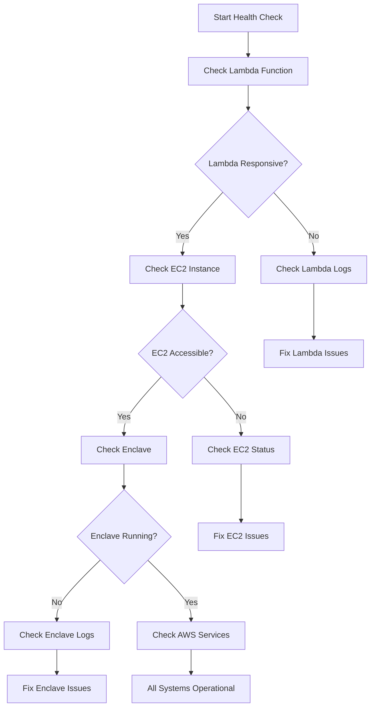
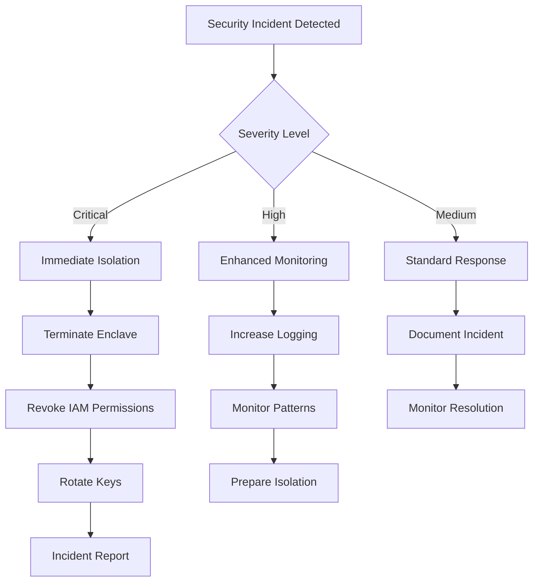

# Heimdall Starknet Integration - Troubleshooting Guide

This comprehensive troubleshooting guide covers common issues, diagnostic procedures, and resolution steps for the Heimdall Starknet integration using AWS Nitro Enclaves.

## Table of Contents

1. [Common Issues & Solutions](#common-issues--solutions)
2. [Error Code Reference](#error-code-reference)
3. [Diagnostic Procedures](#diagnostic-procedures)
4. [Component-Specific Troubleshooting](#component-specific-troubleshooting)
5. [Performance Issues](#performance-issues)
6. [Security-Related Issues](#security-related-issues)
7. [Monitoring & Alerting](#monitoring--alerting)
8. [Recovery Procedures](#recovery-procedures)

---

## Common Issues & Solutions

### Connection Failures Between Components

**Symptoms:**
- Lambda timeouts when calling EC2 server
- `exception happened sending signing request to Nitro Enclave` errors
- HTTP connection errors

**Common Causes & Solutions:**

1. **Network Connectivity Issues**
   ```bash
   # Check security group rules
   aws ec2 describe-security-groups --group-ids <security-group-id>
   
   # Test connectivity from Lambda environment
   curl -k https://<instance-private-dns>:443
   ```

2. **SSL/TLS Certificate Problems**
   ```bash
   # Verify certificate exists on EC2 instance
   ls -la /etc/pki/tls/certs/localhost.crt
   
   # Check certificate validity
   openssl x509 -in /etc/pki/tls/certs/localhost.crt -text -noout
   ```

3. **EC2 Instance Status**
   ```bash
   # Check if HTTPS server is running
   sudo netstat -tlnp | grep :443
   
   # Verify application logs
   sudo journalctl -u starknet-server -f
   ```

### KMS Decryption Errors

**Symptoms:**
- `exception happened calling kms binary` in enclave logs
- KMS access denied errors
- Invalid ciphertext errors

**Solutions:**

1. **Verify KMS Permissions**
   ```bash
   # Check IAM role permissions
   aws iam get-role-policy --role-name <role-name> --policy-name <policy-name>
   
   # Test KMS access from EC2
   aws kms describe-key --key-id <key-arn>
   ```

2. **Validate Encrypted Key Format**
   ```python
   # Check if encrypted key is base64 encoded
   import base64
   try:
       base64.standard_b64decode(encrypted_key)
       print("Valid base64 encoding")
   except Exception as e:
       print(f"Invalid base64: {e}")
   ```

3. **Check Region Configuration**
   ```bash
   # Verify REGION environment variable
   echo $REGION
   
   # Ensure KMS key exists in correct region
   aws kms list-keys --region <region>
   ```

### Starknet Transaction Signing Failures

**Symptoms:**
- `exception happened signing the Starknet transaction` errors
- Invalid private key format errors
- Transaction hash generation failures

**Solutions:**

1. **Validate Private Key Format**
   ```python
   # Key validation logic
   STARK_ORDER = 0x800000000000010FFFFFFFFFFFFFFFFB781126DCAE7B2321E66A241ADC64D2F
   
   def validate_key(key_hex):
       if not key_hex.startswith("0x"):
           key_hex = "0x" + key_hex
       try:
           key_int = int(key_hex, 16)
           return 1 <= key_int < STARK_ORDER
       except ValueError:
           return False
   ```

2. **Check Contract Address Format**
   ```python
   # Address validation
   def validate_address(address):
       if not address.startswith("0x"):
           address = "0x" + address
       try:
           int(address, 16)
           return True
       except ValueError:
           return False
   ```

3. **Verify Network Connectivity**
   ```bash
   # Test RPC endpoint connectivity
   curl -X POST -H "Content-Type: application/json" \
        -d '{"jsonrpc":"2.0","method":"starknet_blockNumber","id":1}' \
        https://starknet-testnet.public.blastapi.io
   ```

### Invalid Key Format Errors

**Symptoms:**
- `Invalid Starknet private key format` errors
- STARK curve order validation failures
- Hexadecimal parsing errors

**Solutions:**

1. **Key Format Requirements**
   - Must be hexadecimal string
   - Can start with or without "0x" prefix
   - Must be within STARK curve order range
   - Length should be appropriate for 252-bit keys

2. **Validation Steps**
   ```python
   # Complete key validation
   def validate_starknet_key(key):
       # Add 0x prefix if missing
       if not key.startswith("0x"):
           key = "0x" + key
       
       # Check hex format
       try:
           key_int = int(key, 16)
       except ValueError:
           raise ValueError("Invalid hexadecimal format")
       
       # Check range
       STARK_ORDER = 0x800000000000010FFFFFFFFFFFFFFFFB781126DCAE7B2321E66A241ADC64D2F
       if not (1 <= key_int < STARK_ORDER):
           raise ValueError("Key outside valid STARK curve range")
       
       return True
   ```

### Network Connectivity Issues

**Symptoms:**
- Timeouts connecting to Starknet RPC endpoints
- DNS resolution failures
- Proxy or firewall blocking

**Solutions:**

1. **Test Network Connectivity**
   ```bash
   # Test DNS resolution
   nslookup starknet-testnet.public.blastapi.io
   
   # Test HTTP connectivity
   curl -v https://starknet-testnet.public.blastapi.io
   
   # Check routing
   traceroute starknet-testnet.public.blastapi.io
   ```

2. **Verify Security Groups**
   ```bash
   # Check outbound rules
   aws ec2 describe-security-groups --filters "Name=group-id,Values=<sg-id>"
   ```

---

## Error Code Reference

### Lambda Function Error Codes

| Error Message | Code | Cause | Resolution |
|---------------|------|-------|------------|
| `request needs to define operation` | MISSING_OPERATION | No operation specified in request | Include `operation` field in request |
| `starknet_key is required for set_key operation` | MISSING_KEY | No key provided for set_key | Include `starknet_key` in request |
| `Invalid Starknet private key format` | INVALID_KEY_FORMAT | Key not in valid hex format | Ensure key is valid hexadecimal |
| `Missing required field: {field}` | MISSING_FIELD | Required transaction field missing | Include all required fields |
| `exception happened sending encryption request to KMS` | KMS_ERROR | KMS encryption failed | Check KMS permissions and key status |
| `exception happened updating secret` | SECRETS_ERROR | Secrets Manager update failed | Verify IAM permissions |
| `exception happened reading secret from secrets manager` | SECRETS_READ_ERROR | Secret retrieval failed | Check secret exists and permissions |
| `Invalid contract_address format` | INVALID_ADDRESS | Contract address not valid hex | Ensure address is valid hexadecimal |
| `exception happened sending signing request to Nitro Enclave` | ENCLAVE_ERROR | Communication with enclave failed | Check EC2 instance and network |

### Enclave Server Error Messages

| Error Message | Cause | Resolution |
|---------------|-------|------------|
| `exception happened calling kms binary` | KMS tool execution failed | Check AWS credentials and KMS permissions |
| `exception happened signing the Starknet transaction` | Transaction signing failed | Validate transaction parameters |
| `Unexpected error in main loop` | General server error | Check enclave logs and resources |
| `Fatal error in server` | Server startup failure | Verify enclave configuration |

### EC2 Server HTTP Status Codes

| Status Code | Description | Common Causes |
|-------------|-------------|---------------|
| 200 | Success | Request processed successfully |
| 400 | Bad Request | Missing or invalid transaction_payload fields |
| 404 | Not Found | Missing transaction_payload or secret_id |
| 500 | Internal Server Error | Server processing error |
| 502 | Bad Gateway | Enclave communication failure |
| 503 | Service Unavailable | Server overloaded or not ready |

### AWS Service Error Codes

| Service | Error Code | Description | Resolution |
|---------|------------|-------------|------------|
| KMS | `AccessDenied` | Insufficient permissions | Update IAM role policy |
| KMS | `InvalidCiphertextException` | Invalid encrypted data | Verify ciphertext format |
| Secrets Manager | `ResourceNotFoundException` | Secret not found | Create secret or check ARN |
| Secrets Manager | `AccessDenied` | Insufficient permissions | Update IAM role policy |
| EC2 | `NetworkUnreachable` | Network connectivity issue | Check security groups and routing |

---

## Diagnostic Procedures

### Quick Health Check



### Step-by-Step Diagnostic Process

1. **Lambda Function Health Check**
   ```bash
   # Test Lambda function directly
   aws lambda invoke \
     --function-name <function-name> \
     --payload '{"operation":"get_key"}' \
     response.json
   
   # Check response
   cat response.json
   ```

2. **EC2 Instance Connectivity**
   ```bash
   # SSH to instance
   ssh -i <key-pair> ec2-user@<instance-ip>
   
   # Check server process
   ps aux | grep python
   
   # Check port binding
   sudo netstat -tlnp | grep :443
   ```

3. **Enclave Status**
   ```bash
   # List running enclaves
   nitro-cli describe-enclaves
   
   # Check enclave console output
   nitro-cli console --enclave-id <enclave-id>
   
   # Monitor vsock connections
   sudo lsof | grep vsock
   ```

4. **AWS Service Connectivity**
   ```bash
   # Test KMS access
   aws kms describe-key --key-id <key-arn>
   
   # Test Secrets Manager
   aws secretsmanager get-secret-value --secret-id <secret-arn>
   
   # Check IAM permissions
   aws sts get-caller-identity
   ```

### Log Analysis Techniques

1. **Lambda Function Logs**
   ```bash
   # View recent Lambda logs
   aws logs describe-log-groups --log-group-name-prefix /aws/lambda/
   
   # Get specific log stream
   aws logs get-log-events \
     --log-group-name /aws/lambda/<function-name> \
     --log-stream-name <stream-name>
   ```

2. **EC2 Instance Logs**
   ```bash
   # Application logs
   sudo journalctl -u starknet-server -f
   
   # System logs
   sudo tail -f /var/log/messages
   
   # User data execution logs
   sudo cat /var/log/cloud-init-output.log
   ```

3. **Enclave Logs**
   ```bash
   # Enclave console output
   nitro-cli console --enclave-id <enclave-id>
   
   # Enclave system logs
   sudo journalctl -u nitro-enclaves-allocator -f
   ```

---

## Component-Specific Troubleshooting

### Lambda Function Issues

#### Environment Variable Problems

**Symptoms:**
- `NITRO_INSTANCE_PRIVATE_DNS, SECRET_ARN and KEY_ARN environment variables need to be set`
- Lambda function returns `None`

**Diagnostic Steps:**
```bash
# Check Lambda configuration
aws lambda get-function-configuration --function-name <function-name>

# Verify environment variables
aws lambda get-function-configuration \
  --function-name <function-name> \
  --query 'Environment.Variables'
```

**Solutions:**
1. Set missing environment variables:
   ```bash
   aws lambda update-function-configuration \
     --function-name <function-name> \
     --environment Variables='{
       "NITRO_INSTANCE_PRIVATE_DNS":"<instance-dns>",
       "SECRET_ARN":"<secret-arn>",
       "KEY_ARN":"<key-arn>",
       "REGION":"<region>"
     }'
   ```

#### IAM Permission Errors

**Symptoms:**
- `AccessDenied` errors when accessing KMS or Secrets Manager
- `exception happened sending encryption request to KMS`

**Required Permissions:**
```json
{
  "Version": "2012-10-17",
  "Statement": [
    {
      "Effect": "Allow",
      "Action": [
        "kms:Encrypt",
        "kms:Decrypt",
        "kms:DescribeKey"
      ],
      "Resource": "<kms-key-arn>"
    },
    {
      "Effect": "Allow",
      "Action": [
        "secretsmanager:GetSecretValue",
        "secretsmanager:UpdateSecret"
      ],
      "Resource": "<secret-arn>"
    }
  ]
}
```

#### Request Validation Failures

**Symptoms:**
- `Missing required field` errors
- `Invalid contract_address format` errors

**Validation Checklist:**
- Ensure `operation` field is included
- For `set_key`: include valid `starknet_key`
- For `sign_transaction`: include `transaction_payload` with required fields
- Contract addresses must be valid hexadecimal

### EC2 Server Issues

#### HTTPS Certificate Problems

**Symptoms:**
- SSL handshake failures
- Certificate verification errors
- Connection refused on port 443

**Diagnostic Steps:**
```bash
# Check certificate exists
sudo ls -la /etc/pki/tls/certs/localhost.crt

# Verify certificate validity
sudo openssl x509 -in /etc/pki/tls/certs/localhost.crt -text -noout

# Check certificate expiration
sudo openssl x509 -in /etc/pki/tls/certs/localhost.crt -noout -dates
```

**Solutions:**
1. Generate new certificate:
   ```bash
   sudo openssl req -x509 -nodes -days 365 -newkey rsa:2048 \
     -keyout /etc/pki/tls/private/localhost.key \
     -out /etc/pki/tls/certs/localhost.crt
   ```

2. Set proper permissions:
   ```bash
   sudo chmod 600 /etc/pki/tls/private/localhost.key
   sudo chmod 644 /etc/pki/tls/certs/localhost.crt
   ```

#### Instance Metadata Access

**Symptoms:**
- `Failed to retrieve instance credentials` errors
- HTTP 401/403 when accessing metadata service

**Diagnostic Steps:**
```bash
# Test metadata service access
curl -s http://169.254.169.254/latest/meta-data/

# Check IMDSv2 token
TOKEN=$(curl -X PUT "http://169.254.169.254/latest/api/token" \
  -H "X-aws-ec2-metadata-token-ttl-seconds: 21600")

# Test with token
curl -H "X-aws-ec2-metadata-token: $TOKEN" \
  http://169.254.169.254/latest/meta-data/iam/security-credentials/
```

**Solutions:**
1. Enable instance metadata service:
   ```bash
   aws ec2 modify-instance-metadata-options \
     --instance-id <instance-id> \
     --http-endpoint enabled \
     --http-tokens optional
   ```

#### vsock Communication Failures

**Symptoms:**
- Connection refused to enclave
- vsock socket binding errors
- Enclave communication timeouts

**Diagnostic Steps:**
```bash
# Check vsock proxy status
sudo systemctl status nitro-enclaves-vsock-proxy

# Verify vsock configuration
sudo cat /etc/nitro_enclaves/vsock-proxy.yaml

# List vsock connections
sudo lsof | grep vsock
```

**Solutions:**
1. Restart vsock proxy:
   ```bash
   sudo systemctl restart nitro-enclaves-vsock-proxy
   ```

2. Check enclave CID mapping:
   ```bash
   nitro-cli describe-enclaves
   ```

### Nitro Enclave Issues

#### Enclave Startup Failures

**Symptoms:**
- Enclave fails to start
- Resource allocation errors
- Docker image issues

**Diagnostic Steps:**
```bash
# Check available resources
nitro-cli describe-enclaves

# Verify enclave image
docker images | grep enclave

# Check allocator service
sudo systemctl status nitro-enclaves-allocator
```

**Solutions:**
1. Allocate more resources:
   ```bash
   # Modify allocator configuration
   sudo vi /etc/nitro_enclaves/allocator.yaml
   
   # Restart allocator
   sudo systemctl restart nitro-enclaves-allocator
   ```

2. Rebuild enclave image:
   ```bash
   cd /path/to/enclave
   docker build -t starknet-enclave .
   nitro-cli build-enclave --docker-uri starknet-enclave:latest \
     --output-file starknet-enclave.eif
   ```

#### Memory Allocation Issues

**Symptoms:**
- `insufficient memory` errors
- Enclave OOM kills
- Performance degradation

**Solutions:**
1. Increase memory allocation:
   ```yaml
   # /etc/nitro_enclaves/allocator.yaml
   memory_mib: 4096  # Increase as needed
   cpu_count: 2
   ```

2. Monitor memory usage:
   ```bash
   # Inside enclave (if accessible)
   free -m
   ps aux --sort=-%mem
   ```

#### KMS Tool Execution Errors

**Symptoms:**
- `exception happened calling kms binary` errors
- KMS tool not found
- Authentication failures

**Diagnostic Steps:**
```bash
# Check if KMS tool exists in enclave
# (Run inside enclave container)
ls -la /app/kmstool_enclave_cli

# Test KMS tool directly
/app/kmstool_enclave_cli --help
```

**Solutions:**
1. Verify KMS tool installation in Dockerfile:
   ```dockerfile
   # Download and install kmstool_enclave_cli
   RUN wget https://github.com/aws/aws-nitro-enclaves-sdk-c/releases/download/v0.3.2/kmstool_enclave_cli \
       && chmod +x kmstool_enclave_cli \
       && mv kmstool_enclave_cli /app/
   ```

2. Check proxy configuration:
   ```bash
   # Verify vsock-proxy.yaml includes KMS endpoint
   allowlisted_addresses: ["kms.region.amazonaws.com:443"]
   ```

---

## Performance Issues

### Slow Response Times

**Symptoms:**
- Lambda function timeouts
- High latency in transaction signing
- Slow KMS operations

**Diagnostic Steps:**
1. **Profile Lambda execution time:**
   ```bash
   # Check Lambda duration metrics
   aws cloudwatch get-metric-statistics \
     --namespace AWS/Lambda \
     --metric-name Duration \
     --dimensions Name=FunctionName,Value=<function-name> \
     --start-time <start> --end-time <end> \
     --period 300 --statistics Average,Maximum
   ```

2. **Monitor EC2 performance:**
   ```bash
   # CPU usage
   top -p $(pgrep python)
   
   # Memory usage
   free -m
   
   # Disk I/O
   iostat -x 1
   ```

3. **Analyze network latency:**
   ```bash
   # Test connection time to services
   time curl -k https://<ec2-instance>:443
   
   # Check KMS latency
   time aws kms describe-key --key-id <key-arn>
   ```

**Optimization Solutions:**

1. **Lambda optimizations:**
   - Increase memory allocation (improves CPU)
   - Use provisioned concurrency for consistent performance
   - Optimize Python imports and initialization

2. **EC2 optimizations:**
   - Use instance types with enhanced networking
   - Enable SR-IOV and placement groups
   - Optimize application threading

3. **Enclave optimizations:**
   - Allocate sufficient CPU cores and memory
   - Minimize vsock communication overhead
   - Cache frequently used data

### Memory Usage Problems

**Symptoms:**
- Out of memory errors
- Enclave terminations
- Swap usage increasing

**Monitoring:**
```bash
# Monitor memory usage
watch -n 1 'free -m && echo "--- Enclave Memory ---" && \
  nitro-cli describe-enclaves | grep -i memory'

# Check for memory leaks
valgrind --tool=memcheck --leak-check=full python server.py
```

**Solutions:**
1. **Increase enclave memory:**
   ```yaml
   # /etc/nitro_enclaves/allocator.yaml
   memory_mib: 8192  # Increase allocation
   ```

2. **Optimize memory usage:**
   - Implement proper cleanup in finally blocks
   - Use memory-efficient data structures
   - Clear sensitive data from memory

### CPU Utilization Issues

**Symptoms:**
- High CPU usage
- CPU throttling
- Slow cryptographic operations

**Monitoring:**
```bash
# Monitor CPU usage
htop

# Check CPU frequency scaling
cat /proc/cpuinfo | grep MHz

# Monitor enclave CPU allocation
nitro-cli describe-enclaves
```

**Solutions:**
1. **Increase CPU allocation:**
   ```yaml
   # /etc/nitro_enclaves/allocator.yaml
   cpu_count: 4  # Increase CPU cores
   ```

2. **Optimize CPU usage:**
   - Use efficient cryptographic libraries
   - Implement connection pooling
   - Optimize hot code paths

---

## Security-Related Issues

### Key Decryption Failures

**Symptoms:**
- KMS decryption errors
- Invalid ciphertext exceptions
- Authentication failures

**Security Checklist:**
1. **Verify attestation document:**
   ```bash
   # Check enclave measurements
   nitro-cli describe-enclaves | grep -i pcr
   
   # Validate against expected values
   cat expected_pcrs.json
   ```

2. **Check KMS key policy:**
   ```json
   {
     "Version": "2012-10-17",
     "Statement": [
       {
         "Effect": "Allow",
         "Principal": {
           "AWS": "*"
         },
         "Action": "kms:Decrypt",
         "Resource": "*",
         "Condition": {
           "StringEqualsIgnoreCase": {
             "kms:RecipientAttestation:PCR0": "<expected-pcr0>"
           }
         }
       }
     ]
   }
   ```

### Authentication Problems

**Symptoms:**
- IAM role assumption failures
- Cross-account access denied
- Temporary credential expiration

**Solutions:**
1. **Verify role trust relationships:**
   ```json
   {
     "Version": "2012-10-17",
     "Statement": [
       {
         "Effect": "Allow",
         "Principal": {
           "Service": "ec2.amazonaws.com"
         },
         "Action": "sts:AssumeRole"
       }
     ]
   }
   ```

2. **Check credential expiration:**
   ```bash
   # Test current credentials
   aws sts get-caller-identity
   
   # Check credential expiration
   aws configure list
   ```

### Network Security Misconfigurations

**Symptoms:**
- Unauthorized access attempts
- Network policy violations
- TLS handshake failures

**Security Hardening:**
1. **Review security groups:**
   ```bash
   # Check inbound rules
   aws ec2 describe-security-groups \
     --group-ids <sg-id> \
     --query 'SecurityGroups[*].IpPermissions'
   ```

2. **Enable VPC Flow Logs:**
   ```bash
   aws ec2 create-flow-logs \
     --resource-type VPC \
     --resource-ids <vpc-id> \
     --traffic-type ALL \
     --log-destination-type cloud-watch-logs
   ```

3. **Implement NACLs:**
   ```bash
   # Create restrictive network ACL
   aws ec2 create-network-acl --vpc-id <vpc-id>
   ```

---

## Monitoring & Alerting

### CloudWatch Metrics Interpretation

**Key Metrics to Monitor:**

1. **Lambda Function Metrics:**
   - `Duration`: Function execution time
   - `Errors`: Error count
   - `Throttles`: Throttling events
   - `Invocations`: Total invocations

2. **EC2 Instance Metrics:**
   - `CPUUtilization`: CPU usage percentage
   - `NetworkIn/Out`: Network traffic
   - `StatusCheckFailed`: Instance health

3. **Custom Application Metrics:**
   ```python
   import boto3
   
   cloudwatch = boto3.client('cloudwatch')
   
   # Send custom metric
   cloudwatch.put_metric_data(
       Namespace='Starknet/Application',
       MetricData=[
           {
               'MetricName': 'TransactionSigningTime',
               'Value': response_time,
               'Unit': 'Milliseconds'
           }
       ]
   )
   ```

### Log Aggregation and Analysis

**Centralized Logging Setup:**
```bash
# Install CloudWatch agent
sudo yum install amazon-cloudwatch-agent

# Configure log forwarding
sudo /opt/aws/amazon-cloudwatch-agent/bin/amazon-cloudwatch-agent-config-wizard
```

**Log Analysis Queries:**
```bash
# Search for errors in Lambda logs
aws logs filter-log-events \
  --log-group-name /aws/lambda/<function-name> \
  --filter-pattern "ERROR"

# Count specific error types
aws logs filter-log-events \
  --log-group-name /aws/lambda/<function-name> \
  --filter-pattern "exception happened" \
  --start-time $(date -d '1 hour ago' +%s)000
```

### Alert Configuration and Thresholds

**Critical Alerts:**
1. **High Error Rate:**
   ```bash
   aws cloudwatch put-metric-alarm \
     --alarm-name "Lambda-HighErrorRate" \
     --alarm-description "High error rate in Lambda function" \
     --metric-name Errors \
     --namespace AWS/Lambda \
     --statistic Sum \
     --period 300 \
     --threshold 10 \
     --comparison-operator GreaterThanThreshold
   ```

2. **Enclave Failures:**
   ```bash
   # Custom metric for enclave health
   aws cloudwatch put-metric-alarm \
     --alarm-name "Enclave-Unhealthy" \
     --metric-name EnclaveStatus \
     --namespace Custom/Starknet \
     --statistic Average \
     --period 60 \
     --threshold 1 \
     --comparison-operator LessThanThreshold
   ```

### Proactive Monitoring Strategies

**Health Check Implementation:**
```python
import boto3
import json

def health_check():
    """Comprehensive health check for Starknet integration"""
    checks = {
        'lambda_function': check_lambda_health(),
        'ec2_instance': check_ec2_health(),
        'enclave': check_enclave_health(),
        'aws_services': check_aws_services()
    }
    
    # Send results to CloudWatch
    cloudwatch = boto3.client('cloudwatch')
    for component, status in checks.items():
        cloudwatch.put_metric_data(
            Namespace='Starknet/HealthCheck',
            MetricData=[{
                'MetricName': f'{component}_health',
                'Value': 1 if status else 0
            }]
        )
    
    return checks
```

---

## Recovery Procedures

### Service Restart Procedures

**Lambda Function Recovery:**
```bash
# Update function code (triggers restart)
aws lambda update-function-code \
  --function-name <function-name> \
  --zip-file fileb://deployment.zip

# Clear any cached issues
aws lambda delete-function-concurrency \
  --function-name <function-name>
```

**EC2 Service Recovery:**
```bash
# Restart application service
sudo systemctl restart starknet-server

# If service doesn't exist, start manually
sudo python3 /opt/starknet/server/app.py &

# Restart supporting services
sudo systemctl restart nitro-enclaves-allocator
sudo systemctl restart nitro-enclaves-vsock-proxy
```

**Enclave Recovery:**
```bash
# Stop existing enclave
nitro-cli terminate-enclave --enclave-id <enclave-id>

# Start new enclave
nitro-cli run-enclave \
  --cpu-count 2 \
  --memory 4096 \
  --eif-path starknet-enclave.eif \
  --debug-mode
```

### Data Recovery Methods

**Key Recovery:**
1. **From Secrets Manager backup:**
   ```bash
   # List secret versions
   aws secretsmanager describe-secret --secret-id <secret-arn>
   
   # Restore previous version
   aws secretsmanager restore-secret --secret-id <secret-arn>
   ```

2. **From encrypted backup:**
   ```bash
   # Decrypt backup using KMS
   aws kms decrypt \
     --ciphertext-blob fileb://backup.encrypted \
     --output text --query Plaintext | base64 -d
   ```

### Rollback Strategies

**Application Rollback:**
```bash
# Rollback Lambda function
aws lambda update-function-code \
  --function-name <function-name> \
  --zip-file fileb://previous-version.zip

# Rollback EC2 application
sudo systemctl stop starknet-server
sudo cp /opt/backup/app.py /opt/starknet/server/
sudo systemctl start starknet-server
```

**Infrastructure Rollback:**
```bash
# Use AWS CloudFormation/CDK
cdk deploy --require-approval never --rollback

# Manual rollback
aws ec2 revert-instance-to-snapshot \
  --instance-id <instance-id> \
  --snapshot-id <snapshot-id>
```

### Emergency Response Protocols



**Emergency Contacts:**
- AWS Support: Critical severity ticket
- Security Team: Immediate notification
- DevOps On-call: Service restoration

**Incident Response Checklist:**
1. Identify and contain the issue
2. Preserve evidence and logs
3. Assess impact and scope
4. Implement immediate fixes
5. Document incident details
6. Conduct post-incident review
7. Update procedures and monitoring

---

## Additional Resources

- [AWS Nitro Enclaves User Guide](https://docs.aws.amazon.com/enclaves/)
- [Starknet Documentation](https://docs.starknet.io/)
- [AWS KMS Developer Guide](https://docs.aws.amazon.com/kms/)
- [CloudWatch Monitoring Guide](https://docs.aws.amazon.com/cloudwatch/)

For additional support, consult the main README.md and security documentation in this repository.